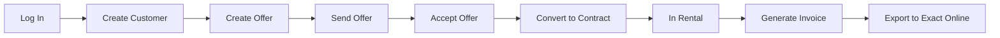

## Overview

This walkthrough takes you through the core ARMS rental workflow from start to finish. By the end, you will have created a customer, built an offer, converted it to a contract, and generated an invoice ready for export.

<Callout kind="info">
  This workflow requires at least a **Commercial** role for the offer and contract steps, and an **Accounting** role for the invoicing steps. In practice, different team members handle different parts of this flow.
</Callout>

## Complete walkthrough

<Steps>
  <Step title="Log in to ARMS" icon="log-in" titleType="h3">
    Open your browser and navigate to your ARMS URL. Click **Sign in with Microsoft** and authenticate with your company account.

    After signing in, you land on the **Dashboard** showing your KPIs and notifications.

    See [Logging In](/getting-started/logging-in) for detailed instructions.
  </Step>

  <Step title="Create a customer with VIES validation" icon="user-plus" titleType="h3">
    Navigate to **Customers** in the sidebar and click **New Customer**.

    1. Enter a working name for the customer (e.g., "Transport Pieters").
    2. Enter the customer's VAT number.
    3. Click **Check VIES** to validate the VAT number against the European VIES database.
    4. On success, the official company name, address, and country are filled in automatically.
    5. Set the **VAT percentage** and **payment conditions**.
    6. Add at least one **contact person** with an email address and language preference.
    7. Mark the contact as "For communication" so they receive offers.
    8. Click **Save**.

    <Callout kind="tip">
      The contact's language determines the default template language for offers and contracts. Set it to the language your customer prefers.
    </Callout>

    See [Creating a Customer](/user-guide/customers/creating-customer) and [VIES Validation](/user-guide/customers/vies-validation) for details.
  </Step>

  <Step title="Create an offer" icon="file-plus" titleType="h3">
    Navigate to **Offers** and click **New Offer**.

    1. Select the **company** (Atrac or Urbain).
    2. Select the **customer** you just created. VAT%, payment conditions, and contacts are pre-filled.
    3. Select the **contact** to receive the offer.
    4. Set the **unit** (day, month, or km) and **rental unit price**.
    5. Optionally add a **discount percentage** and **insurance price**.
    6. Select the **desired trailer type** and optionally other properties (volume, sheet type, model, door type).
    7. Optionally select a specific **trailer** from the filtered list of available trailers.
    8. Add an **external description** (visible on the offer document) and an **internal description** (for your team only).
    9. Click **Save**.

    The offer is created with status **Created**.

    See [Creating an Offer](/user-guide/offers/creating-offer) for details.
  </Step>

  <Step title="Send the offer via Outlook" icon="mail" titleType="h3">
    On the offer detail screen, click **Send via email**.

    1. ARMS generates the offer PDF from the selected template.
    2. If a trailer is selected, trailer photos are attached.
    3. A draft email opens in Outlook with the contact's email, a standard message, and the PDF attached.
    4. Review the email, make any adjustments, and click **Send** in Outlook.
    5. Back in ARMS, confirm that the email was sent when prompted.

    The offer status changes to **Sent**.

    <Callout kind="info">
      ARMS creates a draft in your Outlook. You are responsible for reviewing and sending the actual email.
    </Callout>

    See [Sending via Outlook](/user-guide/offers/sending-outlook) for details.
  </Step>

  <Step title="Accept the offer" icon="check-circle" titleType="h3">
    When the customer accepts your offer, update the status:

    1. Open the offer.
    2. Change the status to **Accepted**.
    3. Click **Save**.

    The **Create Contract** button becomes available.

    See [Offer Lifecycle](/user-guide/offers/lifecycle) for all status transitions.
  </Step>

  <Step title="Convert the offer to a contract" icon="arrow-right-circle" titleType="h3">
    On the accepted offer, click **Create Contract**.

    1. A new contract form opens with all fields pre-filled from the offer (customer, contact, pricing, trailer preferences).
    2. A **trailer is required** for the contract. Select one if not already chosen.
    3. Set the **estimated start and end dates**.
    4. Set the **invoice-to customer** (defaults to the selected customer).
    5. Review the **deposit** and **advance** amounts (calculated automatically based on the unit type).
    6. Click **Save**.

    The contract is created with status **Created**.

    <Callout kind="tip">
      You can adjust any pre-filled field before saving. The deposit defaults to 2,000 EUR (configurable by your admin).
    </Callout>

    See [Converting to Contract](/user-guide/offers/converting-to-contract) for details.
  </Step>

  <Step title="Contract goes to In Rental automatically" icon="play" titleType="h3">
    After the contract is accepted and the rental start date arrives:

    1. Send the contract via email (similar to the offer flow).
    2. Mark the contract as **Accepted** after the customer signs.
    3. When `effective_start_date <= today`, ARMS **automatically** transitions the contract to **In Rental**.
    4. A **deposit invoice** and **advance invoice** are created automatically.

    The trailer status changes to **Rented** and appears on the [Planning](/user-guide/planning/overview) timeline.

    <Callout kind="alert">
      The automatic transition runs daily. If you accept a contract with a start date in the past or today, the transition happens on the next daily check.
    </Callout>

    See [Contract Lifecycle](/user-guide/contracts/lifecycle) and [Deposits & Advances](/user-guide/contracts/deposits-advances) for details.
  </Step>

  <Step title="Generate an invoice proposal" icon="clipboard-list" titleType="h3">
    Navigate to **Invoicing** and open the **Invoice Proposals** tab.

    1. Select the **unit type** (day, month, or km) matching the contract.
    2. For day/km: set the **start and end date** of the billing period.
    3. For month: select the **month and year**.
    4. Optionally filter by **company** or **customer**.
    5. Click **Generate Overview**.

    ARMS calculates the billable amount for each qualifying contract, accounting for non-driving days, pro-rata periods, and already-invoiced ranges (anti-double-invoicing).

    See [Invoice Proposals](/user-guide/invoicing/proposals) for details.
  </Step>

  <Step title="Create and export the invoice" icon="upload" titleType="h3">
    From the invoice proposals overview:

    1. Select the contract(s) you want to invoice using the checkboxes.
    2. Click **Generate Invoice(s)**.
    3. ARMS creates the invoice with calculated lines (rental, insurance, non-driving day deductions, advance offset).
    4. Review the invoice in the **Invoices** tab.
    5. Click **Export to Exact Online** to send the invoice data.

    The invoice status changes to **Exported** and the Exact Online reference is recorded.

    <Callout kind="success">
      You have completed the full offer-to-cash workflow. The invoice is now in Exact Online for payment processing.
    </Callout>

    See [Managing Invoices](/user-guide/invoicing/managing-invoices) and [Exact Online Export](/user-guide/invoicing/exact-online-export) for details.
  </Step>
</Steps>

## What happens next

After the invoice is exported to Exact Online:

- **Payment tracking** happens in Exact Online, with status updates synced back to ARMS.
- **Recurring invoices** follow the same proposal-to-export flow each billing period.
- **Trailer return** triggers the damage control workflow. See [Trailer Return](/role-guides/workflows/trailer-return).
- **Contract completion** automatically generates a deposit credit note.

<Columns cols="2">
  <Card title="Offer-to-Cash Workflow" href="/role-guides/workflows/offer-to-cash" icon="arrow-right" horizontal="false">
    Detailed workflow guide with all variations and edge cases.
  </Card>

  <Card title="Monthly Invoicing" href="/role-guides/workflows/monthly-invoicing" icon="calendar" horizontal="false">
    Step-by-step guide for the monthly invoicing cycle.
  </Card>

  <Card title="Role Guides" href="/role-guides/by-role/admin" icon="shield" horizontal="false">
    See what you can do based on your specific role.
  </Card>

  <Card title="FAQ" href="/help/faq" icon="message-circle" horizontal="false">
    Answers to common questions about ARMS.
  </Card>
</Columns>
