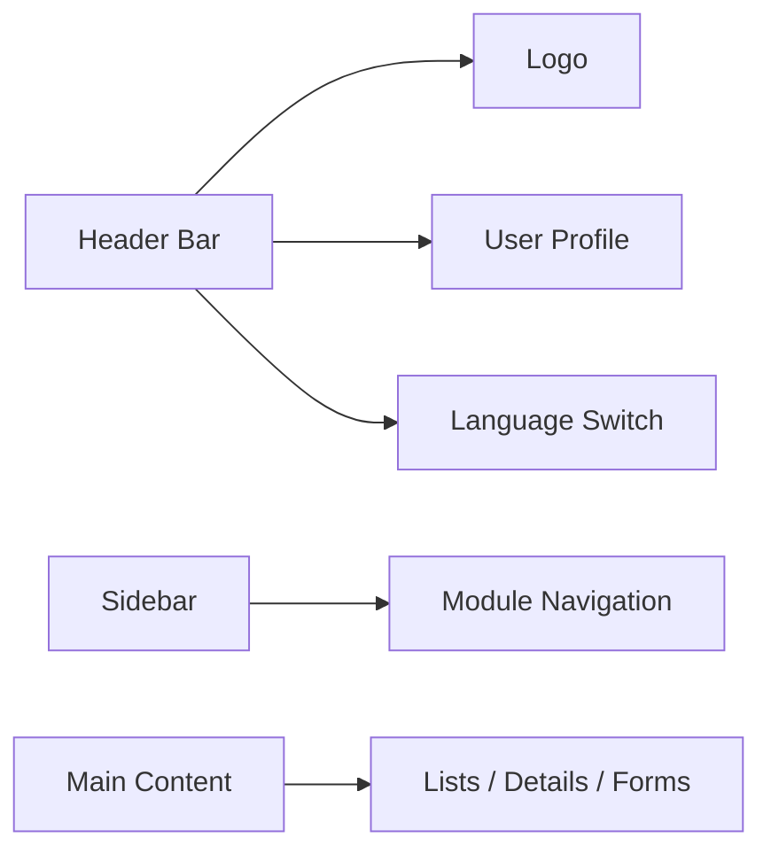

## Interface overview

The ARMS interface consists of three main areas: a **header bar**, a **sidebar** for navigation, and a **main content area** where you work with your data.

## Header bar

The header bar is always visible at the top of the screen and contains:

| Element | Description |
|---------|-------------|
| **Logo** | Company logo. Click to return to the Dashboard. |
| **User profile** | Your name and role. Click to access language settings, profile info, and sign out. |
| **Language switch** | Toggle between Dutch (NL) and French (FR). |
| **Company context** | Displays which company (Atrac or Urbain) you are currently viewing, where applicable. |

## Sidebar navigation

The sidebar is your primary way to move between modules. It lists all available modules as menu items, each with an icon and label.

### Available modules

| Module | Icon | Description |
|--------|------|-------------|
| **Dashboard** | Layout Dashboard | KPI widgets, notifications, and activity stream |
| **Fleet** | Truck | Trailer management, inspections, km registrations |
| **Customers** | Users | Customer companies and contact persons |
| **Offers** | File Text | Rental offer creation and lifecycle |
| **Contracts** | Handshake | Contract management from creation to completion |
| **Invoicing** | Receipt | Invoice proposals, invoices, and Exact Online export |
| **Planning** | Calendar | Gantt-style timeline view per trailer |
| **Templates** | File Stack | Document template management (Admin only) |
| **Parameters** | Sliders | System configuration and dropdown values (Admin only) |

### Module visibility by role

Not every role sees every module. The sidebar automatically shows only the modules you have access to.

| Module | Admin | Commercial | Accounting | Fleet Manager | Read-Only |
|--------|:-----:|:----------:|:----------:|:------------:|:---------:|
| Dashboard | Full | Full | Full | Full | Read |
| Fleet | Full | Read | Read | Full | Read |
| Customers | Full | Full | Read | -- | Read |
| Offers | Full | Full | Read | -- | Read |
| Contracts | Full | Full | Read | Read | Read |
| Invoicing | Full | -- | Full | -- | -- |
| Planning | Full | Read | Read | Read | Read |
| Templates | Full | -- | -- | -- | -- |
| Parameters | Full | -- | -- | -- | -- |

> [!info]
> A dash (--) means the module is completely hidden from your sidebar. If you need access to a module you cannot see, contact your administrator.

## Breadcrumbs

As you navigate deeper into a module, breadcrumbs appear at the top of the content area showing your current location. For example:

`Dashboard > Fleet > K28 - QAMD180 > Inspections`

Click any segment in the breadcrumb trail to navigate back to that level.

## List screens

Most modules start with a **list screen** (overview) that shows records in a table format. Common features across all list screens:

| Feature | Description |
|---------|-------------|
| **Search bar** | Full-text search across key fields |
| **Filters** | Dropdowns and multi-selects to narrow results |
| **Column sorting** | Click column headers to sort ascending/descending |
| **Status badges** | Color-coded badges indicating record status |
| **Row click** | Click any row to open the detail screen |
| **Action buttons** | Create new records, export to Excel |

## Detail screens

When you open a record, the detail screen shows all information organized in sections and tabs:

- **Header section**: Key fields always visible (ID, name, status, main actions)
- **Tabs**: Grouped related information (e.g., General, Properties, Documents, Invoices)
- **Action buttons**: Edit, status changes, send email, generate PDF

> [!tip]
> Most detail screens have a tabbed layout. The first tab is selected by default. Navigate between tabs to see all related information for a record.

## Quick navigation tips

- **Click the logo** in the header to return to the Dashboard at any time.
- **Use breadcrumbs** to go back to a parent screen without losing your place.
- **Dashboard KPI widgets** are clickable and take you directly to a pre-filtered list (e.g., clicking "Expiring Inspections" opens Fleet filtered on trailers with expiring inspections).
- **Notifications** in the Dashboard link directly to the relevant record.
- **Related records** are linked throughout the system. For example, clicking a customer name on a contract opens that customer's detail page.

- **[[getting-started/logging-in|Logging In]]** — Learn how to sign in and manage your session.

  - **[[getting-started/first-workflow|Your First Workflow]]** — Follow a complete offer-to-invoice walkthrough.
