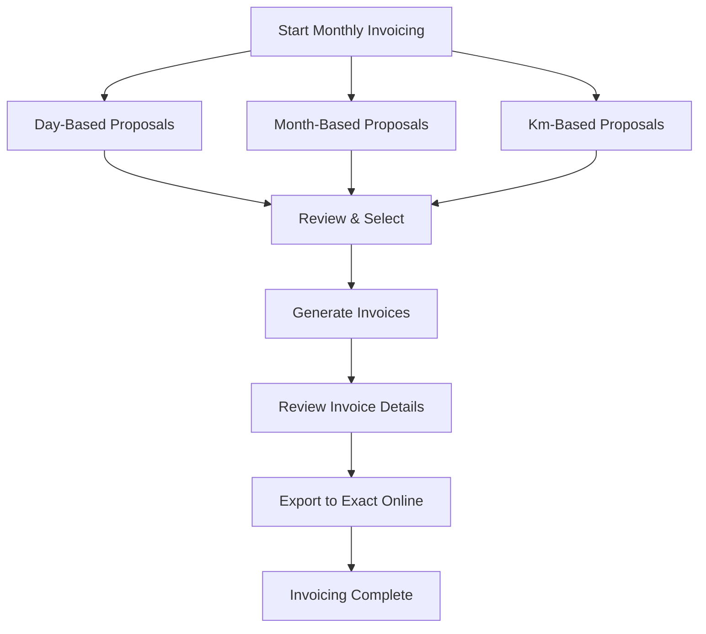

## Overview

The monthly invoicing cycle is the primary recurring financial workflow in ARMS. Typically performed by the Accounting role, it involves generating invoice proposals for each unit type, reviewing the calculated amounts, creating invoices, and exporting them to Exact Online.

**Role required**: Accounting or Admin

## Invoicing steps

<Steps>
  <Step title="Prepare for invoicing" icon="clipboard-list" titleType="h3">
    Before generating proposals, verify the data is complete:

    1. **Km registrations**: confirm that km readings are up to date for all km-based contracts. Coordinate with the Fleet Manager if readings are missing.
    2. **Non-driving days**: confirm that all non-driving day periods have been registered by the Commercial team for day-based contracts.
    3. **Contract dates**: verify that real start/end dates are entered where applicable (ARMS falls back to estimated dates if real dates are not set).

    <Callout kind="tip">
      Check the Dashboard for "Missing km registration" notifications (blue). Address these before running km-based proposals to avoid incomplete invoice calculations.
    </Callout>
  </Step>

  <Step title="Generate day-based proposals" icon="calendar" titleType="h3">
    Open **Invoicing** > **Invoice Proposals**.

    1. Select unit type: **Day**.
    2. Set the billing period **start date** and **end date** (e.g., first and last day of the previous month).
    3. Select company: Atrac, Urbain, or both.
    4. Optionally filter by a specific customer.
    5. Click **Generate Overview**.

    ARMS shows one row per qualifying contract with:

    | Column | Description |
    |--------|-------------|
    | Contract & Customer | Linked contract and customer name |
    | Overlap period | Days within the billing period where the contract is active |
    | Billable days | Overlap days minus non-driving days |
    | Non-driving days | Registered non-driving days within the period |
    | Unit price & discount | Contract rental price and discount percentage |
    | Insurance price | Per-day insurance amount |
    | Net total | Calculated total excluding VAT |
    | Status | Normal / Partially invoiced / Fully invoiced |

    <Callout kind="info">
      **Forfait pricing**: contracts with a total duration of 1 day use the forfait rate (default: 120 EUR). Contracts of 2 total days use the 2-day forfait (default: 170 EUR). These are set as system parameters by the Admin. See [Day-Based Invoicing](/user-guide/invoicing/day-based) for calculation details.
    </Callout>
  </Step>

  <Step title="Generate month-based proposals" icon="calendar-range" titleType="h3">
    Switch to unit type: **Month**.

    1. Select the **month and year** to invoice.
    2. Click **Generate Overview**.

    ARMS calculates pro-rata amounts:

    - If the contract starts or ends mid-month, only the active days are billed.
    - Pro-rata fraction = days used / days in month, rounded up to 2 decimal places.
    - Non-driving days do **not** apply to month-based contracts.

    **Example**: a contract starting on the 26th of a 28-day month = 3/28 = 0.1071... rounded up to **0.11 months**.

    See [Month-Based Invoicing](/user-guide/invoicing/month-based) for details.
  </Step>

  <Step title="Generate km-based proposals" icon="gauge" titleType="h3">
    Switch to unit type: **Km**.

    1. Set the billing period **start and end dates**.
    2. Click **Generate Overview**.

    ARMS calculates:

    - Km at period start: most recent km registration on or before the start date
    - Km at period end: most recent km registration on or before the end date
    - Driven km = end reading - start reading

    <Callout kind="alert">
      Rows highlighted in **red** indicate missing km data. The last km registration is older than the billing period end date. Do not invoice these contracts until km readings are updated.
    </Callout>

    See [Km-Based Invoicing](/user-guide/invoicing/km-based) for details.
  </Step>

  <Step title="Select proposals and create invoices" icon="receipt" titleType="h3">
    For each unit type:

    1. Review all rows. Skip rows with "Fully invoiced" status.
    2. Select the rows to invoice using the checkboxes.
    3. Click **Generate Invoice(s)**.

    ARMS creates one invoice per customer. Each invoice includes the following lines:

    **Day-based invoice lines:**
    1. Rental line: billable days x unit price (with discount)
    2. Non-driving day deduction: negative line for non-driving days
    3. Insurance line: billable days x insurance price (0% VAT, no discount)
    4. Insurance non-driving deduction: negative insurance for non-driving days

    **Month-based invoice lines:**
    1. Rental line: months fraction x unit price (with discount)
    2. Insurance line: months fraction x insurance price (0% VAT)

    **Km-based invoice lines:**
    1. Rental line: driven km x unit price (with discount)
    2. Insurance line: driven km x insurance price (0% VAT)

    **On the first recurrent invoice** for each contract, an additional **advance offset line** is added (negative amount) to deduct the previously paid advance.

    <Callout kind="info">
      The advance offset deducts up to the full advance amount from the first recurrent invoice. If the invoice total is less than the advance, the remaining balance carries over to the next invoice.
    </Callout>
  </Step>

  <Step title="Review created invoices" icon="eye" titleType="h3">
    Switch to the **Invoices** tab and filter on status **New**.

    For each invoice, verify:

    - Invoice lines match the expected amounts
    - VAT is applied correctly (0% for insurance lines)
    - Discount is applied only to rental lines (not insurance)
    - Advance offset line is present and correct (first recurrent invoice only)
    - Invoice totals are accurate
  </Step>

  <Step title="Export to Exact Online" icon="upload" titleType="h3">
    For each reviewed invoice:

    1. Click **Export to Exact Online**.
    2. ARMS sends the invoice data in the required format.
    3. On success: status changes to **Exported**, Exact Online reference is recorded.
    4. On failure: ARMS displays the error message. Common issues include:
       - Customer not mapped in Exact Online
       - Network connectivity issues
       - Invalid data format

    <Callout kind="success">
      Once exported, payment processing and debtor management happen in Exact Online. Payment status is synced back to ARMS.
    </Callout>

    See [Exact Online Export](/user-guide/invoicing/exact-online-export) for details and troubleshooting.
  </Step>
</Steps>

## Anti-double-invoicing

ARMS automatically prevents invoicing the same period or km range twice:

| Unit Type | Lock Mechanism | What It Tracks |
|-----------|---------------|----------------|
| Day | `Invoice_Period_Lock` | Start and end dates of invoiced periods |
| Month | `Invoice_Period_Lock` | Start and end dates of the invoiced month range |
| Km | `Invoice_Km_Lock` | Start and end km readings of invoiced ranges |

Already-invoiced portions are excluded from proposals and marked as "Partially invoiced" or "Fully invoiced".

## Tips for efficient invoicing

<Callout kind="tip">
  - Process one unit type at a time to keep the workflow organized.
  - Start with day-based contracts (most complex due to non-driving days and forfait logic).
  - Check for missing km data before running km-based proposals.
  - Review the advance offset on the first recurrent invoice carefully.
  - Export invoices in batches rather than one by one for efficiency.
</Callout>

## Related guides

<Columns cols="2">
  <Card title="Invoice Proposals" href="/user-guide/invoicing/proposals" icon="clipboard-list" horizontal="false">
    Detailed reference for the proposal generation screen.
  </Card>

  <Card title="Day-Based Invoicing" href="/user-guide/invoicing/day-based" icon="calendar" horizontal="false">
    Calculation details including forfait pricing and non-driving day deductions.
  </Card>

  <Card title="Exact Online Export" href="/user-guide/invoicing/exact-online-export" icon="upload" horizontal="false">
    Export process and error handling.
  </Card>

  <Card title="Accounting Role Guide" href="/role-guides/by-role/accounting" icon="calculator" horizontal="false">
    Complete overview of the Accounting role.
  </Card>
</Columns>
