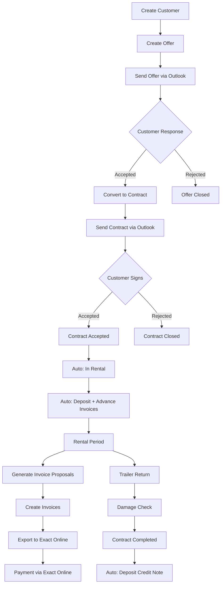

## Overview

The offer-to-cash workflow is the core business process in ARMS. It covers the entire lifecycle from first customer contact to receiving payment, spanning multiple modules and roles.

## Roles involved

| Step | Primary Role | Supporting Role |
|------|-------------|-----------------|
| Customer creation | Commercial | Admin |
| Offer management | Commercial | -- |
| Contract management | Commercial | Admin |
| Invoice generation | Accounting | -- |
| Exact Online export | Accounting | Admin |
| Trailer return inspection | Fleet Manager | Commercial |

## Detailed steps

### Step 1: Create or select a customer

**Role**: Commercial

    If the customer does not exist yet:

    1. Navigate to **Customers** and click **New Customer**.
    2. Enter the working name and VAT number.
    3. Click **Check VIES** to validate and auto-fill company details.
    4. Set VAT percentage and payment conditions.
    5. Add at least one contact person with an email address.
    6. Mark the contact for communication (receives offers/contracts) and/or invoicing.

    > [!tip]
> The contact's language preference determines the default template language for all documents sent to this contact.

    See [[user-guide/customers/creating-customer|Creating a Customer]] | [[user-guide/customers/vies-validation|VIES Validation]] | [[user-guide/customers/contacts|Contacts]]

### Step 2: Create the offer

**Role**: Commercial

    1. Navigate to **Offers** and click **New Offer**.
    2. Select the company (Atrac or Urbain).
    3. Select the customer. VAT%, payment conditions, and contacts are pre-filled.
    4. Select the contact who will receive the offer.
    5. Configure rental details:
       - **Unit**: day, month, or km
       - **Rental unit price**: price per unit
       - **Discount %**: optional, applies to rental only (not insurance)
       - **Insurance unit price**: optional, no discount applies
    6. Specify desired trailer properties (type, volume, sheet type, model, door type).
    7. Optionally select a specific trailer from the filtered availability list.
    8. Add external description (appears on the offer PDF) and internal notes.
    9. The **due date** is automatically set based on the `OFFER_DUE_DATE_OFFSET_WEEKS` parameter.
    10. Click **Save**.

    The offer is created with status **Created**.

    See [[user-guide/offers/creating-offer|Creating an Offer]]

### Step 3: Send the offer via Outlook

**Role**: Commercial

    1. On the offer detail screen, click **Send via email**.
    2. ARMS generates the offer PDF using the selected template.
    3. If a trailer is selected, trailer photos are attached.
    4. An Outlook draft opens with the recipient, subject, body text, and attachments.
    5. Review, adjust if needed, and send in Outlook.
    6. Back in ARMS, confirm the email was sent.

    Status changes to **Sent**.

    > [!info]
> ARMS does not detect whether you actually sent the email. The status change relies on your manual confirmation.

    See [[user-guide/offers/sending-outlook|Sending via Outlook]]

### Step 4: Process the customer's response

**Role**: Commercial

    When the customer responds:

    - **Accepted**: change the offer status to **Accepted**. The "Create Contract" button becomes available.
    - **Rejected**: change the offer status to **Rejected**. The offer is closed.
    - **No response**: if the due date passes, the offer appears with a yellow warning badge on the Dashboard.

    See [[user-guide/offers/lifecycle|Offer Lifecycle]]

### Step 5: Convert the offer to a contract

**Role**: Commercial

    1. On the accepted offer, click **Create Contract**.
    2. A new contract form opens with fields pre-filled from the offer.
    3. **Trailer is required**: select one if not already chosen in the offer.
    4. Set estimated start and end dates (required for contracts).
    5. Configure the **invoice-to customer** (defaults to the selected customer; can be Atrac/Urbain for commercial gestures or STAS for warranty).
    6. Review deposit (default 2,000 EUR) and advance amounts (auto-calculated based on unit type).
    7. Save the contract.

    **Advance calculation by unit type:**

    | Unit | Advance Formula |
    |------|----------------|
    | Day | 30 x rental unit price |
    | Month | 1 x rental unit price |
    | Km | 6,000 x rental unit price |

    See [[user-guide/offers/converting-to-contract|Converting to Contract]] | [[user-guide/contracts/deposits-advances|Deposits & Advances]]

### Step 6: Send and accept the contract

**Role**: Commercial

    1. Click **Send via email** on the contract detail.
    2. ARMS generates the contract PDF and attaches the trailer registration certificate.
    3. Review and send via Outlook, then confirm in ARMS. Status changes to **Sent**.
    4. When the customer returns the signed contract, change status to **Accepted**.

    See [[user-guide/contracts/lifecycle|Contract Lifecycle]] | [[user-guide/contracts/sending-outlook|Sending via Outlook]]

### Step 7: Automatic transition to In Rental

**Automatic** (system)

    When `effective_start_date <= today`, ARMS automatically:

    1. Changes the contract status from **Accepted** to **In Rental**.
    2. Creates a **deposit invoice** for the deposit amount.
    3. Creates an **advance invoice** for the advance amount.
    4. Changes the trailer status to **Rented**.

    Both invoices appear in the Invoicing module with status "New".

    > [!warning]
> This transition runs as a daily automated check. If you accept a contract with a start date in the past, the transition happens on the next daily run.

    See [[user-guide/contracts/lifecycle|Contract Lifecycle]]

### Step 8: During the rental period

**Roles**: Commercial (non-driving days), Fleet Manager (km registrations)

    During the rental:

    - **Day-based contracts**: register non-driving day periods as the customer reports them (e.g., planned holidays).
    - **Km-based contracts**: the Fleet Manager ensures km readings are registered regularly.
    - **Month-based contracts**: no special actions needed during the rental.
    - The contract and trailer appear on the **Planning** timeline.

    See [[user-guide/contracts/non-driving-days|Non-Driving Days]] | [[user-guide/fleet/km-registration|Km Registration]]

### Step 9: Generate invoice proposals

**Role**: Accounting

    1. Open **Invoicing** > **Invoice Proposals**.
    2. Select the unit type (day, month, or km).
    3. Set the billing period or month.
    4. Click **Generate Overview**.
    5. ARMS calculates billable amounts per contract, accounting for:
       - Non-driving days (day-based)
       - Pro-rata periods (month-based)
       - Km ranges (km-based)
       - Already-invoiced periods/ranges (anti-double-invoicing)
       - Forfait pricing for 1-day and 2-day contracts

    See [[user-guide/invoicing/proposals|Invoice Proposals]] | [[user-guide/invoicing/day-based|Day-Based]] | [[user-guide/invoicing/month-based|Month-Based]] | [[user-guide/invoicing/km-based|Km-Based]]

### Step 10: Create and export invoices

**Role**: Accounting

    1. Select proposals and click **Generate Invoice(s)**.
    2. ARMS creates invoices with calculated lines:
       - Rental line (with discount if applicable)
       - Insurance line (0% VAT, no discount)
       - Non-driving day deduction lines (day-based only)
       - Advance offset line (on the first recurrent invoice, deducting the advance amount)
    3. Review the invoice details and totals.
    4. Click **Export to Exact Online**.
    5. On success, the invoice status changes to "Exported" with the Exact Online reference.

    > [!success]
> The invoice is now in Exact Online for payment processing and debtor management.

    See [[user-guide/invoicing/managing-invoices|Managing Invoices]] | [[user-guide/invoicing/exact-online-export|Exact Online Export]]

### Step 11: Trailer return and contract completion

**Roles**: Commercial (status change), Fleet Manager (inspection)

    When the rental ends:

    1. Commercial changes contract status to **To Check**.
    2. Fleet Manager inspects the returned trailer.
    3. If no damage: mark "Checked" on the contract, change status to **Completed**.
    4. If damage found: mark "Damage Found", enter the repair order reference. The trailer and contract show a yellow warning until the repair is resolved.
    5. Upon completion, ARMS automatically creates a **deposit credit note**.

    See [[role-guides/workflows/trailer-return|Trailer Return Workflow]] | [[user-guide/contracts/damage-control|Damage Control]]

## Related guides

- **[[role-guides/workflows/monthly-invoicing|Monthly Invoicing]]** — Detailed monthly invoicing cycle for the Accounting role.

  - **[[role-guides/workflows/trailer-return|Trailer Return]]** — Post-return inspection and damage control workflow.

  - **[[role-guides/workflows/fleet-onboarding|Fleet Onboarding]]** — Adding a new trailer to the fleet.

  - **[[help/faq|FAQ]]** — Common questions about the offer-to-cash process.
