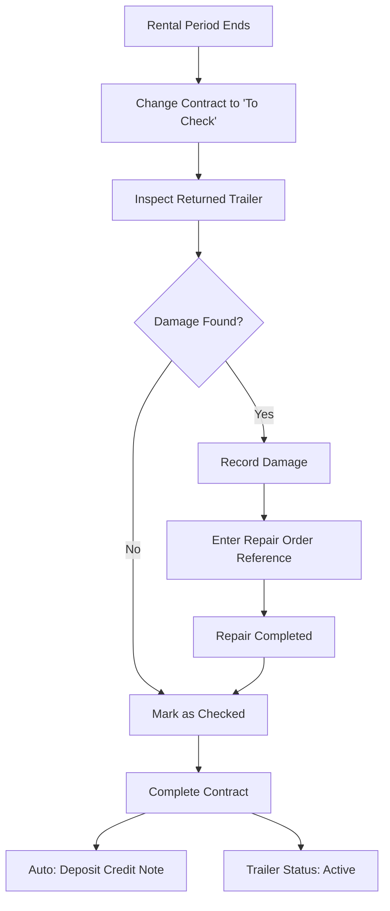

## Overview

When a rental period ends and the customer returns the trailer, a structured return workflow ensures the trailer is properly inspected, any damage is documented, and the contract is closed correctly. This triggers automatic deposit credit note generation.

**Roles involved**: Commercial (status changes), Fleet Manager (inspection), Accounting (credit note)

## Return steps

### Step 1: Set contract status to To Check

**Role**: Commercial

    When the customer returns the trailer:

    1. Open the contract in the **Contracts** module.
    2. Change the status to **To Check**.
    3. If not already set, enter the **real end date** (dropoff date) in the rental period section.

    The trailer now appears with a **yellow background** in the [[user-guide/planning/overview|Planning]] timeline and the contract overview, indicating it requires inspection.

    > [!info]
> The status "To Check" signals to the Fleet Manager that the trailer needs a post-rental inspection. A notification also appears on the Dashboard.

### Step 2: Inspect the returned trailer

**Role**: Fleet Manager

    Perform a physical inspection of the returned trailer:

    1. Check for exterior damage (body, tarpaulin, doors, chassis).
    2. Check interior condition (floor, walls, loading mechanisms).
    3. Verify tire condition and braking system.
    4. Record the current km reading (add a new km registration in the trailer's Km Registration tab).
    5. Take photos of any damage found.

### Step 3: Record inspection results

**Role**: Fleet Manager or Commercial

    Open the contract detail and navigate to the **Damage Control** tab:

    **If no damage found:**

    1. Check the **Checked** checkbox to confirm the inspection was performed.
    2. Leave **Damage Found** unchecked.
    3. The yellow warning background clears from the contract and planning views.

    **If damage is found:**

    1. Check the **Checked** checkbox.
    2. Check the **Damage Found** checkbox.
    3. Enter the **Repair Order Reference** linking to the external repair order system.
    4. Upload damage photos in the **Documents** tab.

    > [!warning]
> When damage is found, the contract and trailer remain highlighted in yellow until the repair is resolved. This is visible to all users on the Dashboard, Planning, and Contract overview.

### Step 4: Handle damage resolution (if applicable)

**Role**: Fleet Manager

    If damage was found:

    1. The repair is handled through the external repair order system (out of ARMS scope).
    2. Once the repair is completed, update the repair order status in ARMS.
    3. When the repair order is marked as "Completed" (either via external integration or manually), the yellow warning clears.

    > [!tip]
> During the repair period, the trailer may also have a non-productive period registered (reason: "Damage"). This prevents it from being offered for new rentals while under repair.

### Step 5: Complete the contract

**Role**: Commercial or Admin

    Once the inspection is complete and any damage is resolved:

    1. Change the contract status to **Completed**.
    2. ARMS automatically creates a **deposit credit note** for the full deposit amount.
    3. The credit note appears in the Invoicing module with status "New", ready for Exact Online export.
    4. The trailer status changes back to **Active** and becomes available for new offers.

    > [!success]
> The contract is now fully closed. The deposit credit note ensures the customer's deposit is returned through Exact Online.

### Step 6: Export the deposit credit note

**Role**: Accounting

    1. Open the **Invoicing** module and find the new credit note (type: Credit Note).
    2. Review the credit note details (deposit amount, customer, linked contract).
    3. Click **Export to Exact Online**.
    4. The credit note is processed through Exact Online for deposit refund.

    See [[user-guide/invoicing/managing-invoices|Managing Invoices]] for details.

## Status changes summary

The trailer return workflow involves coordinated status changes across two entities:

| Step | Contract Status | Trailer Status | Visual Indicator |
|------|----------------|---------------|-----------------|
| Rental active | In Rental | Rented | Red on Planning |
| Return initiated | To Check | To Check | Yellow background |
| Inspection done (no damage) | To Check | To Check | Yellow clears |
| Damage found | To Check | To Check | Yellow persists |
| Repair completed | To Check | To Check | Yellow clears |
| Contract completed | Completed | Active | Normal |

## Common scenarios

> [!info]- Trailer returned with minor wear (no damage)
> This is the most common scenario:
>
>     1. Commercial sets contract to "To Check".
>     2. Fleet Manager inspects and marks "Checked" with no damage.
>     3. Commercial completes the contract.
>     4. Deposit credit note is generated automatically.
>     5. Total time: same day.

  > [!info]- Trailer returned with damage requiring repair
> 1. Commercial sets contract to "To Check".
>     2. Fleet Manager finds damage, records it, and creates a repair order reference.
>     3. Optionally add a non-productive period for the trailer during repair.
>     4. After repair is completed, update the status.
>     5. Commercial completes the contract.
>     6. Deposit credit note is generated.
>     7. Total time: depends on repair duration.

  > [!info]- Customer disputes damage found
> 1. Follow the standard damage recording process.
>     2. Use the damage photos uploaded to the Documents tab as evidence.
>     3. Coordinate with the Commercial team on customer communication.
>     4. The repair order reference tracks the resolution externally.
>     5. Complete the contract once the dispute is resolved.

## Related guides

- **[[user-guide/contracts/damage-control|Damage Control]]** — Detailed reference for the damage control tab and fields.

  - **[[user-guide/contracts/lifecycle|Contract Lifecycle]]** — All contract status transitions and their triggers.

  - **[[user-guide/fleet/status-changes|Status Changes]]** — Trailer status transitions and validation rules.

  - **[[role-guides/workflows/offer-to-cash|Offer-to-Cash Workflow]]** — The complete end-to-end business workflow.
