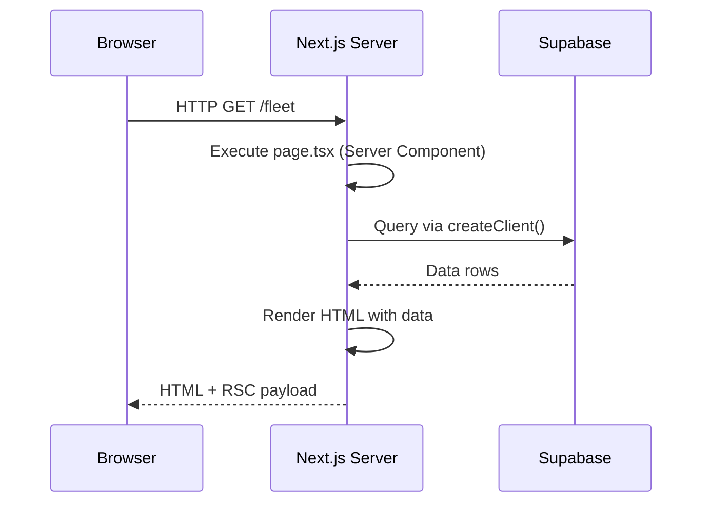
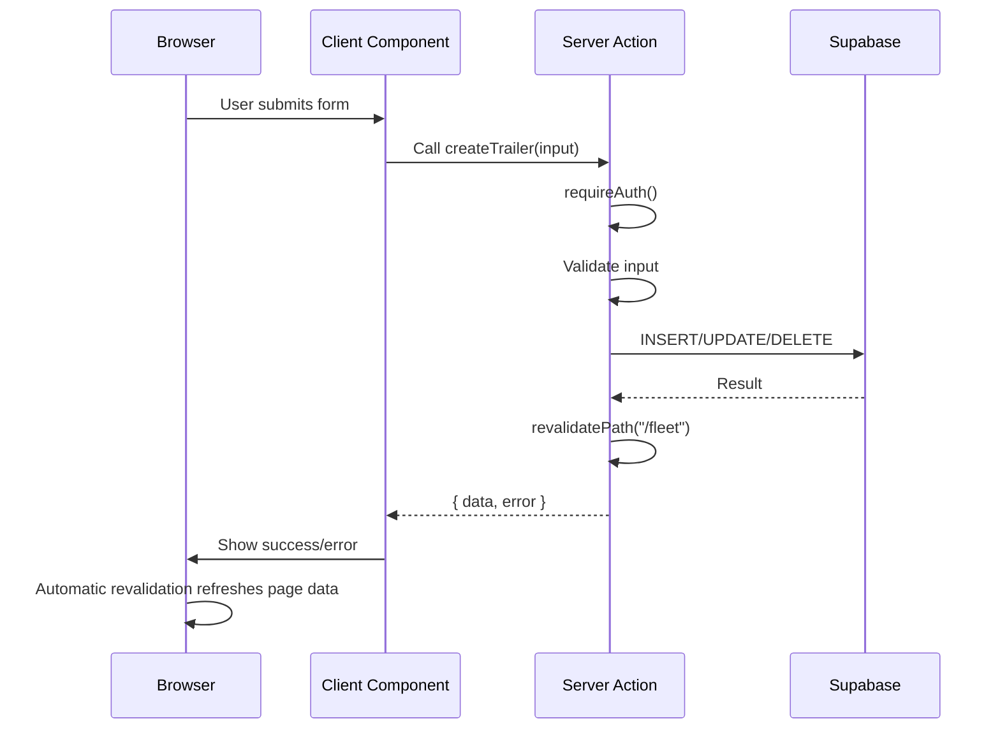
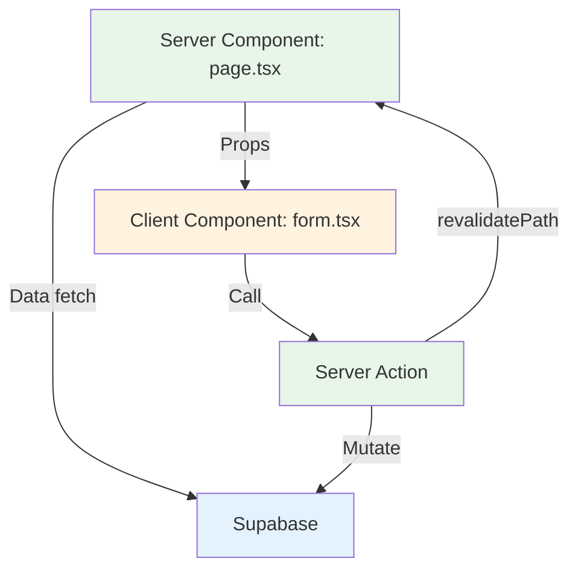

## Overview

ARMS uses two primary data flow patterns: **server-side data fetching** for reading data and **server actions** for mutations. Both patterns leverage the Next.js App Router's built-in support for React Server Components and server-side data handling.

## Read flow: Server Component data fetching

Pages in ARMS are React Server Components that fetch data directly on the server. There is no client-side data fetching layer (no SWR, React Query, or useEffect + fetch patterns).



**Example pattern:**

```typescript
// app/(app)/fleet/page.tsx (Server Component)
export default async function FleetPage() {
  const supabase = await createClient();
  const { data: trailers } = await supabase
    .from("trailer")
    .select("*")
    .order("trailer_ref");

  return ;
}
```

Key characteristics:
- Data is fetched on every request (no stale data)
- Database queries run on the server, never exposed to the client
- The Supabase client uses the user's auth cookies for Row Level Security
- HTML is streamed progressively to the browser

## Write flow: Server Actions

All data mutations go through server actions. These are async functions marked with `"use server"` that run on the server when called from client components.



**Example pattern:**

```typescript
// Client component
"use client";

async function handleSubmit(formData: FormData) {
  const result = await createTrailer({
    plate_number: formData.get("plate_number") as string,
    // ...other fields
  });

  if (result.error) {
    setError(result.error);
  } else {
    router.push(`/fleet/${result.data.plate_number}`);
  }
}
```

## Revalidation strategy

After a mutation, `revalidatePath()` invalidates the Next.js cache for affected routes. This causes the next navigation to those routes to re-fetch fresh data.

| Mutation target | Revalidation path | Scope |
|----------------|-------------------|-------|
| Trailer CRUD | `/fleet` | `layout` |
| Customer CRUD | `/customers` | `layout` |
| Contact CRUD | `/customers` and `/contacts` | `layout` |
| Offer CRUD | `/offers` | `layout` |
| Contract CRUD | `/contracts` | `layout` |
| Invoice operations | `/invoices` | `layout` |
| Document upload/delete | `/` | `layout` (all pages) |
| Parameter update | `/parameters` | `layout` |

The `"layout"` scope revalidates the path and all child routes sharing the same layout.

## Caching

### Page-level caching

ARMS pages are dynamically rendered (not statically cached) because:
- Every request needs the user's auth cookies for RLS
- Data freshness is important for a multi-user business application
- Server Components make the rendering fast enough without caching

### Parameter caching

System parameters use `unstable_cache` with a 5-minute revalidation window:

```typescript
const getCachedParameter = unstable_cache(
  async (key: string) => fetchParameter(key),
  ["parameter"],
  { revalidate: 300, tags: ["parameters"] }
);
```

This prevents hitting the database for every parameter read while still reflecting updates within 5 minutes.

## Client-server boundary

ARMS maintains a clear boundary between server and client components:



| Layer | Runs on | Responsibility |
|-------|---------|---------------|
| Server Components (green) | Server | Data fetching, initial render, layout |
| Client Components (orange) | Browser | Interactivity, forms, state management |
| Server Actions (green) | Server | Data mutations, validation, business logic |
| Supabase (blue) | Cloud | Data storage, auth, file storage |

> [!info]
> Server Components fetch data and pass it as props to Client Components. Client Components handle user interactions and call Server Actions for mutations. This unidirectional flow keeps the architecture simple and predictable.
