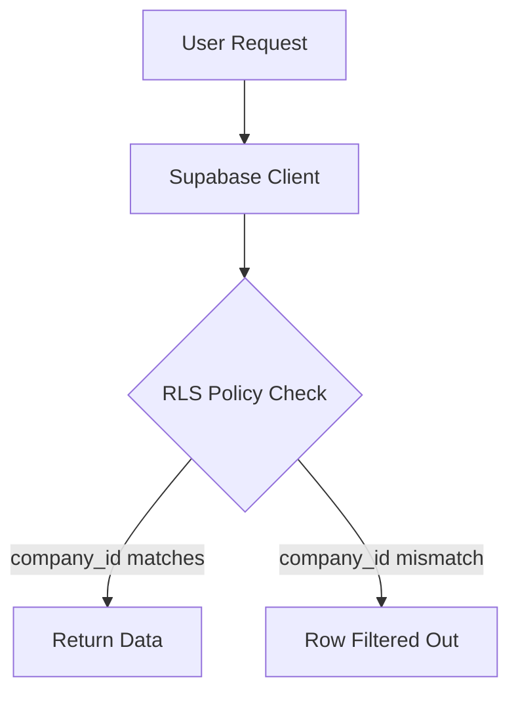
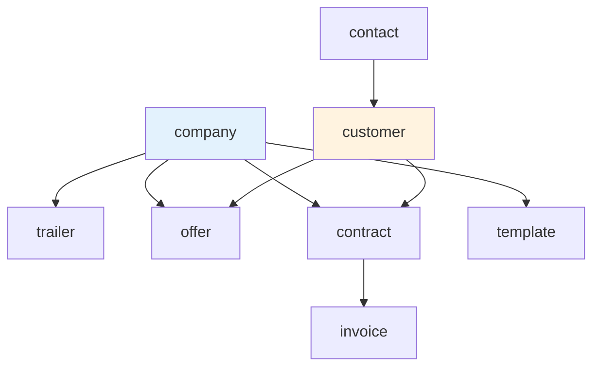

## Overview

ARMS is a multi-tenant application where multiple companies (e.g., Atrac, Urbain) share the same database and application instance. Data isolation is achieved through a `company_id` foreign key on every business entity, combined with PostgreSQL Row Level Security (RLS) policies.

## Company model

Companies are stored in the `company` table and serve as the top-level organizational unit:

```sql
CREATE TABLE company (
  company_id SERIAL PRIMARY KEY,
  company_name TEXT NOT NULL UNIQUE,
  created_on TIMESTAMPTZ DEFAULT now()
);
```

Each user is assigned to one or more companies through their profile, and the active company is selected in the UI.

## Entity-level isolation

Every business entity includes a `company_id` column:

| Entity | Company-scoped columns |
|--------|----------------------|
| Trailer | `company_id` |
| Offer | `company_id` |
| Contract | `company_id` |
| Invoice | via Contract `company_id` |
| Template | `company_id` |
| Invoice numbering | `company_id` (separate sequence per company) |

Customers and contacts are shared across companies (a customer can do business with multiple Atrac companies).

## Row Level Security

Supabase RLS policies ensure that database queries only return rows the user is authorized to see. The policies use the authenticated user's JWT claims to filter data.



### How RLS uses company_id

RLS policies on company-scoped tables filter rows based on the user's company associations:

```sql
-- Example RLS policy for trailers
CREATE POLICY "Users can view trailers in their companies"
ON trailer FOR SELECT
USING (
  company_id IN (
    SELECT uc.company_id
    FROM user_company uc
    WHERE uc.user_id = auth.uid()
  )
);
```

This pattern ensures that:
- Users only see data belonging to their assigned companies
- No application-level filtering is needed (the database handles it)
- Even if a bug skips a `WHERE` clause, RLS prevents data leaks

## Company-specific configuration

Some entities are configured per company:

### Invoice numbering

Each company has its own invoice number sequence. The `next_invoice_number` database RPC accepts a `p_company_id` parameter and returns the next number in that company's sequence.

```sql
SELECT next_invoice_number(p_company_id := 1);
-- Returns: 2024001
```

### Templates

Document templates (for offers, contracts, invoices) are company-specific. Each company can have its own set of templates with different branding and content.

### Parameters

While most system parameters are global, some parameters can be overridden per company. The parameter system supports this through the company context.

## UI company selector

The application provides a company selector in the UI that allows users with access to multiple companies to switch between them. When a user switches companies:

1. The active `company_id` is stored in the session/context
2. All list pages automatically show data for the selected company
3. New records are created with the selected `company_id`
4. RLS ensures the user can only select companies they belong to

## Cross-company operations

Some operations span multiple companies:

| Operation | Multi-company behavior |
|-----------|----------------------|
| Invoice proposals | Can filter by multiple `companyIds` |
| Dashboard statistics | Aggregated across accessible companies |
| Customer search | Customers are shared across companies |
| Planning calendar | Can show trailers from multiple companies |

<Callout kind="alert">
  When creating records, always pass the correct `company_id` from the UI context. The server action does not automatically set the company -- it relies on the client to provide it. RLS prevents creating records in unauthorized companies.
</Callout>

## Data model diagram



Entities connected to `company` (blue) are company-scoped. Customers and contacts (orange) are shared across companies.
