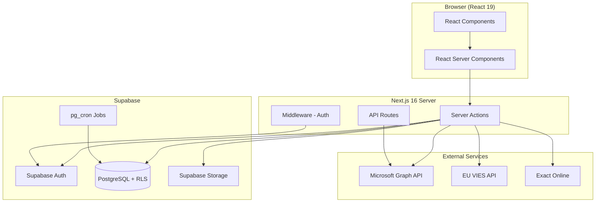
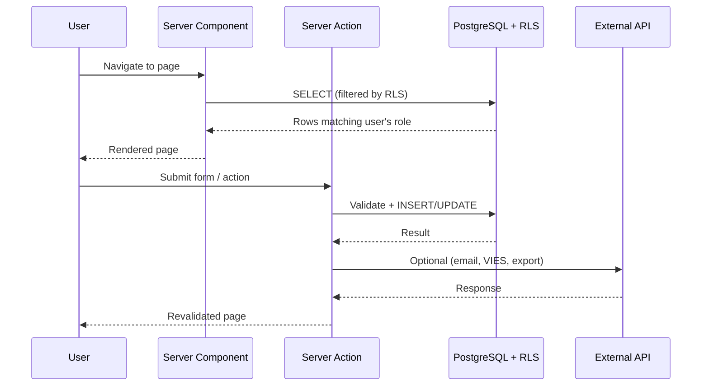

## System architecture

ARMS is built as a modern full-stack web application using Next.js 16 with React 19 on the frontend and Supabase (PostgreSQL) as the backend. All business logic runs as Next.js Server Actions, with Row Level Security (RLS) enforcing access control at the database layer.

## Core design principles

| Principle | Implementation |
|-----------|---------------|
| **Server-first rendering** | React Server Components for all data fetching; client components only for interactivity |
| **Database-level security** | Supabase RLS policies enforce role-based access — no data leaks even if application logic is bypassed |
| **Multi-tenancy** | `company_id` on every entity scopes data to Atrac or Urbain |
| **Parameterization** | All thresholds stored in the `parameter` table — no hardcoded business values |
| **Status-driven workflows** | State machines define valid transitions for offers, contracts, invoices, and trailers |
| **Bilingual by design** | i18n via `next-intl` with NL/FR translations; dropdown values stored in both languages |

## Application layers

### Presentation layer

React 19 components organized by route. Each module (fleet, customers, offers, contracts, invoices, planning) has its own route group under `app/(app)/`.

### Business logic layer

Server Actions in `lib/actions/` contain all mutations. Pure utility functions handle calculations, status transitions, and serialization. Key files:

| File | Responsibility |
|------|---------------|
| `lib/actions/trailers.ts` | Fleet CRUD operations |
| `lib/actions/customers.ts` | Customer and contact management |
| `lib/actions/offers.ts` | Offer lifecycle management |
| `lib/actions/contracts.ts` | Contract lifecycle and auto-transitions |
| `lib/actions/invoicing.ts` | Invoice proposal generation and creation |
| `lib/offer-status-transitions.ts` | Offer state machine |
| `lib/contract-status-transitions.ts` | Contract state machine |
| `lib/invoice-status-transitions.ts` | Invoice state machine |
| `lib/parameters.ts` | Cached parameter retrieval |

### Data layer

Supabase PostgreSQL with 18 migrations defining the schema. RLS policies implement the role-based access matrix. A `get_user_role()` SQL function returns the authenticated user's role for policy evaluation.

### Integration layer

| Integration | Purpose | Protocol |
|------------|---------|----------|
| **Microsoft Graph** | Create Outlook email drafts with PDF attachments | OAuth2 + REST |
| **VIES** | Validate EU VAT numbers and retrieve company data | SOAP/REST |
| **Exact Online** | Export invoices for accounting | JSON download (MVP) |
| **Supabase Storage** | Store document uploads (PDFs, images) | S3-compatible API |

## Data flow

## Further reading

- **[[technical/architecture/tech-stack|Tech Stack]]** — Detailed breakdown of frameworks, libraries, and versions used.

  - **[[technical/database/schema-overview|Database Schema]]** — Complete entity-relationship model and table documentation.

  - **[[technical/auth/overview|Authentication]]** — Supabase Auth, Microsoft OAuth, and RBAC implementation.

  - **[[technical/state-machines/offer-status|State Machines]]** — Status transition rules for offers, contracts, invoices, and trailers.
