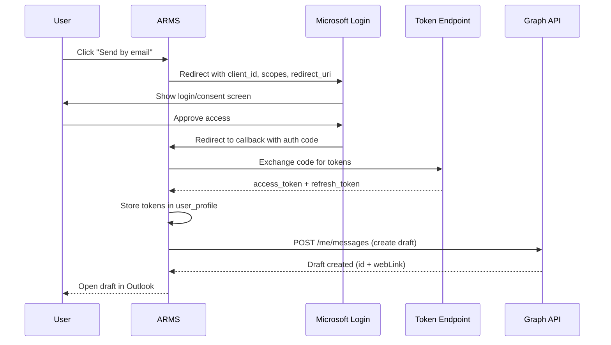

## Overview

ARMS integrates with Microsoft Outlook to create email drafts with attachments (e.g., offer PDFs, invoice documents). This integration uses the OAuth2 Authorization Code flow to obtain user-specific access tokens for the Microsoft Graph API.

> [!info]
> This integration creates **drafts** in the user's Outlook mailbox, not sent emails. The user reviews and sends the draft manually, maintaining control over outgoing communications.


## Authentication flow



## Configuration

The integration requires three environment variables and derives the remaining configuration from them.

| Variable | Required | Default | Description |
|----------|----------|---------|-------------|
| `MICROSOFT_CLIENT_ID` | Yes | -- | Azure AD application (client) ID |
| `MICROSOFT_CLIENT_SECRET` | Yes | -- | Azure AD client secret |
| `MICROSOFT_TENANT_ID` | No | `common` | Azure AD tenant ID (use `common` for multi-tenant) |
| `NEXT_PUBLIC_APP_URL` | No | `http://localhost:3000` | Application base URL for redirect URI |

**Derived URLs:**

| URL | Value |
|-----|-------|
| Redirect URI | `{NEXT_PUBLIC_APP_URL}/api/auth/microsoft/callback` |
| Authorize URL | `https://login.microsoftonline.com/{tenantId}/oauth2/v2.0/authorize` |
| Token URL | `https://login.microsoftonline.com/{tenantId}/oauth2/v2.0/token` |
| Graph API base | `https://graph.microsoft.com/v1.0` |

**Required scopes:**

```
openid offline_access Mail.ReadWrite
```

| Scope | Purpose |
|-------|---------|
| `openid` | Standard OpenID Connect authentication |
| `offline_access` | Enables refresh token issuance |
| `Mail.ReadWrite` | Create and manage email drafts in the user's mailbox |

## Authorization URL generation

The `buildAuthorizationUrl()` function constructs the Microsoft login URL with all required OAuth2 parameters.

```typescript lib/microsoft-graph.ts
export function buildAuthorizationUrl(state: string): string {
  const config = getConfig();
  const params = new URLSearchParams({
    client_id: config.clientId,
    response_type: "code",
    redirect_uri: config.redirectUri,
    scope: config.scopes,
    response_mode: "query",
    state,
  });
  return `${config.authorizeUrl}?${params.toString()}`;
}
```

The `state` parameter is used for CSRF protection -- the application generates a random value, stores it in the session, and verifies it matches when the callback is received.

## Token exchange

After the user approves access, Microsoft redirects to the callback URL with an authorization code. The `exchangeCodeForTokens()` function exchanges this code for an access token and refresh token.

```typescript lib/microsoft-graph.ts
export async function exchangeCodeForTokens(
  code: string,
): Promise<{ data: TokenResponse | null; error: string | null }> {
  const config = getConfig();

  const body = new URLSearchParams({
    client_id: config.clientId,
    client_secret: config.clientSecret,
    code,
    redirect_uri: config.redirectUri,
    grant_type: "authorization_code",
    scope: config.scopes,
  });

  const response = await fetch(config.tokenUrl, {
    method: "POST",
    headers: { "Content-Type": "application/x-www-form-urlencoded" },
    body: body.toString(),
  });

  // Returns { access_token, refresh_token, expires_in }
}
```

The returned `TokenResponse` contains:

| Field | Type | Description |
|-------|------|-------------|
| `access_token` | string | Bearer token for Graph API calls (short-lived) |
| `refresh_token` | string | Long-lived token for obtaining new access tokens |
| `expires_in` | number | Access token lifetime in seconds |

## Token refresh

When an access token expires (signaled by a `401` response from the Graph API), the `refreshAccessToken()` function uses the stored refresh token to obtain a new access token.

```typescript lib/microsoft-graph.ts
export async function refreshAccessToken(
  refreshToken: string,
): Promise<{ data: TokenResponse | null; error: string | null }> {
  const config = getConfig();

  const body = new URLSearchParams({
    client_id: config.clientId,
    client_secret: config.clientSecret,
    refresh_token: refreshToken,
    grant_type: "refresh_token",
    scope: config.scopes,
  });

  const response = await fetch(config.tokenUrl, {
    method: "POST",
    headers: { "Content-Type": "application/x-www-form-urlencoded" },
    body: body.toString(),
  });

  // Returns new tokens; keeps existing refresh_token if not rotated
}
```

> [!tip]
> Microsoft may or may not return a new refresh token on each refresh call. The implementation handles both cases by falling back to the existing refresh token when a new one is not provided: `data.refresh_token ?? refreshToken`.


## Creating email drafts

The `createMailDraft()` function creates a draft email in the user's Outlook mailbox via the Graph API.

```typescript lib/microsoft-graph.ts
export async function createMailDraft(
  accessToken: string,
  input: CreateDraftInput,
): Promise<{ data: { id: string; webLink: string } | null; error: string | null }>
```

**Input interface:**

| Field | Type | Description |
|-------|------|-------------|
| `to` | string | Recipient email address |
| `subject` | string | Email subject line |
| `body` | string | Email body text |
| `attachments` | EmailAttachment[] | Array of file attachments |

**EmailAttachment interface:**

| Field | Type | Description |
|-------|------|-------------|
| `filename` | string | Attachment filename |
| `contentType` | string | MIME type of the attachment |
| `contentBytes` | string | Base64-encoded file content |

The function posts to `POST /me/messages` on the Graph API. On a `401` response, it returns the error string `"TOKEN_EXPIRED"` so the calling code can trigger a token refresh and retry.

## Error handling

All functions in the Microsoft Graph module return a consistent result type:

```typescript
{ data: T | null; error: string | null }
```

| Error scenario | Returned error |
|----------------|---------------|
| Missing environment variables | Thrown `Error` (startup failure) |
| Token exchange HTTP failure | `"Token exchange failed: {details}"` |
| Token exchange network error | `"Token exchange error: {message}"` |
| Token refresh HTTP failure | `"Token refresh failed: {details}"` |
| Graph API 401 | `"TOKEN_EXPIRED"` |
| Graph API other error | `"Graph API error ({status}): {details}"` |
| Graph API network error | `"Graph API error: {message}"` |

## Related pages

- **[[technical/auth/overview|Authentication overview]]** — Full authentication architecture and how Microsoft OAuth fits in.

  - **[[technical/auth/supabase-auth|Supabase Auth]]** — Primary authentication and session management.
