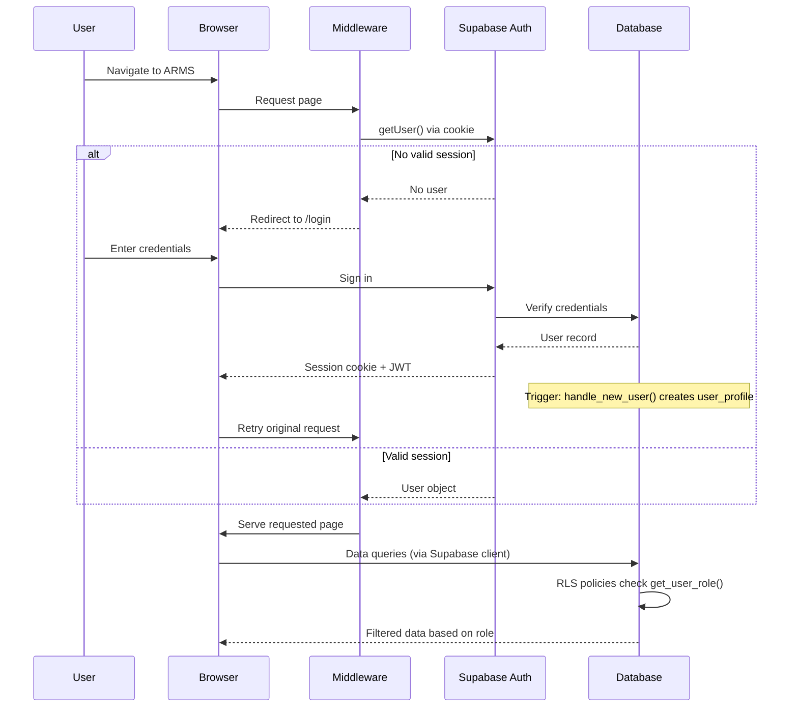

## Overview

ARMS uses a layered authentication and authorization architecture built on three components:

1. **Supabase Auth** -- Primary authentication provider handling user sessions, JWT tokens, and the `auth.users` table.
2. **Microsoft OAuth** -- Optional integration for Outlook email functionality, using the OAuth2 Authorization Code flow.
3. **RBAC (Role-Based Access Control)** -- Five user roles with granular permissions enforced at both database (RLS) and application (navigation filtering) levels.

## Authentication flow



## Architecture layers

### Layer 1: Next.js middleware

The middleware intercepts every request (except static assets) and validates the user session through the Supabase server client. It handles two routing rules:

- **Unauthenticated users** are redirected to `/login`
- **Authenticated users** on the login page are redirected to `/` (dashboard)

```typescript middleware.ts
const { data: { user } } = await supabase.auth.getUser();

if (!user && !isLoginPage) {
  return NextResponse.redirect(loginUrl);
}

if (user && isLoginPage) {
  return NextResponse.redirect(homeUrl);
}
```

### Layer 2: Supabase Auth

Supabase Auth manages the complete authentication lifecycle:

- User registration and login
- Session management via HTTP-only cookies
- JWT token issuance and verification
- The `auth.users` table (managed by Supabase)

When a new user signs up, a database trigger (`handle_new_user`) automatically creates a corresponding `user_profile` record with the default `read_only` role.

### Layer 3: Database RLS

Row Level Security policies enforce data access at the PostgreSQL level. Every query passes through `get_user_role()` to determine what the current user can see and modify. This ensures that even if the application layer has a bug, unauthorized data access is prevented.

### Layer 4: Application RBAC

The `lib/rbac.ts` module controls which navigation items and modules are visible to each role. This provides a consistent user experience where users only see features they have access to.

## Security boundaries

| Layer | Enforces | Bypass risk |
|-------|----------|-------------|
| Middleware | Route protection (login required) | Low -- server-side check on every request |
| Supabase Auth | Identity verification, session validity | Low -- managed by Supabase infrastructure |
| RLS policies | Data access per role per table | None -- enforced at database level |
| Application RBAC | UI navigation visibility | Medium -- cosmetic only, RLS provides true security |

> [!warning]
> The application-level RBAC (navigation filtering) is a **convenience layer**, not a security boundary. The real access control happens at the database level through RLS policies. Even if a user navigates to a restricted URL, the database will deny data access based on their role.


## Related pages

- **[[technical/auth/supabase-auth|Supabase Auth]]** — Session management, user profiles, and automatic logout configuration.

  - **[[technical/auth/microsoft-oauth|Microsoft OAuth]]** — OAuth2 flow for Outlook email integration.

  - **[[technical/auth/rbac|RBAC]]** — Role definitions, access matrix, and navigation filtering.

  - **[[technical/database/rls-policies|RLS policies]]** — Database-level access control policies for all tables.
