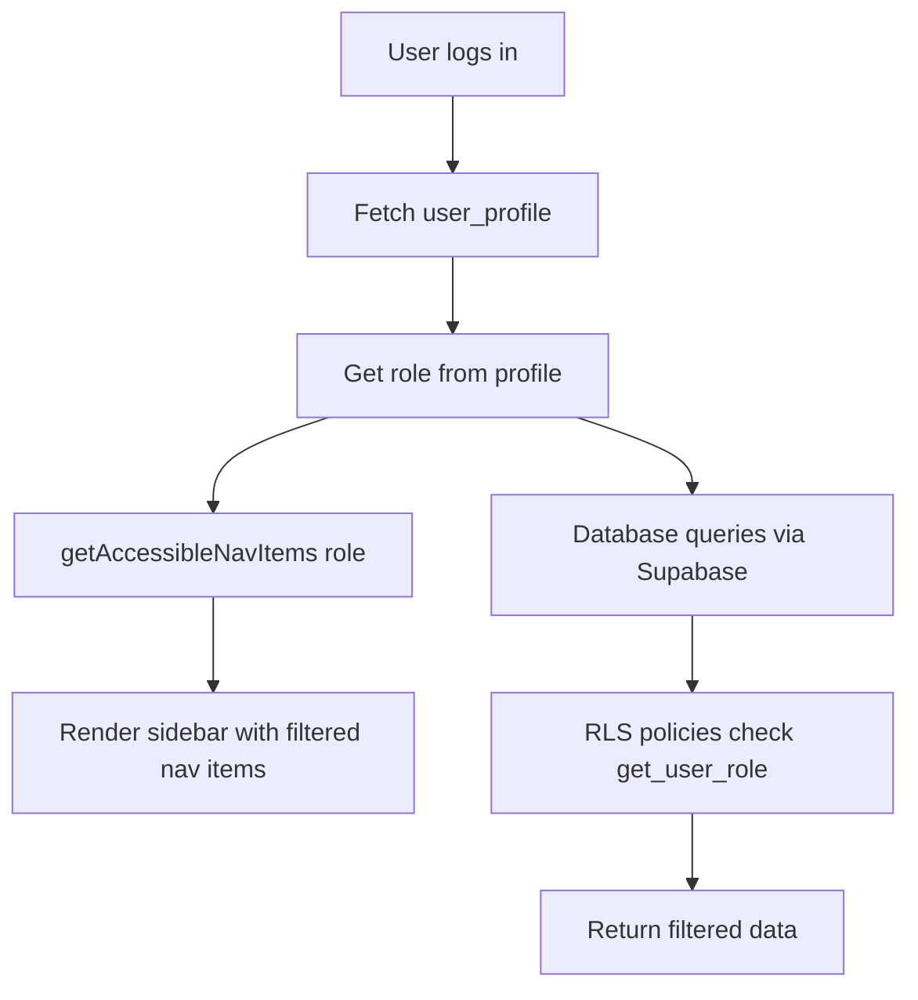

## Overview

ARMS implements role-based access control (RBAC) at two levels:

1. **Database level** -- RLS policies enforce data access per role (documented in [RLS policies](/technical/database/rls-policies)).
2. **Application level** -- The `lib/rbac.ts` module controls which navigation items and modules each role can access, providing a consistent UI experience.

## Roles

The system defines five roles via the `user_role` PostgreSQL enum:

| Role | Description | Typical user |
|------|-------------|-------------|
| `admin` | Full access to all modules and all CRUD operations | System administrators |
| `commercial` | Manages customers, offers, and contracts | Sales staff |
| `accounting` | Manages invoices and financial data | Finance department |
| `fleet_manager` | Manages trailers, inspections, and fleet operations | Fleet operations staff |
| `read_only` | View-only access to most modules | Auditors, consultants |

<Callout kind="info">
  New users are automatically assigned the `read_only` role when they first sign up. An administrator must explicitly change their role through the user management interface.
</Callout>

## Module access matrix

The following table shows which application modules each role can access. This matrix is enforced in the application through the `accessMatrix` in `lib/rbac.ts`.

| Module | Admin | Commercial | Accounting | Fleet Manager | Read Only |
|--------|-------|------------|------------|---------------|-----------|
| Dashboard | Yes | Yes | Yes | Yes | Yes |
| Fleet | Yes | Yes | Yes | Yes | Yes |
| Customers | Yes | Yes | Yes | Yes | Yes |
| Offers | Yes | Yes | Yes | No | Yes |
| Contracts | Yes | Yes | Yes | Yes | Yes |
| Invoices | Yes | Yes | Yes | No | Yes |
| Planning | Yes | Yes | No | Yes | Yes |
| Templates | Yes | No | No | No | No |
| Parameters | Yes | No | No | No | No |

<Callout kind="alert">
  The module access matrix controls **navigation visibility** only. Data-level access is enforced by the database RLS policies. A user who accesses a restricted URL directly will see an empty page (no data returned) rather than an error, because the RLS policies silently filter out unauthorized records.
</Callout>

## Implementation

### Type definitions

```typescript lib/rbac.ts
export type UserRole =
  | "admin"
  | "commercial"
  | "accounting"
  | "fleet_manager"
  | "read_only";

export interface NavItem {
  key: string;
  label: string;
  href: string;
  icon: LucideIcon;
}
```

### Navigation items

All possible navigation items are defined in a single array:

```typescript lib/rbac.ts
const allNavItems: NavItem[] = [
  { key: "dashboard",  label: "Dashboard",   href: "/",           icon: LayoutDashboard },
  { key: "fleet",      label: "Vloot",       href: "/fleet",      icon: Truck },
  { key: "customers",  label: "Klanten",     href: "/customers",  icon: Users },
  { key: "offers",     label: "Offertes",    href: "/offers",     icon: FileText },
  { key: "contracts",  label: "Contracten",  href: "/contracts",  icon: Handshake },
  { key: "invoices",   label: "Facturatie",  href: "/invoices",   icon: Receipt },
  { key: "planning",   label: "Planning",    href: "/planning",   icon: CalendarDays },
  { key: "templates",  label: "Templates",   href: "/templates",  icon: FileStack },
  { key: "parameters", label: "Parameters",  href: "/parameters", icon: SlidersHorizontal },
];
```

### Access matrix

The access matrix maps each role to its set of accessible module keys:

```typescript lib/rbac.ts
const accessMatrix: Record<UserRole, Set<string>> = {
  admin: new Set([
    "dashboard", "fleet", "customers", "offers",
    "contracts", "invoices", "planning", "templates", "parameters",
  ]),
  commercial: new Set([
    "dashboard", "fleet", "customers", "offers",
    "contracts", "invoices", "planning",
  ]),
  accounting: new Set([
    "dashboard", "fleet", "customers", "offers",
    "contracts", "invoices",
  ]),
  fleet_manager: new Set([
    "dashboard", "fleet", "customers", "contracts", "planning",
  ]),
  read_only: new Set([
    "dashboard", "fleet", "customers", "offers",
    "contracts", "invoices", "planning",
  ]),
};
```

### Functions

#### getAccessibleNavItems

Returns the filtered list of `NavItem` objects accessible to a given role.

```typescript lib/rbac.ts
export function getAccessibleNavItems(role: UserRole): NavItem[] {
  const allowed = accessMatrix[role];
  return allNavItems.filter((item) => allowed.has(item.key));
}
```

**Usage example:**

```typescript
const navItems = getAccessibleNavItems("commercial");
// Returns: Dashboard, Fleet, Customers, Offers, Contracts, Invoices, Planning
```

#### getAccessibleModuleKeys

Returns just the module key strings accessible to a given role, without the full `NavItem` objects.

```typescript lib/rbac.ts
export function getAccessibleModuleKeys(role: UserRole): string[] {
  return [...accessMatrix[role]];
}
```

#### getNavKeyForSegment

Maps a URL path segment to its corresponding navigation key. Used for breadcrumb resolution and active-state highlighting.

```typescript lib/rbac.ts
export function getNavKeyForSegment(segment: string): string | undefined {
  return segmentToNavKey[segment];
}
```

**Example:** `getNavKeyForSegment("fleet")` returns `"fleet"`, `getNavKeyForSegment("customers")` returns `"customers"`.

## RBAC enforcement flow



## Relationship to RLS policies

The application RBAC and database RLS are complementary:

| Aspect | Application RBAC | Database RLS |
|--------|-----------------|-------------|
| **Scope** | Navigation and UI visibility | Data access per table per operation |
| **Enforcement** | Client/server rendering | PostgreSQL query execution |
| **Bypassable** | Yes (direct URL access) | No (enforced at database level) |
| **Granularity** | Module level | Table and row level |
| **Purpose** | User experience | Security |

## Related pages

<Columns cols="2">
  <Card title="RLS policies" href="/technical/database/rls-policies" icon="shield" horizontal={false}>
    Database-level access control and the complete policy listing.
  </Card>

  <Card title="Authentication overview" href="/technical/auth/overview" icon="lock" horizontal={false}>
    How RBAC fits into the overall authentication architecture.
  </Card>
</Columns>
