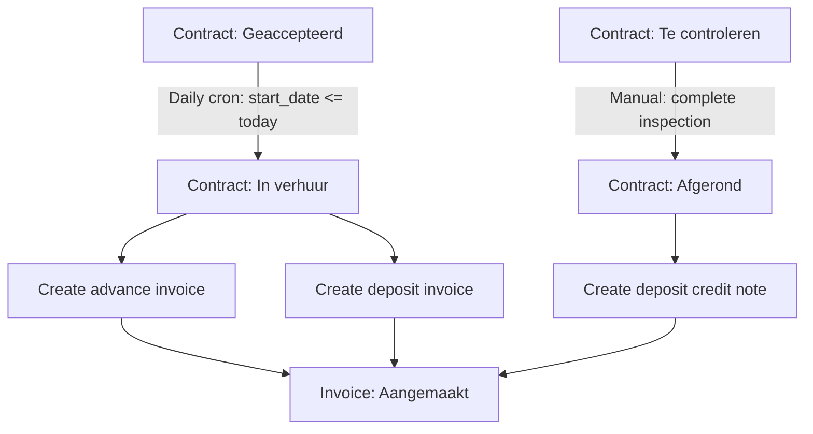

## Overview

ARMS uses automatic transitions to advance contract and trailer statuses based on date conditions and business rules. These transitions run via a daily cron job and trigger side effects such as invoice generation.

## Daily cron: Geaccepteerd to In verhuur

### Trigger condition

The database function `auto_transition_accepted_contracts()` runs daily (scheduled at 01:00 UTC via pg_cron). It transitions all contracts from **Geaccepteerd** to **In verhuur** where the effective start date has been reached.

```sql
-- Effective start = rental_start_real if set, otherwise rental_start_estimated
UPDATE contract
   SET status_id = in_rental_id,
       updated_on = now()
 WHERE status_id = accepted_id
   AND COALESCE(rental_start_real, rental_start_estimated) <= current_date;
```

### How it works

### Step 1: Status ID lookup

The function looks up the `value_id` for both **Geaccepteerd** and **In verhuur** from the `dropdown_value` table where `category = 'contract_status'`.

### Step 2: Filter eligible contracts

It selects all contracts currently in **Geaccepteerd** status where `COALESCE(rental_start_real, rental_start_estimated) <= current_date`.

### Step 3: Bulk update

All matching contracts are updated in a single SQL statement. The function returns the count of transitioned contracts.


### Scheduling

The function can be scheduled using pg_cron:

```sql
SELECT cron.schedule(
  'auto-transition-contracts',
  '0 1 * * *',  -- daily at 01:00 UTC
  $$SELECT auto_transition_accepted_contracts()$$
);
```

Alternatively, this can be invoked by a Supabase Edge Function or any external scheduler.

> [!info]
> The function uses `SECURITY DEFINER` to execute with elevated privileges, bypassing row-level security. This is necessary because cron jobs run outside of a user session.


## Side effects: Geaccepteerd to In verhuur

When a contract transitions to **In verhuur** (whether via the cron job or the application layer), the following invoices are automatically created:

### Advance invoice

| Field | Value |
|-------|-------|
| Invoice type | `advance` (Voorschot) |
| Amount | `contract.advance_amount` |
| Status | Aangemaakt |

The advance invoice is created for the prepaid amount specified on the contract. This amount is later offset against recurring rental invoices (see [[technical/business-logic/invoice-calculations#advance-offset|Invoice calculations]]).

### Deposit invoice

| Field | Value |
|-------|-------|
| Invoice type | `deposit` (Waarborg) |
| Amount | `contract.deposit_amount` (default: 2000 EUR from parameter `DEPOSIT_DEFAULT_AMOUNT_EUR`) |
| Status | Aangemaakt |

The deposit invoice represents the security deposit held for the duration of the rental.

> [!tip]
> Both invoices are immediately visible in the invoice overview with status **Aangemaakt**. They can be sent to the customer and exported to Exact Online like any other invoice.


## Side effect: Te controleren to Afgerond

When a contract transitions from **Te controleren** to **Afgerond**, the system automatically generates a deposit credit note:

| Field | Value |
|-------|-------|
| Invoice type | `credit_note` (Creditnota) |
| Amount | Negative of the original deposit amount |
| Status | Aangemaakt |

This credit note offsets the original deposit invoice, effectively returning the deposit to the customer.

> [!warning]
> The **Afgerond** transition requires a confirmation dialog because it triggers the credit note generation. Make sure all outstanding rental invoices are finalized before completing a contract.


## Transition flow diagram



## Failure modes and recovery

### Cron job does not run

If the daily cron fails to execute, contracts remain in **Geaccepteerd** status. The next successful run will catch up and transition all eligible contracts, as the condition checks `effective_start_date <= today` (not equality).

### Missing dropdown values

The function raises an exception if the **Geaccepteerd** or **In verhuur** status dropdown values are not found. This prevents silent failures from misconfigured seed data.

```sql
IF accepted_id IS NULL OR in_rental_id IS NULL THEN
    RAISE EXCEPTION 'Contract status dropdown values not found';
END IF;
```

### Manual recovery

If automatic transition needs to be triggered outside the scheduled window, an admin can execute the function directly:

```sql
SELECT auto_transition_accepted_contracts();
-- Returns: number of contracts transitioned
```

> [!danger]
> Running the function manually will transition all eligible contracts immediately. Verify which contracts will be affected before executing by querying contracts in **Geaccepteerd** status with a past start date.


### Monitoring

To check which contracts are pending automatic transition:

```sql
SELECT c.contract_id, c.contract_name,
       COALESCE(c.rental_start_real, c.rental_start_estimated) AS effective_start
  FROM contract c
  JOIN dropdown_value dv ON c.status_id = dv.value_id
 WHERE dv.value_nl = 'Geaccepteerd'
   AND COALESCE(c.rental_start_real, c.rental_start_estimated) <= current_date;
```

## Related pages

- [[technical/state-machines/contract-status|Contract status machine]] -- full contract lifecycle
- [[technical/state-machines/invoice-status|Invoice status machine]] -- lifecycle of generated invoices
- [[technical/business-logic/invoice-calculations|Invoice calculations]] -- recurring invoice calculation logic
- [[technical/business-logic/parameterization|Parameterization]] -- deposit default amount parameter
