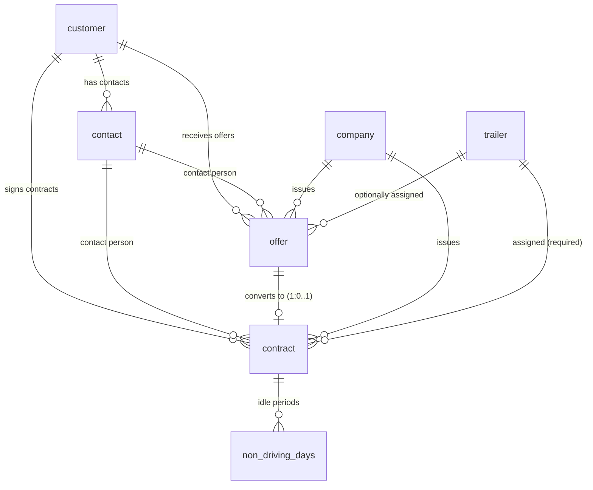

## Overview

The commercial tables manage the rental sales pipeline from customer management through offers to active contracts. The `customer` and `contact` tables are documented here alongside the offer and contract tables because they form the commercial domain together.

## Customer and contact tables

### customer

Customer companies that receive offers and sign rental contracts.

| Column | Type | Required | Description |
|--------|------|----------|-------------|
| `customer_id` | bigint (identity PK) | Yes | Auto-generated unique identifier |
| `customer_name` | text | Yes | Company display name |
| `vat_number` | text | No | VAT registration number |
| `official_name` | text | No | Legal company name |
| `street` | text | No | Street name |
| `number` | text | No | Street number |
| `postal_code` | text | No | Postal code |
| `city` | text | No | City |
| `country` | text | No | Country |
| `vat_percentage` | numeric | No | Default VAT percentage for this customer |
| `payment_conditions_id` | bigint (FK) | No | Default payment terms (references `dropdown_value`) |
| `creditworthiness` | text | No | Credit assessment notes |
| `is_active` | boolean | Yes | Whether the customer is active (default: `true`) |

**Indexes:**

| Index | Columns | Purpose |
|-------|---------|---------|
| `idx_customer_vat_number` | `vat_number` | Lookup customers by VAT number |

> [!info]- SQL definition
> ```sql
> create table customer (
>   customer_id          bigint generated always as identity primary key,
>   customer_name        text not null,
>   vat_number           text,
>   official_name        text,
>   street               text,
>   number               text,
>   postal_code          text,
>   city                 text,
>   country              text,
>   vat_percentage       numeric,
>   payment_conditions_id bigint references dropdown_value(value_id),
>   creditworthiness     text,
>   is_active            boolean not null default true,
>
>   created_on timestamptz not null default now(),
>   created_by uuid references auth.users(id),
>   updated_on timestamptz not null default now(),
>   updated_by uuid references auth.users(id)
> );
> ```


### contact

Individual contacts belonging to a customer. Contacts can be flagged for communication, invoicing, or both.

| Column | Type | Required | Description |
|--------|------|----------|-------------|
| `contact_id` | bigint (identity PK) | Yes | Auto-generated unique identifier |
| `customer_id` | bigint (FK) | Yes | Parent customer |
| `first_name` | text | Yes | First name |
| `last_name` | text | Yes | Last name |
| `email` | text | No | Email address |
| `phone` | text | No | Phone number |
| `mobile` | text | No | Mobile phone number |
| `language` | contact_language (enum) | Yes | Preferred language: `NL` or `FR` (default: `NL`) |
| `for_communication` | boolean | Yes | Use this contact for general communication (default: `false`) |
| `for_invoicing` | boolean | Yes | Use this contact for invoice delivery (default: `false`) |

**Indexes:**

| Index | Columns | Purpose |
|-------|---------|---------|
| `idx_contact_customer_id` | `customer_id` | Filter contacts by customer |

> [!info]- SQL definition
> ```sql
> create type contact_language as enum ('NL', 'FR');
>
> create table contact (
>   contact_id         bigint generated always as identity primary key,
>   customer_id        bigint not null references customer(customer_id) on delete cascade,
>   first_name         text not null,
>   last_name          text not null,
>   email              text,
>   phone              text,
>   mobile             text,
>   language           contact_language not null default 'NL',
>   for_communication  boolean not null default false,
>   for_invoicing      boolean not null default false,
>
>   created_on timestamptz not null default now(),
>   created_by uuid references auth.users(id),
>   updated_on timestamptz not null default now(),
>   updated_by uuid references auth.users(id)
> );
> ```


## offer

Rental offers sent to customers. An offer captures the desired trailer specifications, pricing, and estimated rental period. Offers may optionally convert into contracts.

| Column | Type | Required | Description |
|--------|------|----------|-------------|
| `offer_id` | bigint (identity PK) | Yes | Auto-generated unique identifier |
| `company_id` | bigint (FK) | Yes | Issuing company |
| `offer_name` | text | Yes | Display name |
| `description_internal` | text | No | Internal notes (not shown to customer) |
| `description_external` | text | No | Description visible to customer |
| `due_date` | date | Yes | Offer expiration date |
| `status_id` | bigint (FK) | Yes | Current status (references `dropdown_value`, category `offer_status`) |
| `customer_id` | bigint (FK) | Yes | Target customer |
| `vat_percentage` | numeric | Yes | VAT rate |
| `payment_conditions_id` | bigint (FK) | Yes | Payment terms (references `dropdown_value`) |
| `contact_id` | bigint (FK) | Yes | Customer contact person |
| `template_id` | text | No | Document template reference |
| `language` | contact_language (enum) | Yes | Document language: `NL` or `FR` |
| `rental_start_estimated` | date | No | Estimated rental start |
| `rental_end_estimated` | date | No | Estimated rental end |
| `unit_price_rental` | numeric | Yes | Rental unit price |
| `discount_pct` | integer | Yes | Discount percentage (default: `0`) |
| `unit_price_insurance` | numeric | Yes | Insurance unit price (default: `0`) |
| `unit` | pricing_unit (enum) | Yes | Pricing unit: `day`, `month`, or `km` |
| `desired_trailer_type_id` | bigint (FK) | Yes | Desired trailer type |
| `desired_volume` | numeric | No | Desired cargo volume |
| `desired_sheet_type_id` | bigint (FK) | No | Desired sheet type |
| `desired_model_id` | bigint (FK) | No | Desired model |
| `desired_door_type_id` | bigint (FK) | No | Desired door type |
| `plate_number` | text (FK) | No | Optionally assigned trailer |

**Indexes:**

| Index | Columns |
|-------|---------|
| `idx_offer_company_id` | `company_id` |
| `idx_offer_status_id` | `status_id` |
| `idx_offer_customer_id` | `customer_id` |
| `idx_offer_contact_id` | `contact_id` |
| `idx_offer_payment_conditions_id` | `payment_conditions_id` |
| `idx_offer_due_date` | `due_date` |
| `idx_offer_plate_number` | `plate_number` |
| `idx_offer_desired_trailer_type_id` | `desired_trailer_type_id` |

> [!info]- SQL definition
> ```sql
> create type pricing_unit as enum ('day', 'month', 'km');
>
> create table offer (
>   offer_id                bigint generated always as identity primary key,
>   company_id              bigint not null references company(company_id),
>   offer_name              text not null,
>   description_internal    text,
>   description_external    text,
>   due_date                date not null,
>   status_id               bigint not null references dropdown_value(value_id),
>   customer_id             bigint not null references customer(customer_id),
>   vat_percentage          numeric not null,
>   payment_conditions_id   bigint not null references dropdown_value(value_id),
>   contact_id              bigint not null references contact(contact_id),
>   template_id             text,
>   language                contact_language not null default 'NL',
>
>   rental_start_estimated  date,
>   rental_end_estimated    date,
>
>   unit_price_rental       numeric not null,
>   discount_pct            integer not null default 0,
>   unit_price_insurance    numeric not null default 0,
>   unit                    pricing_unit not null,
>
>   desired_trailer_type_id bigint not null references dropdown_value(value_id),
>   desired_volume          numeric,
>   desired_sheet_type_id   bigint references dropdown_value(value_id),
>   desired_model_id        bigint references dropdown_value(value_id),
>   desired_door_type_id    bigint references dropdown_value(value_id),
>
>   plate_number            text references trailer(plate_number),
>
>   created_on timestamptz not null default now(),
>   created_by uuid references auth.users(id),
>   updated_on timestamptz not null default now(),
>   updated_by uuid references auth.users(id)
> );
> ```


## contract

Rental contracts with customers. A contract may originate from an offer (1:0..1 relationship) or be created independently.

> [!info]
> The offer-to-contract relationship is **1:0..1** -- each offer can lead to at most one contract, but contracts can also be created without an offer. When converting, the contract's `offer_id` column links back to the source offer, and many fields are prefilled from the offer data.


| Column | Type | Required | Description |
|--------|------|----------|-------------|
| `contract_id` | bigint (identity PK) | Yes | Auto-generated unique identifier |
| `company_id` | bigint (FK) | Yes | Issuing company |
| `offer_id` | bigint (FK) | No | Source offer (if converted from an offer) |
| `contract_name` | text | Yes | Display name |
| `description_internal` | text | No | Internal notes |
| `description_external` | text | No | Customer-facing description |
| `free_text` | text | No | Additional free-form text |
| `status_id` | bigint (FK) | Yes | Current status (references `dropdown_value`) |
| `customer_id` | bigint (FK) | Yes | Contracting customer |
| `vat_percentage` | numeric | Yes | VAT rate |
| `payment_conditions_id` | bigint (FK) | Yes | Payment terms |
| `contact_id` | bigint (FK) | Yes | Customer contact person |
| `template_id` | text | No | Document template reference |
| `language` | contact_language (enum) | Yes | Document language |
| `rental_start_estimated` | date | Yes | Planned rental start |
| `rental_end_estimated` | date | Yes | Planned rental end |
| `rental_start_real` | date | No | Actual rental start |
| `rental_end_real` | date | No | Actual rental end |
| `unit_price_rental` | numeric | Yes | Rental unit price |
| `discount_pct` | integer | Yes | Discount percentage |
| `unit_price_insurance` | numeric | Yes | Insurance unit price |
| `unit` | pricing_unit (enum) | Yes | Pricing unit |
| `desired_trailer_type_id` | bigint (FK) | Yes | Desired trailer type |
| `desired_volume` | numeric | No | Desired volume |
| `desired_sheet_type_id` | bigint (FK) | No | Desired sheet type |
| `desired_model_id` | bigint (FK) | No | Desired model |
| `desired_door_type_id` | bigint (FK) | No | Desired door type |
| `plate_number` | text (FK) | Yes | Assigned trailer (required for contracts) |
| `invoice_to_id` | bigint (FK) | Yes | Customer to invoice (may differ from contracting customer) |
| `deposit_amount` | numeric | Yes | Deposit amount (default: `2000`) |
| `advance_amount` | numeric | Yes | Advance payment amount (default: `0`) |
| `advance_invoice_paid` | boolean | Yes | Whether advance invoice has been paid |
| `deposit_invoice_paid` | boolean | Yes | Whether deposit invoice has been paid |
| `checked_after_return` | boolean | Yes | Whether trailer was inspected after return |
| `damage_found` | boolean | Yes | Whether damage was found on return |
| `repair_order_ref` | text | No | Reference to repair order |

### Contract prefill from offer

When a contract is created from an offer, the following fields are copied:

| Offer field | Contract field |
|-------------|---------------|
| `company_id` | `company_id` |
| `customer_id` | `customer_id` |
| `contact_id` | `contact_id` |
| `vat_percentage` | `vat_percentage` |
| `payment_conditions_id` | `payment_conditions_id` |
| `language` | `language` |
| `rental_start_estimated` | `rental_start_estimated` |
| `rental_end_estimated` | `rental_end_estimated` |
| `unit_price_rental` | `unit_price_rental` |
| `discount_pct` | `discount_pct` |
| `unit_price_insurance` | `unit_price_insurance` |
| `unit` | `unit` |
| `desired_trailer_type_id` | `desired_trailer_type_id` |
| `desired_volume` | `desired_volume` |
| `desired_sheet_type_id` | `desired_sheet_type_id` |
| `desired_model_id` | `desired_model_id` |
| `desired_door_type_id` | `desired_door_type_id` |
| `plate_number` | `plate_number` |

> [!tip]
> The key difference between an offer and a contract: offers have optional `plate_number` and estimated dates, while contracts require a `plate_number` and have both estimated and actual date pairs for start and end.


> [!info]- SQL definition
> ```sql
> create table contract (
>   contract_id             bigint generated always as identity primary key,
>   company_id              bigint not null references company(company_id),
>   offer_id                bigint references offer(offer_id),
>   contract_name           text not null,
>   description_internal    text,
>   description_external    text,
>   free_text               text,
>   status_id               bigint not null references dropdown_value(value_id),
>   customer_id             bigint not null references customer(customer_id),
>   vat_percentage          numeric not null,
>   payment_conditions_id   bigint not null references dropdown_value(value_id),
>   contact_id              bigint not null references contact(contact_id),
>   template_id             text,
>   language                contact_language not null default 'NL',
>
>   rental_start_estimated  date not null,
>   rental_end_estimated    date not null,
>   rental_start_real       date,
>   rental_end_real         date,
>
>   unit_price_rental       numeric not null,
>   discount_pct            integer not null default 0,
>   unit_price_insurance    numeric not null default 0,
>   unit                    pricing_unit not null,
>
>   desired_trailer_type_id bigint not null references dropdown_value(value_id),
>   desired_volume          numeric,
>   desired_sheet_type_id   bigint references dropdown_value(value_id),
>   desired_model_id        bigint references dropdown_value(value_id),
>   desired_door_type_id    bigint references dropdown_value(value_id),
>
>   plate_number            text not null references trailer(plate_number),
>   invoice_to_id           bigint not null references customer(customer_id),
>
>   deposit_amount          numeric not null default 2000,
>   advance_amount          numeric not null default 0,
>   advance_invoice_paid    boolean not null default false,
>   deposit_invoice_paid    boolean not null default false,
>
>   checked_after_return    boolean not null default false,
>   damage_found            boolean not null default false,
>   repair_order_ref        text,
>
>   created_on timestamptz not null default now(),
>   created_by uuid references auth.users(id),
>   updated_on timestamptz not null default now(),
>   updated_by uuid references auth.users(id)
> );
> ```


## non_driving_days

Periods within a contract where the trailer is idle and should not be billed. A trigger validates that dates fall within the contract's effective rental period.

| Column | Type | Required | Description |
|--------|------|----------|-------------|
| `ndd_id` | bigint (identity PK) | Yes | Auto-generated unique identifier |
| `contract_id` | bigint (FK) | Yes | Parent contract |
| `start_date` | date | Yes | Start of idle period |
| `end_date` | date | Yes | End of idle period |

**Constraints:**

| Constraint | Type | Description |
|------------|------|-------------|
| `chk_ndd_dates` | CHECK | `end_date >= start_date` |

**Trigger:** `trg_ndd_within_contract_period` validates that `start_date` and `end_date` fall within the contract's effective rental period, computed as `coalesce(rental_start_real, rental_start_estimated)` to `coalesce(rental_end_real, rental_end_estimated)`.

> [!info]- Trigger function
> ```sql
> create or replace function check_ndd_within_contract_period()
> returns trigger as $$
> declare
>   v_start date;
>   v_end   date;
> begin
>   select
>     coalesce(rental_start_real, rental_start_estimated),
>     coalesce(rental_end_real, rental_end_estimated)
>   into v_start, v_end
>   from contract
>   where contract_id = new.contract_id;
>
>   if new.start_date < v_start or new.end_date > v_end then
>     raise exception 'Non-driving days (% to %) must fall within contract period (% to %)',
>       new.start_date, new.end_date, v_start, v_end;
>   end if;
>
>   return new;
> end;
> $$ language plpgsql security definer;
> ```


## Relationships diagram



## Related pages

- **[[technical/database/invoice-tables|Invoice tables]]** — Invoicing tables linked to contracts.

  - **[[technical/database/rls-policies|RLS policies]]** — Commercial tables are writable by admin and commercial roles.
