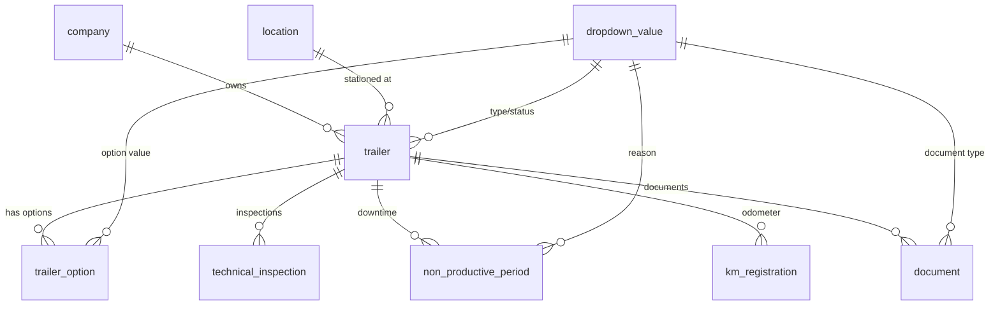

## Overview

The fleet tables manage the core trailer inventory, technical inspections, maintenance downtime, odometer tracking, and document storage. These tables are readable by all authenticated users and writable by `admin` and `fleet_manager` roles.

## trailer

The primary fleet management table. Each trailer is uniquely identified by its license plate number.

> [!warning]
> The `trailer` table uses `plate_number` (text) as its primary key instead of an auto-incrementing integer. This is a natural key design -- plate numbers are real-world unique identifiers. All child tables reference `plate_number` directly.


| Column | Type | Required | Description |
|--------|------|----------|-------------|
| `plate_number` | text (PK) | Yes | License plate number (natural primary key) |
| `trailer_ref` | text (unique) | Yes | Internal trailer reference code |
| `nickname` | text | No | Optional friendly name |
| `chassis_number` | text | Yes | Vehicle chassis number |
| `date_first_registration` | date | Yes | Date of first registration |
| `construction_year` | integer | Yes | Year of manufacture |
| `initial_customer` | text | No | First customer the trailer was assigned to |
| `brand` | text | No | Manufacturer brand |
| `trailer_number` | text | No | Manufacturer serial number |
| `status_id` | bigint (FK) | Yes | Current status (references `dropdown_value`) |
| `company_id` | bigint (FK) | Yes | Owning company |
| `location_id` | bigint (FK) | Yes | Current physical location |
| `trailer_type_id` | bigint (FK) | Yes | Trailer type (references `dropdown_value`) |
| `volume` | numeric | Yes | Cargo volume |
| `sheet_type_id` | bigint (FK) | Yes | Sheet/tarpaulin type (references `dropdown_value`) |
| `model_id` | bigint (FK) | Yes | Trailer model (references `dropdown_value`) |
| `door_type_id` | bigint (FK) | Yes | Door type (references `dropdown_value`) |
| `chassis_material_id` | bigint (FK) | No | Chassis material (references `dropdown_value`) |
| `rim_material_id` | bigint (FK) | No | Rim material (references `dropdown_value`) |
| `empty_weight_kg` | integer | No | Empty weight in kilograms |
| `max_weight_kg` | integer | No | Maximum allowed weight in kilograms |
| `remarks` | text | No | Free-text notes |

> [!info]
> The display name shown in the UI is computed as `trailer_ref + " - " + plate_number`. This concatenation happens in the application layer, not in the database.


**Indexes:**

| Index | Columns | Purpose |
|-------|---------|---------|
| `idx_trailer_company_id` | `company_id` | Filter trailers by company |
| `idx_trailer_location_id` | `location_id` | Filter trailers by location |
| `idx_trailer_status_id` | `status_id` | Filter trailers by status |
| `idx_trailer_trailer_type_id` | `trailer_type_id` | Filter trailers by type |

> [!info]- SQL definition
> ```sql
> create table trailer (
>   plate_number            text primary key,
>   trailer_ref             text not null unique,
>   nickname                text,
>   chassis_number          text not null,
>   date_first_registration date not null,
>   construction_year       integer not null,
>   initial_customer        text,
>   brand                   text,
>   trailer_number          text,
>
>   status_id               bigint not null references dropdown_value(value_id),
>   company_id              bigint not null references company(company_id),
>   location_id             bigint not null references location(location_id),
>
>   trailer_type_id         bigint not null references dropdown_value(value_id),
>   volume                  numeric not null,
>   sheet_type_id           bigint not null references dropdown_value(value_id),
>   model_id                bigint not null references dropdown_value(value_id),
>   door_type_id            bigint not null references dropdown_value(value_id),
>   chassis_material_id     bigint references dropdown_value(value_id),
>   rim_material_id         bigint references dropdown_value(value_id),
>
>   empty_weight_kg         integer,
>   max_weight_kg           integer,
>   remarks                 text,
>
>   created_on timestamptz not null default now(),
>   created_by uuid references auth.users(id),
>   updated_on timestamptz not null default now(),
>   updated_by uuid references auth.users(id)
> );
> ```


## trailer_option

Junction table linking trailers to extra options. Each option is a `dropdown_value` with category `trailer_extra_options`.

| Column | Type | Required | Description |
|--------|------|----------|-------------|
| `plate_number` | text (PK, FK) | Yes | Trailer reference |
| `dropdown_value_id` | bigint (PK, FK) | Yes | Option value reference |

The primary key is a composite of `(plate_number, dropdown_value_id)`. Deleting a trailer cascades to remove its options.

> [!info]- SQL definition
> ```sql
> create table trailer_option (
>   plate_number      text not null references trailer(plate_number) on delete cascade,
>   dropdown_value_id bigint not null references dropdown_value(value_id),
>   primary key (plate_number, dropdown_value_id),
>
>   created_on timestamptz not null default now(),
>   created_by uuid references auth.users(id),
>   updated_on timestamptz not null default now(),
>   updated_by uuid references auth.users(id)
> );
> ```


## technical_inspection

Records of technical inspection validity periods per trailer. Multiple records per trailer are stored for history. The active inspection is the most recent record where `valid_to >= current_date`.

| Column | Type | Required | Description |
|--------|------|----------|-------------|
| `inspection_id` | bigint (identity PK) | Yes | Auto-generated unique identifier |
| `plate_number` | text (FK) | Yes | Trailer reference |
| `valid_from` | date | Yes | Inspection validity start date |
| `valid_to` | date | Yes | Inspection validity end date |

**Constraints:**

| Constraint | Type | Description |
|------------|------|-------------|
| `chk_inspection_dates` | CHECK | `valid_to >= valid_from` |

**Indexes:**

| Index | Columns | Purpose |
|-------|---------|---------|
| `idx_technical_inspection_plate` | `plate_number` | Filter inspections by trailer |
| `idx_technical_inspection_valid_to` | `valid_to` | Find expiring inspections |

> [!info]- SQL definition
> ```sql
> create table technical_inspection (
>   inspection_id bigint generated always as identity primary key,
>   plate_number  text not null references trailer(plate_number) on delete cascade,
>   valid_from    date not null,
>   valid_to      date not null,
>
>   created_on timestamptz not null default now(),
>   created_by uuid references auth.users(id),
>   updated_on timestamptz not null default now(),
>   updated_by uuid references auth.users(id),
>
>   constraint chk_inspection_dates check (valid_to >= valid_from)
> );
> ```


## non_productive_period

Periods when a trailer is out of service due to damage, inspection, or maintenance. An `EXCLUDE` constraint prevents overlapping periods for the same trailer.

| Column | Type | Required | Description |
|--------|------|----------|-------------|
| `np_period_id` | bigint (identity PK) | Yes | Auto-generated unique identifier |
| `plate_number` | text (FK) | Yes | Trailer reference |
| `start_date` | date | Yes | Start of downtime period |
| `end_date` | date | Yes | End of downtime period |
| `reason_id` | bigint (FK) | Yes | Reason for downtime (references `dropdown_value`) |

**Constraints:**

| Constraint | Type | Description |
|------------|------|-------------|
| `chk_np_dates` | CHECK | `end_date >= start_date` |
| `excl_np_overlap` | EXCLUDE (GiST) | Prevents overlapping periods for the same trailer |

> [!tip]
> The overlap prevention constraint uses the `btree_gist` extension. It combines text equality (`plate_number with =`) with daterange overlap (`daterange(start_date, end_date, '[]') with &&`) to ensure no two non-productive periods for the same trailer overlap.


**Indexes:**

| Index | Columns | Purpose |
|-------|---------|---------|
| `idx_np_period_plate` | `plate_number` | Filter periods by trailer |
| `idx_np_period_dates` | `start_date, end_date` | Date range queries |

> [!info]- SQL definition
> ```sql
> create extension if not exists btree_gist;
>
> create table non_productive_period (
>   np_period_id bigint generated always as identity primary key,
>   plate_number text not null references trailer(plate_number) on delete cascade,
>   start_date   date not null,
>   end_date     date not null,
>   reason_id    bigint not null references dropdown_value(value_id),
>
>   created_on timestamptz not null default now(),
>   created_by uuid references auth.users(id),
>   updated_on timestamptz not null default now(),
>   updated_by uuid references auth.users(id),
>
>   constraint chk_np_dates check (end_date >= start_date),
>   constraint excl_np_overlap exclude using gist (
>     plate_number with =,
>     daterange(start_date, end_date, '[]') with &&
>   )
> );
> ```


## km_registration

Time-series table of odometer readings per trailer. Used for km-based billing and fleet tracking.

| Column | Type | Required | Description |
|--------|------|----------|-------------|
| `km_reg_id` | bigint (identity PK) | Yes | Auto-generated unique identifier |
| `plate_number` | text (FK) | Yes | Trailer reference |
| `registration_date` | date | Yes | Date of the reading |
| `km_amount` | numeric | Yes | Odometer value in kilometers |

**Indexes:**

| Index | Columns | Purpose |
|-------|---------|---------|
| `idx_km_reg_plate` | `plate_number` | Filter readings by trailer |
| `idx_km_reg_date` | `registration_date` | Chronological queries |

> [!info]- SQL definition
> ```sql
> create table km_registration (
>   km_reg_id         bigint generated always as identity primary key,
>   plate_number      text not null references trailer(plate_number) on delete cascade,
>   registration_date date not null,
>   km_amount         numeric not null,
>
>   created_on timestamptz not null default now(),
>   created_by uuid references auth.users(id),
>   updated_on timestamptz not null default now(),
>   updated_by uuid references auth.users(id)
> );
> ```


## document

Polymorphic document storage table. Documents can be attached to any entity type (trailer, contract, offer, inspection) using the `entity_type` and `entity_id` columns.

| Column | Type | Required | Description |
|--------|------|----------|-------------|
| `document_id` | bigint (identity PK) | Yes | Auto-generated unique identifier |
| `entity_type` | entity_type (enum) | Yes | Parent entity type: `trailer`, `contract`, `offer`, or `inspection` |
| `entity_id` | text | Yes | Identifier of the parent entity |
| `filename` | text | Yes | Original filename |
| `storage_path` | text | Yes | Path in Supabase Storage |
| `mime_type` | text | Yes | MIME content type |
| `file_size_bytes` | bigint | Yes | File size in bytes |
| `document_type_id` | bigint (FK) | Yes | Document category (references `dropdown_value`) |
| `uploaded_by` | uuid (FK) | No | User who uploaded the document |
| `upload_date` | timestamptz | Yes | When the document was uploaded |

> [!warning]
> The `document` table uses a **polymorphic foreign key pattern**. The `entity_type` enum determines which table `entity_id` references. For example, when `entity_type = 'trailer'`, `entity_id` contains a `plate_number`. When `entity_type = 'contract'`, `entity_id` contains a `contract_id` cast to text. This pattern trades referential integrity for flexibility.


**Indexes:**

| Index | Columns | Purpose |
|-------|---------|---------|
| `idx_document_entity` | `entity_type, entity_id` | Find all documents for an entity |
| `idx_document_type_id` | `document_type_id` | Filter by document category |

> [!info]- SQL definition
> ```sql
> create type entity_type as enum ('trailer', 'contract', 'offer', 'inspection');
>
> create table document (
>   document_id     bigint generated always as identity primary key,
>   entity_type     entity_type not null,
>   entity_id       text not null,
>   filename        text not null,
>   storage_path    text not null,
>   mime_type       text not null,
>   file_size_bytes bigint not null,
>   document_type_id bigint not null references dropdown_value(value_id),
>   uploaded_by     uuid references auth.users(id),
>   upload_date     timestamptz not null default now(),
>
>   created_on timestamptz not null default now(),
>   created_by uuid references auth.users(id),
>   updated_on timestamptz not null default now(),
>   updated_by uuid references auth.users(id)
> );
>
> create index idx_document_entity on document(entity_type, entity_id);
> create index idx_document_type_id on document(document_type_id);
> ```


## Relationships diagram



## Related pages

- **[[technical/database/schema-overview|Schema overview]]** — High-level ER diagram and complete table listing.

  - **[[technical/database/rls-policies|RLS policies]]** — Fleet tables are writable by admin and fleet_manager roles.
