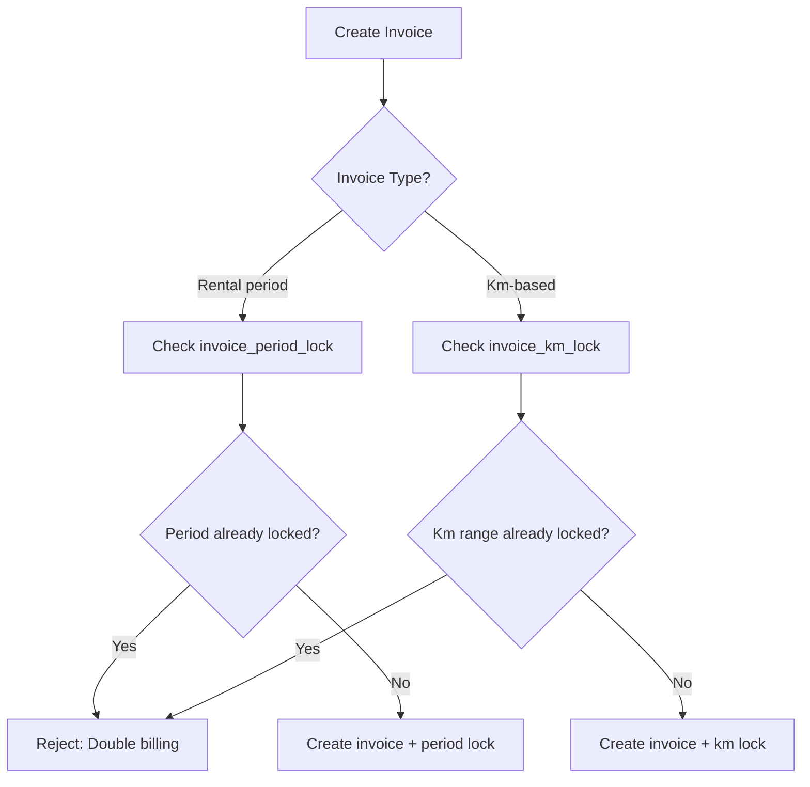
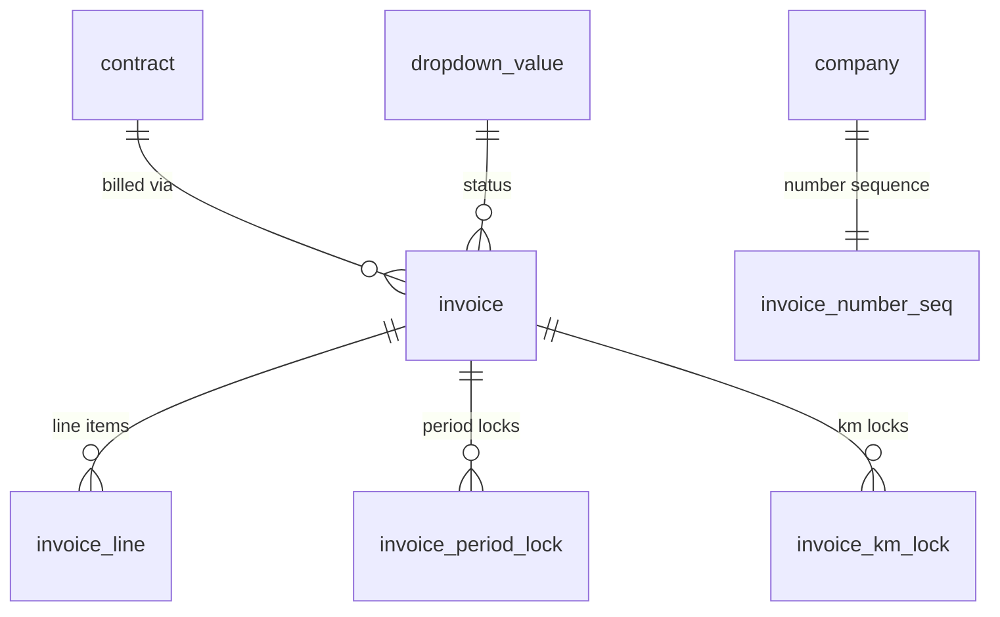

## Overview

The invoice tables handle billing for rental contracts. The schema includes an anti-double-invoicing mechanism through lock tables that track which date ranges and km ranges have already been billed. Invoice numbers are generated per company using an atomic sequence function.

These tables are readable by `admin`, `accounting`, `commercial`, and `read_only` roles. Only `admin` and `accounting` can create, update, or delete invoices.

## invoice_number_seq

Per-company invoice number sequences. Each company maintains its own incrementing counter to generate unique invoice numbers.

| Column | Type | Required | Description |
|--------|------|----------|-------------|
| `company_id` | bigint (PK, FK) | Yes | Company reference (one row per company) |
| `current_number` | bigint | Yes | Last generated invoice number (default: `0`) |

### next_invoice_number function

The `next_invoice_number()` function atomically generates the next invoice number for a given company. It uses `INSERT ... ON CONFLICT DO UPDATE` with row-level locking to prevent concurrent duplicates.

```sql
create or replace function next_invoice_number(p_company_id bigint)
returns bigint as $$
declare
  v_next bigint;
begin
  insert into invoice_number_seq (company_id, current_number)
  values (p_company_id, 1)
  on conflict (company_id) do update
    set current_number = invoice_number_seq.current_number + 1
  returning current_number into v_next;

  return v_next;
end;
$$ language plpgsql security definer;
```

> [!info]
> This function is declared as `security definer` to bypass RLS policies on `invoice_number_seq`. This is necessary because the function needs to read and write the sequence table regardless of the calling user's role.


## invoice

Invoices linked to rental contracts. Each invoice has a type that determines its purpose in the billing lifecycle.

| Column | Type | Required | Description |
|--------|------|----------|-------------|
| `invoice_id` | bigint (identity PK) | Yes | Auto-generated unique identifier |
| `contract_id` | bigint (FK) | Yes | Associated contract |
| `invoice_number` | text | Yes | Company-specific invoice number |
| `invoice_date` | date | Yes | Date of invoice creation |
| `due_date` | date | Yes | Payment due date |
| `invoice_type` | invoice_type (enum) | Yes | Type: `rental`, `advance`, `deposit`, `credit_note`, or `damage` |
| `status_id` | bigint (FK) | Yes | Current status (references `dropdown_value`) |
| `exactonline_ref` | text | No | Exact Online integration reference |
| `exactonline_status` | text | No | Sync status with Exact Online |
| `advance_offset_amount` | numeric | Yes | Advance payment offset (default: `0`) |

**Invoice types:**

| Type | Description |
|------|-------------|
| `rental` | Regular rental period invoice |
| `advance` | Advance payment invoice |
| `deposit` | Deposit invoice |
| `credit_note` | Credit note (reversal) |
| `damage` | Damage invoice after trailer return |

**Indexes:**

| Index | Columns | Purpose |
|-------|---------|---------|
| `idx_invoice_contract_id` | `contract_id` | Find invoices by contract |
| `idx_invoice_invoice_date` | `invoice_date` | Chronological queries |
| `idx_invoice_status_id` | `status_id` | Filter by status |
| `idx_invoice_invoice_number` | `invoice_number` | Lookup by invoice number |

> [!info]- SQL definition
> ```sql
> create type invoice_type as enum ('rental', 'advance', 'deposit', 'credit_note', 'damage');
>
> create table invoice (
>   invoice_id            bigint generated always as identity primary key,
>   contract_id           bigint not null references contract(contract_id),
>   invoice_number        text not null,
>   invoice_date          date not null,
>   due_date              date not null,
>   invoice_type          invoice_type not null,
>   status_id             bigint not null references dropdown_value(value_id),
>   exactonline_ref       text,
>   exactonline_status    text,
>   advance_offset_amount numeric not null default 0,
>
>   created_on timestamptz not null default now(),
>   created_by uuid references auth.users(id),
>   updated_on timestamptz not null default now(),
>   updated_by uuid references auth.users(id)
> );
> ```


## invoice_line

Individual line items on an invoice. The `line_total_excl_vat` column stores the computed total for convenience.

| Column | Type | Required | Description |
|--------|------|----------|-------------|
| `line_id` | bigint (identity PK) | Yes | Auto-generated unique identifier |
| `invoice_id` | bigint (FK) | Yes | Parent invoice |
| `description` | text | Yes | Line item description |
| `quantity` | numeric | Yes | Quantity |
| `unit` | text | No | Unit of measure |
| `unit_price` | numeric | Yes | Price per unit |
| `discount_pct` | numeric | Yes | Discount percentage (default: `0`) |
| `vat_percentage` | numeric | Yes | VAT rate for this line |
| `line_total_excl_vat` | numeric | Yes | Computed: `quantity * unit_price * (1 - discount_pct / 100)` |

**Indexes:**

| Index | Columns | Purpose |
|-------|---------|---------|
| `idx_invoice_line_invoice_id` | `invoice_id` | Find lines by invoice |

> [!info]- SQL definition
> ```sql
> create table invoice_line (
>   line_id              bigint generated always as identity primary key,
>   invoice_id           bigint not null references invoice(invoice_id) on delete cascade,
>   description          text not null,
>   quantity             numeric not null,
>   unit                 text,
>   unit_price           numeric not null,
>   discount_pct         numeric not null default 0,
>   vat_percentage       numeric not null,
>   line_total_excl_vat  numeric not null,
>
>   created_on timestamptz not null default now(),
>   created_by uuid references auth.users(id),
>   updated_on timestamptz not null default now(),
>   updated_by uuid references auth.users(id)
> );
> ```


## Anti-double-invoicing mechanism

The lock tables prevent billing the same date range or km range twice for a contract. When an invoice is created, corresponding lock records are inserted to mark the covered periods and distances as billed.



### invoice_period_lock

Records the rental date range that has been invoiced for a contract. Each lock row ties a specific date range to a specific invoice.

| Column | Type | Required | Description |
|--------|------|----------|-------------|
| `lock_id` | bigint (identity PK) | Yes | Auto-generated unique identifier |
| `contract_id` | bigint (FK) | Yes | Contract that was invoiced |
| `invoice_id` | bigint (FK) | Yes | Invoice that covers this period |
| `locked_from` | date | Yes | Start of the invoiced period |
| `locked_to` | date | Yes | End of the invoiced period |

**Constraints:**

| Constraint | Type | Description |
|------------|------|-------------|
| `chk_period_lock_dates` | CHECK | `locked_to >= locked_from` |

**Indexes:**

| Index | Columns | Purpose |
|-------|---------|---------|
| `idx_invoice_period_lock_contract_id` | `contract_id` | Find locks by contract |
| `idx_invoice_period_lock_invoice_id` | `invoice_id` | Find locks by invoice |

> [!info]- SQL definition
> ```sql
> create table invoice_period_lock (
>   lock_id      bigint generated always as identity primary key,
>   contract_id  bigint not null references contract(contract_id),
>   invoice_id   bigint not null references invoice(invoice_id),
>   locked_from  date not null,
>   locked_to    date not null,
>
>   created_on timestamptz not null default now(),
>   created_by uuid references auth.users(id),
>   updated_on timestamptz not null default now(),
>   updated_by uuid references auth.users(id),
>
>   constraint chk_period_lock_dates check (locked_to >= locked_from)
> );
> ```


### invoice_km_lock

Records the km range that has been invoiced for a contract. Prevents double billing of the same kilometer range.

| Column | Type | Required | Description |
|--------|------|----------|-------------|
| `km_lock_id` | bigint (identity PK) | Yes | Auto-generated unique identifier |
| `contract_id` | bigint (FK) | Yes | Contract that was invoiced |
| `invoice_id` | bigint (FK) | Yes | Invoice that covers this range |
| `km_from` | numeric | Yes | Start of the invoiced km range |
| `km_to` | numeric | Yes | End of the invoiced km range |

**Constraints:**

| Constraint | Type | Description |
|------------|------|-------------|
| `chk_km_lock_range` | CHECK | `km_to >= km_from` |

**Indexes:**

| Index | Columns | Purpose |
|-------|---------|---------|
| `idx_invoice_km_lock_contract_id` | `contract_id` | Find locks by contract |
| `idx_invoice_km_lock_invoice_id` | `invoice_id` | Find locks by invoice |

> [!info]- SQL definition
> ```sql
> create table invoice_km_lock (
>   km_lock_id   bigint generated always as identity primary key,
>   contract_id  bigint not null references contract(contract_id),
>   invoice_id   bigint not null references invoice(invoice_id),
>   km_from      numeric not null,
>   km_to        numeric not null,
>
>   created_on timestamptz not null default now(),
>   created_by uuid references auth.users(id),
>   updated_on timestamptz not null default now(),
>   updated_by uuid references auth.users(id),
>
>   constraint chk_km_lock_range check (km_to >= km_from)
> );
> ```


## Relationships diagram



## Related pages

- **[[technical/database/commercial-tables|Commercial tables]]** — Contracts and offers that invoices are generated from.

  - **[[technical/database/rls-policies|RLS policies]]** — Invoice tables are writable by admin and accounting roles.
