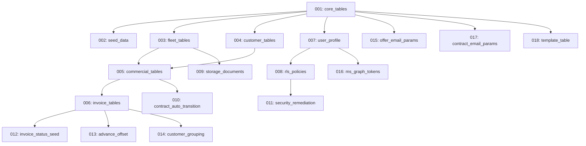

## Overview

ARMS uses Supabase migrations to manage the PostgreSQL database schema. All migration files are in `supabase/migrations/` and are numbered sequentially to ensure correct execution order.

## Migration list

| # | File | Description |
|---|------|-------------|
| 1 | `20260303000001_core_tables.sql` | Core foundation tables: `company`, `dropdown_value`, `parameter`. The `dropdown_value` table stores all configurable lookup values (statuses, types, options). |
| 2 | `20260303000002_seed_data.sql` | Seed data for dropdown values (trailer statuses, types, sheet types, models, door types, chassis materials, rim materials, options, locations, payment conditions), initial parameters, and company records. |
| 3 | `20260303000003_fleet_tables.sql` | Fleet management tables: `trailer`, `trailer_option` (junction table for trailer-to-option many-to-many), `inspection`, `km_registration`, `non_productive_period`. |
| 4 | `20260303000004_customer_tables.sql` | Customer tables: `customer`, `contact`. Includes fields for VAT number, address, payment conditions, and creditworthiness. |
| 5 | `20260303000005_commercial_tables.sql` | Commercial tables: `offer` and `contract`. Both share similar pricing fields (unit, unit_price_rental, discount_pct, unit_price_insurance) and desired trailer properties. Contract adds deposit, advance, and damage control fields. |
| 6 | `20260303000006_invoice_tables.sql` | Invoicing tables: `invoice` and `invoice_line`. Includes invoice types (rental, deposit, advance, credit_note, km, manual), Exact Online status tracking, and the `next_invoice_number` RPC function for sequential company-scoped numbering. |
| 7 | `20260303000007_user_profile.sql` | User profile table: `user_profile` with role (`admin`, `fleet_manager`, `accountant`, `viewer`), full name, and company associations. |
| 8 | `20260303000008_rls_policies.sql` | Row Level Security policies for all tables. Implements company-scoped access control using `auth.uid()` and user-company associations. |
| 9 | `20260303000009_storage_documents.sql` | Creates the `documents` storage bucket and the `document` metadata table. Configures storage policies for authenticated users. |
| 10 | `20260303000010_contract_auto_transition.sql` | Adds support for automatic contract status transitions based on rental dates (e.g., auto-activate when rental start date arrives). |
| 11 | `20260303000011_security_remediation.sql` | Security fixes and policy refinements based on security review. Tightens RLS policies and adds additional access controls. |
| 12 | `20260303000012_invoice_status_seed.sql` | Adds invoice status dropdown values (Aangemaakt, Verstuurd, Betaald, Geannuleerd) to the seed data. |
| 13 | `20260303000013_contract_advance_offset.sql` | Adds fields and logic for advance payment offset during rental invoicing. Allows advance amounts to be deducted from subsequent rental invoices. |
| 14 | `20260303000014_invoice_customer_grouping.sql` | Adds support for grouping invoices by customer when generating proposals. Enables batch invoicing across multiple contracts for the same customer. |
| 15 | `20260303000015_offer_email_parameters.sql` | Adds system parameters for offer email templates (subject line, body template, CC recipients). |
| 16 | `20260303000016_user_profile_ms_graph.sql` | Adds Microsoft Graph OAuth token fields to `user_profile`: `ms_access_token`, `ms_refresh_token`, `ms_token_expires_at`. |
| 17 | `20260303000017_contract_email_parameters.sql` | Adds system parameters for contract email templates (subject line, body template, CC recipients). |
| 18 | `20260303000018_template_table.sql` | Creates the `template` table for managing document templates. Templates are company-scoped and categorized by entity type (offer, contract, invoice). |

## Migration naming convention

Migrations follow the pattern:

```
{timestamp}_{description}.sql
```

- **Timestamp:** `YYYYMMDDHHMMSS` format, ensuring chronological order
- **Description:** Snake_case description of the migration's purpose

All current migrations use the base date `20260303` with sequential suffixes (`000001` through `000018`).

## Dependency order

Migrations must run in sequence because of foreign key dependencies:



## Running migrations

### Against Supabase Cloud

```bash
supabase db push
```

This applies all pending migrations to the remote Supabase database.

### Against local Supabase

```bash
supabase migration up
```

### Checking migration status

```bash
supabase migration list
```

This shows which migrations have been applied and which are pending.

## Creating new migrations

To add a new migration:

```bash
supabase migration new <description>
```

This creates a new timestamped SQL file in the `supabase/migrations/` directory.

> [!warning]
> Never modify an already-applied migration. If you need to change the schema, create a new migration with the alteration. Modifying applied migrations can cause inconsistencies between environments.


## Key database objects

### Tables (18 migrations create approximately 15 tables)

| Table | Created in | Purpose |
|-------|-----------|---------|
| `company` | Migration 1 | Multi-tenant company records |
| `dropdown_value` | Migration 1 | All configurable lookup values |
| `parameter` | Migration 1 | System-wide configuration |
| `trailer` | Migration 3 | Fleet trailer records |
| `trailer_option` | Migration 3 | Trailer-to-option junction |
| `inspection` | Migration 3 | Trailer inspection records |
| `km_registration` | Migration 3 | Kilometer readings |
| `non_productive_period` | Migration 3 | Non-productive periods |
| `customer` | Migration 4 | Customer records |
| `contact` | Migration 4 | Customer contact persons |
| `offer` | Migration 5 | Rental offers |
| `contract` | Migration 5 | Rental contracts |
| `invoice` | Migration 6 | Invoice headers |
| `invoice_line` | Migration 6 | Invoice line items |
| `user_profile` | Migration 7 | User profiles and roles |
| `document` | Migration 9 | Document metadata |
| `template` | Migration 18 | Document templates |

### Functions

| Function | Created in | Purpose |
|----------|-----------|---------|
| `next_invoice_number` | Migration 6 | Generates sequential invoice numbers per company |
