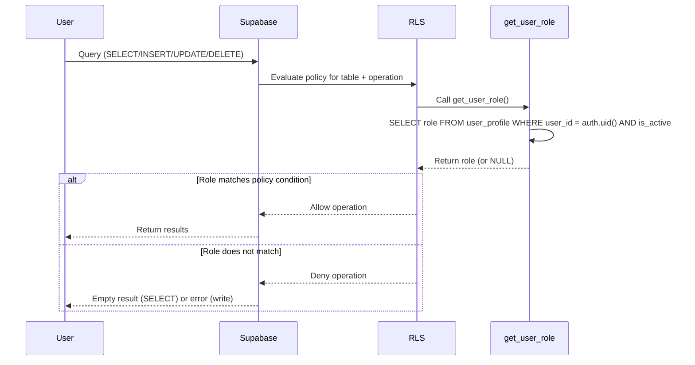

## Overview

All tables in the ARMS database have Row Level Security (RLS) enabled. Access is controlled through policies that reference the `get_user_role()` helper function, which returns the current authenticated user's role from the `user_profile` table.

## get_user_role() function

The core authorization function used by every RLS policy. It queries the `user_profile` table to return the role of the currently authenticated user.

```sql
create or replace function get_user_role()
returns user_role as $$
  select role from user_profile
  where user_id = auth.uid() and is_active = true
$$ language sql security definer stable;
```

**Key characteristics:**

- **`security definer`**: Executes with the function owner's permissions, bypassing RLS on `user_profile` to avoid circular dependency (the function reads `user_profile`, which itself has RLS policies that call `get_user_role()`).
- **`stable`**: Tells PostgreSQL the result is constant within a single SQL statement, allowing the optimizer to cache the result and avoid repeated lookups.
- **Returns `NULL`**: If the user has no profile or `is_active = false`, the function returns `NULL`, which causes all `is not null` checks in SELECT policies to fail and denies access.

> [!warning]
> Inactive users (`is_active = false`) are effectively locked out of the entire system because `get_user_role()` returns `NULL` for them. This is the intended behavior -- deactivating a user profile immediately revokes all data access.


## Access matrix

The following matrix shows each role's access level per table group. **CRUD** means full create, read, update, and delete access. **Read** means SELECT only. **None** means no access.

| Table group | Admin | Commercial | Accounting | Fleet Manager | Read Only |
|-------------|-------|------------|------------|---------------|-----------|
| **Core** (company, location, dropdown_value, parameter, notification_log) | CRUD | Read | Read | Read | Read |
| **Fleet** (trailer, trailer_option, technical_inspection, non_productive_period, km_registration, document) | CRUD | Read | Read | CRUD | Read |
| **Customer** (customer, contact) | CRUD | CRUD | Read | Read | Read |
| **Offer** | CRUD | CRUD | Read | None | Read |
| **Contract, non_driving_days** | CRUD | CRUD | Read | Read | Read |
| **Invoice** (invoice, invoice_line, invoice_period_lock, invoice_km_lock) | CRUD | Read | CRUD | None | Read |
| **User profile** | CRUD | Read | Read | Read | Read |

> [!info]
> The `fleet_manager` role has **no access** to offer and invoice tables. The `read_only` role cannot access offer data. These restrictions are enforced at the database level through RLS policies, making them impossible to bypass from the application layer.


## Security definer functions

Three functions are declared with `security definer` to bypass RLS when they need to read from tables that have restrictive policies:

| Function | Reason |
|----------|--------|
| `get_user_role()` | Reads `user_profile` which has RLS policies that depend on `get_user_role()` itself (circular dependency) |
| `check_ndd_within_contract_period()` | Trigger function that reads from `contract` table to validate non-driving day dates |
| `next_invoice_number()` | Reads and writes `invoice_number_seq` table regardless of the calling user's role |

> [!danger]
> Security definer functions run with the permissions of the function owner (typically the database owner), not the calling user. Any changes to these functions should be reviewed carefully, as they bypass all RLS protections.


## Policies by table

### user_profile

| Policy | Operation | Condition |
|--------|-----------|-----------|
| `user_profile_select` | SELECT | `get_user_role() is not null` (any active user) |
| `user_profile_insert` | INSERT | `get_user_role() = 'admin'` |
| `user_profile_update` | UPDATE | `get_user_role() = 'admin'` |
| `user_profile_delete` | DELETE | `get_user_role() = 'admin'` |

### Core tables

The following tables share identical policies: `company`, `location`, `dropdown_value`, `parameter`, `notification_log`.

| Policy pattern | Operation | Condition |
|----------------|-----------|-----------|
| `{table}_select` | SELECT | `get_user_role() is not null` (any active user) |
| `{table}_insert` | INSERT | `get_user_role() = 'admin'` |
| `{table}_update` | UPDATE | `get_user_role() = 'admin'` |
| `{table}_delete` | DELETE | `get_user_role() = 'admin'` |

### Fleet tables

The following tables share identical policies: `trailer`, `trailer_option`, `technical_inspection`, `non_productive_period`, `km_registration`, `document`.

| Policy pattern | Operation | Condition |
|----------------|-----------|-----------|
| `{table}_select` | SELECT | `get_user_role() is not null` (any active user) |
| `{table}_insert` | INSERT | `get_user_role() in ('admin', 'fleet_manager')` |
| `{table}_update` | UPDATE | `get_user_role() in ('admin', 'fleet_manager')` |
| `{table}_delete` | DELETE | `get_user_role() in ('admin', 'fleet_manager')` |

### Customer tables

The following tables share identical policies: `customer`, `contact`.

| Policy pattern | Operation | Condition |
|----------------|-----------|-----------|
| `{table}_select` | SELECT | `get_user_role() is not null` (any active user) |
| `{table}_insert` | INSERT | `get_user_role() in ('admin', 'commercial')` |
| `{table}_update` | UPDATE | `get_user_role() in ('admin', 'commercial')` |
| `{table}_delete` | DELETE | `get_user_role() in ('admin', 'commercial')` |

### Offer

| Policy | Operation | Condition |
|--------|-----------|-----------|
| `offer_select` | SELECT | `get_user_role() in ('admin', 'commercial', 'accounting', 'read_only')` |
| `offer_insert` | INSERT | `get_user_role() in ('admin', 'commercial')` |
| `offer_update` | UPDATE | `get_user_role() in ('admin', 'commercial')` |
| `offer_delete` | DELETE | `get_user_role() in ('admin', 'commercial')` |

> [!info]
> The offer SELECT policy explicitly excludes `fleet_manager`. This is the only table where a specific role is denied read access while other non-admin roles retain it.


### Contract and non_driving_days

Both tables share the same policy structure.

| Policy pattern | Operation | Condition |
|----------------|-----------|-----------|
| `{table}_select` | SELECT | `get_user_role() is not null` (any active user) |
| `{table}_insert` | INSERT | `get_user_role() in ('admin', 'commercial')` |
| `{table}_update` | UPDATE | `get_user_role() in ('admin', 'commercial')` |
| `{table}_delete` | DELETE | `get_user_role() in ('admin', 'commercial')` |

### Invoice tables

The following tables share identical policies: `invoice`, `invoice_line`, `invoice_period_lock`, `invoice_km_lock`.

| Policy pattern | Operation | Condition |
|----------------|-----------|-----------|
| `{table}_select` | SELECT | `get_user_role() in ('admin', 'accounting', 'commercial', 'read_only')` |
| `{table}_insert` | INSERT | `get_user_role() in ('admin', 'accounting')` |
| `{table}_update` | UPDATE | `get_user_role() in ('admin', 'accounting')` |
| `{table}_delete` | DELETE | `get_user_role() in ('admin', 'accounting')` |

## Policy enforcement flow



## Related pages

- **[[technical/auth/rbac|RBAC implementation]]** — Application-level role-based access control and navigation filtering.

  - **[[technical/auth/supabase-auth|Supabase Auth]]** — Authentication configuration and user profile management.
