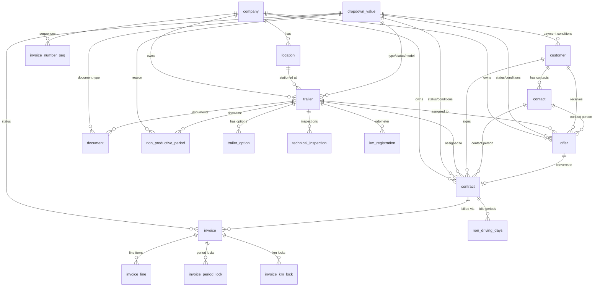

## Overview

The ARMS database runs on PostgreSQL via Supabase and consists of 19 tables organized across five domains. The schema uses Row Level Security (RLS) policies for access control and includes several custom enum types, triggers, and helper functions.

All tables follow a consistent pattern with audit columns (`created_on`, `created_by`, `updated_on`, `updated_by`) to track record history.

## Entity relationship diagram

## Tables by domain

### Core tables

Shared configuration and infrastructure tables used across the entire application.

| Table | Primary key | Description |
|-------|------------|-------------|
| `company` | `company_id` (bigint) | Legal entities that own trailers and issue contracts |
| `location` | `location_id` (bigint) | Physical locations belonging to a company |
| `dropdown_value` | `value_id` (bigint) | Centralized lookup values for all dropdowns (status, type, model, etc.) |
| `parameter` | `param_key` (text) | System-wide configuration parameters (auto-logout timeout, email settings) |
| `notification_log` | `notification_id` (bigint) | Email notification audit trail |

<Callout kind="info">
  The `dropdown_value` table is the most referenced table in the schema. It uses a `category` column to group values (e.g., `trailer_status`, `offer_status`, `payment_conditions`) and provides bilingual labels via `value_nl` and `value_fr`.
</Callout>

### Fleet tables

Trailer management, inspections, maintenance tracking, and document storage.

| Table | Primary key | Description |
|-------|------------|-------------|
| `trailer` | `plate_number` (text) | Fleet trailers with technical specifications and status |
| `trailer_option` | `plate_number, dropdown_value_id` (composite) | Junction table for trailer extra options |
| `technical_inspection` | `inspection_id` (bigint) | Inspection validity periods per trailer |
| `non_productive_period` | `np_period_id` (bigint) | Out-of-service periods with overlap prevention |
| `km_registration` | `km_reg_id` (bigint) | Odometer reading time series |
| `document` | `document_id` (bigint) | Polymorphic document storage for any entity type |

<Callout kind="alert">
  The `trailer` table uses `plate_number` (text) as its primary key instead of an auto-incrementing integer. This is a natural key design choice since plate numbers are unique identifiers in the real world.
</Callout>

### Customer tables

Customer records and their associated contacts.

| Table | Primary key | Description |
|-------|------------|-------------|
| `customer` | `customer_id` (bigint) | Customer companies with address and billing details |
| `contact` | `contact_id` (bigint) | Individual contacts belonging to a customer |

### Commercial tables

Offers, contracts, and rental management.

| Table | Primary key | Description |
|-------|------------|-------------|
| `offer` | `offer_id` (bigint) | Rental offers with pricing and desired trailer specifications |
| `contract` | `contract_id` (bigint) | Active rental contracts, optionally created from an offer |
| `non_driving_days` | `ndd_id` (bigint) | Idle periods within a contract excluded from billing |

### Invoice tables

Billing, invoice generation, and anti-double-invoicing mechanisms.

| Table | Primary key | Description |
|-------|------------|-------------|
| `invoice` | `invoice_id` (bigint) | Invoices linked to contracts with Exact Online integration |
| `invoice_line` | `line_id` (bigint) | Individual line items on an invoice |
| `invoice_period_lock` | `lock_id` (bigint) | Tracks invoiced date ranges to prevent double billing |
| `invoice_km_lock` | `km_lock_id` (bigint) | Tracks invoiced km ranges to prevent double billing |
| `invoice_number_seq` | `company_id` (bigint) | Per-company invoice number sequences |

### Authentication

| Table | Primary key | Description |
|-------|------------|-------------|
| `user_profile` | `user_id` (uuid) | User profiles with role assignment, linked to `auth.users` |

## Custom enum types

The schema defines several PostgreSQL enum types for type-safe column values.

| Enum | Values | Used in |
|------|--------|---------|
| `param_type` | `integer`, `decimal`, `boolean`, `text`, `email_list` | `parameter.param_type` |
| `entity_type` | `trailer`, `contract`, `offer`, `inspection` | `document.entity_type` |
| `contact_language` | `NL`, `FR` | `contact.language`, `offer.language`, `contract.language` |
| `pricing_unit` | `day`, `month`, `km` | `offer.unit`, `contract.unit` |
| `invoice_type` | `rental`, `advance`, `deposit`, `credit_note`, `damage` | `invoice.invoice_type` |
| `user_role` | `admin`, `commercial`, `accounting`, `fleet_manager`, `read_only` | `user_profile.role` |

## Database functions

| Function | Returns | Description |
|----------|---------|-------------|
| `get_user_role()` | `user_role` | Returns the current authenticated user's role. Used by all RLS policies. |
| `next_invoice_number(company_id)` | `bigint` | Atomically generates the next invoice number for a company. |
| `handle_new_user()` | trigger | Automatically creates a `user_profile` row when a new auth user signs up. |
| `check_ndd_within_contract_period()` | trigger | Validates that non-driving days fall within the contract's rental period. |

## Extensions

| Extension | Purpose |
|-----------|---------|
| `btree_gist` | Required for the `EXCLUDE` constraint on `non_productive_period` that prevents overlapping downtime periods for the same trailer. |

## Related pages

<Columns cols="2">
  <Card title="Core tables" href="/technical/database/core-tables" icon="database" horizontal={false}>
    Company, location, dropdown values, parameters, and notification log table definitions.
  </Card>

  <Card title="Fleet tables" href="/technical/database/fleet-tables" icon="truck" horizontal={false}>
    Trailer, inspections, km registration, and polymorphic document storage.
  </Card>

  <Card title="Commercial tables" href="/technical/database/commercial-tables" icon="handshake" horizontal={false}>
    Offers, contracts, non-driving days, and the offer-to-contract conversion pattern.
  </Card>

  <Card title="Invoice tables" href="/technical/database/invoice-tables" icon="receipt" horizontal={false}>
    Invoicing, line items, and the anti-double-invoicing lock mechanism.
  </Card>

  <Card title="RLS policies" href="/technical/database/rls-policies" icon="shield" horizontal={false}>
    Row Level Security policies and the role-based access matrix.
  </Card>

  <Card title="Authentication overview" href="/technical/auth/overview" icon="lock" horizontal={false}>
    Authentication architecture with Supabase Auth, Microsoft OAuth, and RBAC.
  </Card>
</Columns>
