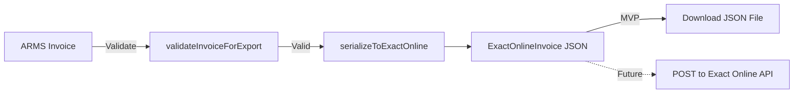

## Overview

ARMS exports invoices to Exact Online, a cloud-based accounting platform widely used in Belgium and the Netherlands. The current MVP implementation generates downloadable JSON files that can be imported into Exact Online. A future version will integrate directly via the Exact Online OAuth2 API.

The implementation is in `lib/exactonline.ts`.

## Architecture



## Types

### ExactOnlineInvoice

The target format for Exact Online import:

```typescript
interface ExactOnlineInvoice {
  CustomerCode: string;              // Customer VAT number
  YourRef: string;                   // ARMS invoice number
  InvoiceDate: string;               // ISO date
  DueDate: string;                   // ISO date
  InvoiceLines: ExactOnlineInvoiceLine[];
}

interface ExactOnlineInvoiceLine {
  Description: string;
  Quantity: number;
  UnitPrice: number;
  VATCode: string;                   // Mapped from percentage
  NetAmount: number;
}
```

### ArmsInvoiceForExport

The input format from the ARMS invoice system:

```typescript
interface ArmsInvoiceForExport {
  invoice_number: string;
  invoice_date: string;
  due_date: string;
  customer_vat_number: string | null;
  lines: {
    description: string;
    quantity: number;
    unit_price: number;
    vat_percentage: number;
    discount_pct: number;
    line_total_excl_vat: number;
  }[];
}
```

## VAT code mapping

Exact Online uses numeric codes instead of percentages for Belgian VAT rates:

| VAT percentage | Exact Online code | Rate name |
|---------------|-------------------|-----------|
| 21% | `"1"` | Standard rate |
| 12% | `"3"` | Parking rate |
| 6% | `"2"` | Reduced rate |
| 0% | `"0"` | Exempt / zero-rated |

Unknown percentages fall back to the percentage value as a string.

```typescript
function mapVatPercentageToCode(vatPercentage: number): string {
  switch (vatPercentage) {
    case 21: return "1";
    case 12: return "3";
    case 6:  return "2";
    case 0:  return "0";
    default: return String(vatPercentage);
  }
}
```

## Functions

### validateInvoiceForExport

Checks that an invoice has all required fields for export. Returns an empty array when valid.

| Property | Value |
|----------|-------|
| Signature | `validateInvoiceForExport(invoice: ArmsInvoiceForExport)` |
| Returns | `ExportValidationError[]` |

**Validated fields:**

| Field | Error message |
|-------|--------------|
| `customer_vat_number` | "Customer VAT number is required for ExactOnline export" |
| `invoice_number` | "Invoice number is required" |
| `invoice_date` | "Invoice date is required" |
| `due_date` | "Due date is required" |
| `lines` | "Invoice must have at least one line" |

```typescript
interface ExportValidationError {
  field: string;
  message: string;
}
```

### serializeToExactOnline

Converts an ARMS invoice to the Exact Online JSON format.

| Property | Value |
|----------|-------|
| Signature | `serializeToExactOnline(invoice: ArmsInvoiceForExport)` |
| Returns | `ExactOnlineInvoice` |

**Field mapping:**

| ARMS field | Exact Online field |
|------------|-------------------|
| `customer_vat_number` | `CustomerCode` |
| `invoice_number` | `YourRef` |
| `invoice_date` | `InvoiceDate` |
| `due_date` | `DueDate` |
| `line.description` | `Description` |
| `line.quantity` | `Quantity` |
| `line.unit_price` | `UnitPrice` |
| `line.vat_percentage` | `VATCode` (mapped) |
| `line.line_total_excl_vat` | `NetAmount` |

## Export workflow

<Steps>
  <Step title="User triggers export" icon="download" titleType="p">
    From the invoice detail page, the user clicks the "Export to Exact Online" button.
  </Step>

  <Step title="Server validates invoice" icon="check-circle" titleType="p">
    The `exportInvoiceToExactOnline` server action fetches the invoice data and runs validation.

    <Callout kind="alert">
      The customer must have a VAT number set. If missing, the export fails with a validation error.
    </Callout>
  </Step>

  <Step title="Serialize to Exact Online format" icon="file-json" titleType="p">
    The invoice is converted to the `ExactOnlineInvoice` JSON structure with mapped VAT codes.
  </Step>

  <Step title="Download JSON" icon="download" titleType="p">
    The JSON is returned to the client, which triggers a file download named after the invoice number.
  </Step>
</Steps>

## Future: OAuth2 API integration

The planned next phase will add direct API integration with Exact Online:

- OAuth2 Authorization Code flow (similar to the Microsoft Graph integration)
- Direct POST of invoices to the Exact Online REST API
- Automatic status sync (tracking whether an invoice was successfully imported)
- The `exactonline_status` field on the invoice table is already prepared for this
