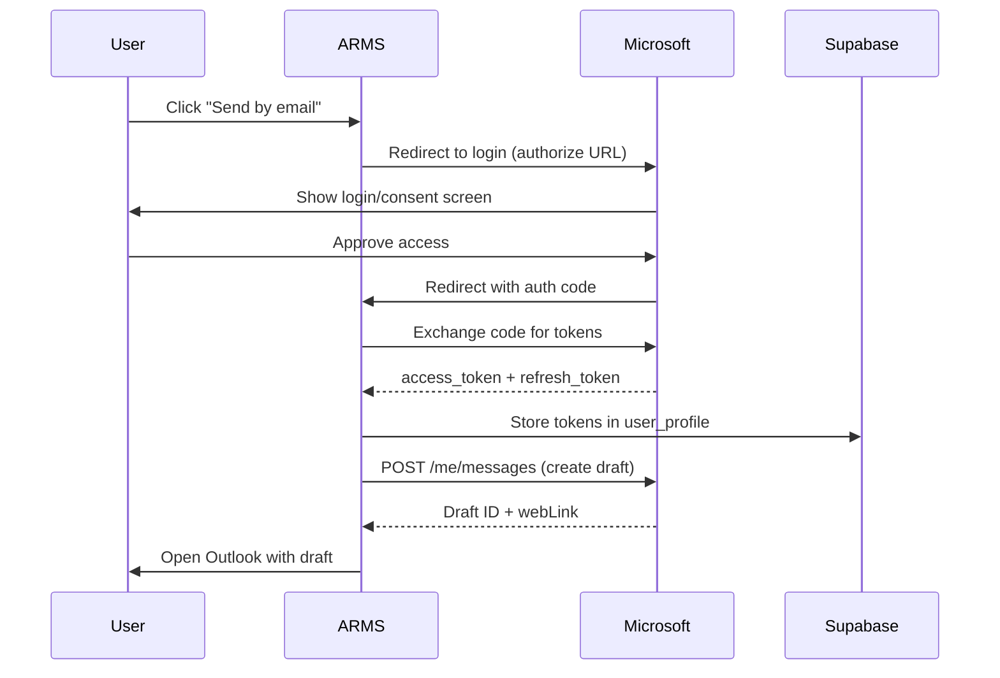

## Overview

ARMS integrates with Microsoft Graph API to create email drafts in the user's Outlook mailbox. This is used for sending offers and contracts to customers. The integration uses the OAuth2 Authorization Code flow, with tokens stored in the user's Supabase profile.

The implementation is in `lib/microsoft-graph.ts`.

## Authentication flow



## Environment variables

| Variable | Required | Description |
|----------|----------|-------------|
| `MICROSOFT_CLIENT_ID` | Yes | Azure AD application client ID |
| `MICROSOFT_CLIENT_SECRET` | Yes | Azure AD application client secret |
| `MICROSOFT_TENANT_ID` | No | Azure AD tenant ID (defaults to `"common"`) |
| `NEXT_PUBLIC_APP_URL` | No | Application base URL (defaults to `http://localhost:3000`) |

## Configuration

The `getConfig()` function builds all OAuth2 URLs from environment variables:

```typescript
{
  redirectUri: `${appUrl}/api/auth/microsoft/callback`,
  authorizeUrl: `https://login.microsoftonline.com/${tenantId}/oauth2/v2.0/authorize`,
  tokenUrl: `https://login.microsoftonline.com/${tenantId}/oauth2/v2.0/token`,
  graphBaseUrl: "https://graph.microsoft.com/v1.0",
  scopes: "openid offline_access Mail.ReadWrite",
}
```

The required scopes are:
- `openid` -- Standard OpenID Connect
- `offline_access` -- Enables refresh tokens
- `Mail.ReadWrite` -- Permission to create email drafts

## Functions

### buildAuthorizationUrl

Constructs the Microsoft OAuth2 authorization URL with the required parameters.

| Property | Value |
|----------|-------|
| Signature | `buildAuthorizationUrl(state: string): string` |
| Parameters | `state` -- Opaque value for CSRF protection |

### exchangeCodeForTokens

Exchanges an authorization code for access and refresh tokens.

| Property | Value |
|----------|-------|
| Signature | `exchangeCodeForTokens(code: string)` |
| Returns | `{ data: TokenResponse \| null; error: string \| null }` |

```typescript
interface TokenResponse {
  access_token: string;
  refresh_token: string;
  expires_in: number;
}
```

### refreshAccessToken

Uses a refresh token to obtain a new access token when the current one expires.

| Property | Value |
|----------|-------|
| Signature | `refreshAccessToken(refreshToken: string)` |
| Returns | `{ data: TokenResponse \| null; error: string \| null }` |

### createMailDraft

Creates an email draft in the user's Outlook mailbox via the Graph API.

| Property | Value |
|----------|-------|
| Signature | `createMailDraft(accessToken: string, input: CreateDraftInput)` |
| Returns | `{ data: { id: string; webLink: string } \| null; error: string \| null }` |

```typescript
interface CreateDraftInput {
  to: string;
  subject: string;
  body: string;
  attachments: EmailAttachment[];
}

interface EmailAttachment {
  filename: string;
  contentType: string;
  contentBytes: string;  // base64-encoded file content
}
```

**Graph API endpoint:** `POST /v1.0/me/messages`

## Error handling

The integration handles three categories of errors:

| Error | Handling |
|-------|----------|
| `TOKEN_EXPIRED` (HTTP 401) | Returned as a specific error string. The calling code should attempt a token refresh and retry. |
| Network errors | Caught and returned as error strings with the original error message. |
| HTTP errors | Status code and response body are included in the error string. |

> [!info]
> Token storage is handled by Supabase, with tokens stored in the `user_profile` table fields `ms_access_token`, `ms_refresh_token`, and `ms_token_expires_at`. Supabase encrypts data at rest.


## Token refresh flow

When a `TOKEN_EXPIRED` error is received:

1. Read the stored refresh token from `user_profile`
2. Call `refreshAccessToken()` with the refresh token
3. Store the new tokens in `user_profile`
4. Retry the original Graph API call with the new access token
