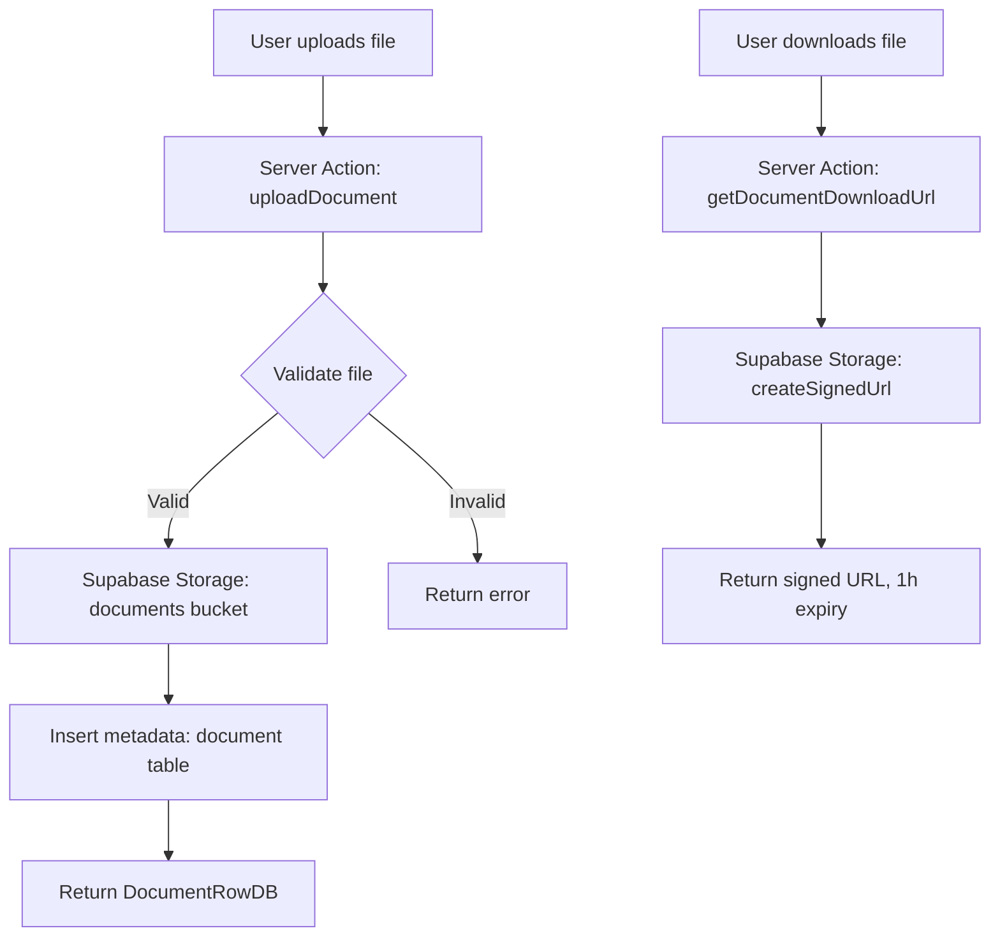

## Overview

ARMS uses Supabase Storage for managing file uploads attached to entities like trailers and contracts. Files are stored in a dedicated `documents` bucket with metadata tracked in the `document` database table.

## Architecture



## Bucket structure

All documents are stored in a single `documents` bucket with a path-based organization:

```
documents/
  trailers/
    {plate_number}/
      {timestamp}_{filename}
  contracts/
    {contract_id}/
      {timestamp}_{filename}
```

The storage path pattern is: `{entity_type}s/{entity_id}/{timestamp}_{sanitized_filename}`

**Path sanitization:** Filenames are sanitized by replacing any character that is not alphanumeric, a dot, underscore, or hyphen with an underscore.

## Supported formats

| MIME type | Extension | Description |
|-----------|-----------|-------------|
| `application/pdf` | `.pdf` | PDF documents |
| `image/jpeg` | `.jpg`, `.jpeg` | JPEG images |
| `image/png` | `.png` | PNG images |
| `image/tiff` | `.tiff`, `.tif` | TIFF images |

Other file types are rejected with the `INVALID_FILE_TYPE` error.

## File size limits

File size limits are configurable per upload via the `max_size_bytes` FormData field. When set to 0, no size limit is enforced. The actual limit is typically set by the calling component based on the document type.

## Metadata tracking

Every uploaded file has a corresponding row in the `document` table:

| Column | Type | Description |
|--------|------|-------------|
| `document_id` | serial | Primary key |
| `entity_type` | text | Entity type (e.g., "trailer", "contract") |
| `entity_id` | text | Entity identifier |
| `filename` | text | Original filename as uploaded |
| `storage_path` | text | Full path in Supabase Storage |
| `mime_type` | text | File MIME type |
| `file_size_bytes` | integer | File size in bytes |
| `document_type_id` | integer | FK to dropdown_value (document category) |
| `uploaded_by` | uuid | FK to user who uploaded |
| `upload_date` | timestamp | Auto-set on creation |

## Document types

Document types are managed through the `dropdown_value` table with category `"document_type"`. This allows administrators to configure available document categories (e.g., "Insurance certificate", "Technical inspection", "Contract copy") through the parameters interface.

## Access control

| Operation | Required role |
|-----------|--------------|
| List documents | Any authenticated user |
| Download document | Any authenticated user |
| Upload document | `admin` or `fleet_manager` |
| Delete document | `admin` or `fleet_manager` |

## Signed URLs

Documents are not publicly accessible. All downloads go through signed URLs generated by Supabase Storage:

- **Expiry:** 1 hour
- **Single use:** No (URL can be reused within the expiry window)
- **Generated by:** `getDocumentDownloadUrl()` server action

> [!info]
> Signed URLs expire after one hour. If a user keeps a download link open for longer, they will need to refresh the page to get a new signed URL.


## Cleanup on failure

The upload process includes built-in rollback: if the metadata insert to the `document` table fails after the file has already been uploaded to storage, the storage file is automatically deleted to prevent orphaned files.

```typescript
if (insertError) {
  // Clean up uploaded file if metadata insert fails
  await supabase.storage.from("documents").remove([storagePath]);
  return { data: null, error: insertError.message };
}
```
