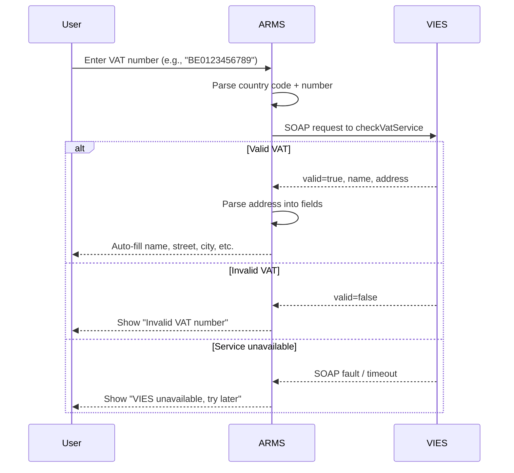

## Overview

ARMS integrates with the EU VIES (VAT Information Exchange System) to validate customer VAT numbers and auto-fill company address details. The implementation is in `lib/vies.ts`.

When a user enters a VAT number on the customer form, the system queries VIES to verify the number and retrieve the registered company name and address.

## How it works



## Input format

VAT numbers must start with a two-letter country code followed by the number. The parser strips whitespace, dots, and dashes before validation.

**Valid formats:**
- `BE0123456789`
- `BE 0123.456.789`
- `NL123456789B01`
- `DE 123456789`

**Invalid formats:**
- `0123456789` (missing country code)
- `123456789` (no country code)

## Three outcomes

| Status | Description | UI behavior |
|--------|-------------|-------------|
| `success` | VAT number is valid and active | Auto-fill company name and parsed address |
| `invalid` | VAT number format is correct but not registered | Show validation error |
| `unavailable` | VIES service is down or timed out | Show warning, allow manual entry |

## Types

```typescript
interface ViesResult {
  valid: boolean;
  name: string | null;
  address: string | null;
  countryCode: string | null;
}

type ViesStatus = "success" | "invalid" | "unavailable";

interface ViesResponse {
  status: ViesStatus;
  data: ViesResult | null;
  error: string | null;
}
```

## Functions

### checkVies

Main function that validates a VAT number against the EU VIES SOAP service.

| Property | Value |
|----------|-------|
| Signature | `checkVies(vatNumber: string): Promise<ViesResponse>` |
| Timeout | 5 seconds per request |
| Retries | Up to 2 retries on failure |

**VIES SOAP endpoint:** `https://ec.europa.eu/taxation_customs/vies/services/checkVatService`

The function sends a SOAP XML request and parses the XML response to extract `valid`, `name`, and `address` fields.

### parseViesAddress

Parses the VIES multi-line address string into structured fields.

| Property | Value |
|----------|-------|
| Signature | `parseViesAddress(address: string \| null)` |
| Returns | `{ street, number, postal_code, city, country }` |

**Parsing logic:**
- **Line 1:** Street name + house number (splits on last numeric group)
- **Line 2:** Postal code + city (splits on 4-6 digit code)
- **Line 3:** Country name (if present)

**Example:**

```
Input:  "INDUSTRIESTRAAT 42\n9000 GENT"
Output: { street: "INDUSTRIESTRAAT", number: "42",
          postal_code: "9000", city: "GENT", country: "" }
```

## Reliability

The VIES service has known availability issues. ARMS handles this through:

- **5-second timeout** per request to prevent blocking the UI
- **Up to 2 retries** on network errors, timeouts, or service unavailability
- **Graceful degradation** -- the `unavailable` status allows users to continue with manual entry
- **SOAP fault detection** -- recognizes `MS_UNAVAILABLE` and `SERVICE_UNAVAILABLE` responses

> [!warning]
> The VIES service is operated by the European Commission and can be temporarily unavailable, especially during peak hours or maintenance windows. The system is designed to handle these outages gracefully.


## Server action wrappers

The customer server actions provide two wrappers for VIES:

- `checkViesVat(vatNumber)` -- Returns the raw `ViesResponse`
- `checkViesAndParse(vatNumber)` -- Returns structured `ViesParsedResult` with parsed address fields ready for form auto-fill
