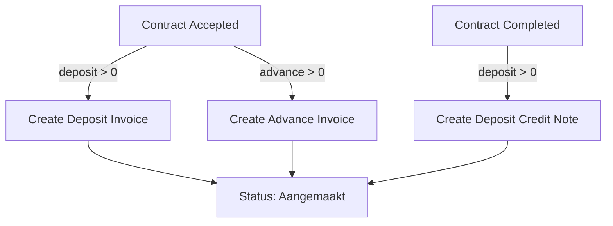

## Overview

The contract server actions in `lib/actions/contracts.ts` manage the full contract lifecycle, including CRUD operations, status transitions with automatic side effects (deposit/advance invoice creation), linked entity queries, and damage control tracking.

## Input types

### CreateContractInput

```typescript
interface CreateContractInput {
  company_id: number;
  contract_name: string;
  status_id: number;
  customer_id: number;
  vat_percentage: number;
  payment_conditions_id: number;
  contact_id: number;
  template_id?: string;
  language: "NL" | "FR";
  description_internal?: string;
  description_external?: string;
  free_text?: string;
  offer_id?: number;
  rental_start_estimated: string;       // Required
  rental_end_estimated: string;         // Required
  unit: "day" | "month" | "km";
  unit_price_rental: number;
  discount_pct?: number;
  unit_price_insurance?: number;
  desired_trailer_type_id: number;
  desired_volume?: number;
  desired_sheet_type_id?: number;
  desired_model_id?: number;
  desired_door_type_id?: number;
  plate_number: string;                 // Required for contracts
  invoice_to_id: number;
  deposit_amount?: number;
  advance_amount?: number;
  deposit_invoice_paid?: boolean;
  advance_invoice_paid?: boolean;
}
```

### UpdateContractInput

Same fields as `CreateContractInput` but all optional. Additionally includes:
- `rental_start_real?: string | null` -- actual start date
- `rental_end_real?: string | null` -- actual end date

## CRUD functions

### createContract

| Property | Value |
|----------|-------|
| Signature | `createContract(input: CreateContractInput)` |
| Auth | `requireAuth()` |
| Returns | `{ data: { contract_id: number } \| null; error: string \| null }` |
| Revalidates | `/contracts` layout |

**Validation:** `contract_name`, `plate_number`, and rental dates are required.

### updateContract

| Property | Value |
|----------|-------|
| Signature | `updateContract(contractId: number, input: UpdateContractInput)` |
| Auth | `requireAuth()` |
| Returns | `{ error: string \| null }` |
| Revalidates | `/contracts` layout |

### getContract

Fetches a detailed contract record with joined relations for status, customer, contact, trailer, and invoice-to customer.

| Property | Value |
|----------|-------|
| Signature | `getContract(contractId: number)` |
| Returns | `{ data: ContractDetail \| null; error: string \| null }` |

The `ContractDetail` type includes computed fields like `plate_number_display` (combining trailer ref and plate number) and `contact_email`.

## Status transitions

### transitionContractStatus

Validates the transition using `isContractTransitionAllowed()` and triggers automatic side effects based on the target status.

| Property | Value |
|----------|-------|
| Signature | `transitionContractStatus(contractId: number, newStatusId: number)` |
| Auth | `requireAuth()` |
| Returns | `{ error: string \| null }` |
| Revalidates | `/contracts` layout |

**Automatic side effects:**

| Target status | Side effect |
|---------------|-------------|
| Geaccepteerd (Accepted) | Creates deposit and advance invoices automatically |
| Afgerond (Completed) | Creates a deposit credit note for refund |

### Auto-invoice creation on acceptance

When a contract transitions to "Geaccepteerd", the system automatically creates:

1. **Deposit invoice** (if `deposit_amount > 0`): Invoice type `"deposit"`, single line "Waarborg" at 0% VAT
2. **Advance invoice** (if `advance_amount > 0`): Invoice type `"advance"`, single line "Voorschot" at 0% VAT

Both invoices use the `next_invoice_number` RPC to get sequential invoice numbers.

### Auto-credit note on completion

When a contract transitions to "Afgerond", a credit note is created for the deposit amount:
- Invoice type: `"credit_note"`
- Line description: "Waarborg terugbetaling"
- Amount: negative deposit amount (refund)



## Related entity queries

### getInternalInvoiceTargets

Returns companies and STAS as potential invoice targets for internal billing.

| Property | Value |
|----------|-------|
| Signature | `getInternalInvoiceTargets()` |
| Returns | `{ value: string; label: string }[]` |

### getLinkedOffer

Fetches the offer that originated this contract (if `offer_id` is set).

| Property | Value |
|----------|-------|
| Signature | `getLinkedOffer(offerId: number)` |
| Returns | `{ data: LinkedOffer \| null; error: string \| null }` |

### getContractInvoices

Fetches all invoices for a contract with computed totals from invoice lines.

| Property | Value |
|----------|-------|
| Signature | `getContractInvoices(contractId: number)` |
| Returns | `{ data: ContractInvoiceRow[]; error: string \| null }` |

## Damage control

### updateDamageControl

Updates the damage assessment fields on a contract after trailer return.

| Property | Value |
|----------|-------|
| Signature | `updateDamageControl(contractId: number, input: UpdateDamageControlInput)` |
| Auth | `requireAuth()` |
| Returns | `{ error: string \| null }` |
| Revalidates | `/contracts` layout |

```typescript
interface UpdateDamageControlInput {
  checked_after_return: boolean;
  damage_found: boolean;
  repair_order_ref: string;
}
```
