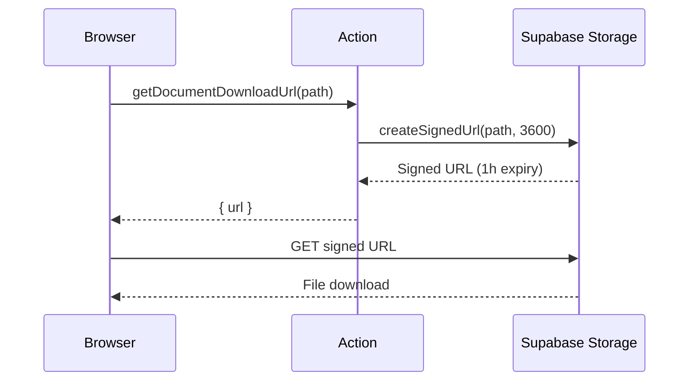

## Overview

The document server actions in `lib/actions/documents.ts` manage file uploads and downloads through Supabase Storage. Documents are linked to entities (trailers, contracts, etc.) via a metadata table and stored in a `documents` bucket.

## Authorization

Document management requires `admin` or `fleet_manager` role, enforced by the `requireFleetManager()` helper. Read-only operations (listing documents, generating download URLs) are available to all authenticated users.

## Types

### DocumentRowDB

```typescript
interface DocumentRowDB {
  document_id: number;
  entity_type: string;          // "trailer", "contract", etc.
  entity_id: string;
  filename: string;
  storage_path: string;
  mime_type: string;
  file_size_bytes: number;
  document_type_id: number;     // FK to dropdown_value
  document_type_nl: string;     // Joined from dropdown_value
  document_type_fr: string;
  uploaded_by: string | null;   // User ID
  uploaded_by_name: string | null; // Joined from user_profile
  upload_date: string;
}
```

## Allowed file types

```typescript
const ALLOWED_MIME_TYPES = [
  "application/pdf",
  "image/jpeg",
  "image/png",
  "image/tiff",
];
```

## Functions

### getDocuments

Fetches all documents for a specific entity, ordered by upload date (newest first).

| Property | Value |
|----------|-------|
| Signature | `getDocuments(entityType: string, entityId: string)` |
| Auth | Authenticated (any role) |
| Returns | `{ data: DocumentRowDB[] \| null; error: string \| null }` |

Joins `dropdown_value` for document type labels and `user_profile` for uploader name.

### uploadDocument

Uploads a file to Supabase Storage and creates a metadata record in the `document` table.

| Property | Value |
|----------|-------|
| Signature | `uploadDocument(formData: FormData)` |
| Auth | `requireFleetManager()` |
| Returns | `{ data: DocumentRowDB \| null; error: string \| null }` |
| Revalidates | `/` layout (all pages) |

**Expected FormData fields:**

| Field | Type | Required |
|-------|------|----------|
| `file` | File | Yes |
| `entity_type` | string | Yes |
| `entity_id` | string | Yes |
| `document_type_id` | string | Yes |
| `max_size_bytes` | string | No (0 = no limit) |

**Storage path convention:**

```
{entity_type}s/{entity_id}/{timestamp}_{sanitized_filename}
```

For example: `trailers/ABC-123/1709550000000_insurance_certificate.pdf`

**Error codes:**
- `MISSING_FIELDS` -- Required form fields not provided
- `INVALID_FILE_TYPE` -- MIME type not in allowed list
- `FILE_TOO_LARGE` -- Exceeds configured size limit

**Rollback behavior:** If the metadata insert fails after a successful storage upload, the uploaded file is automatically cleaned up.

### deleteDocument

Deletes both the storage file and the metadata record.

| Property | Value |
|----------|-------|
| Signature | `deleteDocument(documentId: number)` |
| Auth | `requireFleetManager()` |
| Returns | `{ error: string \| null }` |
| Revalidates | `/` layout |

Fetches the `storage_path` first, then deletes the storage file, then deletes the metadata row.

### getDocumentDownloadUrl

Generates a signed URL for downloading a document, valid for one hour.

| Property | Value |
|----------|-------|
| Signature | `getDocumentDownloadUrl(storagePath: string)` |
| Auth | Authenticated (any role) |
| Returns | `{ url: string \| null; error: string \| null }` |


