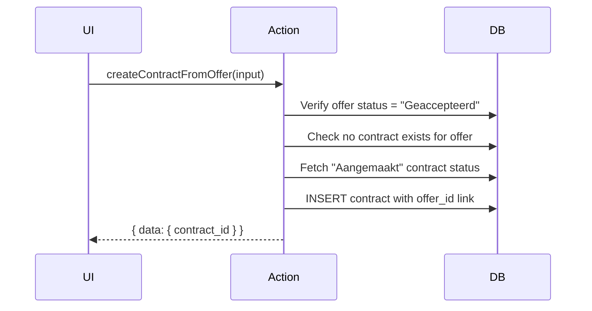

## Overview

The offer server actions in `lib/actions/offers.ts` manage the full lifecycle of rental offers, from creation through status transitions to conversion into contracts. This is one of the larger action files, handling CRUD, customer/contact/trailer lookups, and the offer-to-contract conversion flow.

## Input types

### CreateOfferInput

```typescript
interface CreateOfferInput {
  company_id: number;
  offer_name: string;
  status_id: number;
  customer_id: number;
  vat_percentage: number;
  payment_conditions_id: number;
  contact_id: number;
  template_id?: string;
  language: "NL" | "FR";
  due_date: string;
  description_internal?: string;
  description_external?: string;
  rental_start_estimated?: string;
  rental_end_estimated?: string;
  unit: "day" | "month" | "km";
  unit_price_rental: number;
  discount_pct?: number;
  unit_price_insurance?: number;
  desired_trailer_type_id: number;
  desired_volume?: number;
  desired_sheet_type_id?: number;
  desired_model_id?: number;
  desired_door_type_id?: number;
  plate_number?: string;          // Optional at offer stage
}
```

### UpdateOfferInput

Same fields as `CreateOfferInput` but all optional, allowing partial updates.

## CRUD functions

### createOffer

| Property | Value |
|----------|-------|
| Signature | `createOffer(input: CreateOfferInput)` |
| Auth | `requireAuth()` |
| Returns | `{ data: { offer_id: number } \| null; error: string \| null }` |
| Revalidates | `/offers` layout |

**Validation:** `offer_name` is required. Defaults `discount_pct` to 0 and `unit_price_insurance` to 0.

### updateOffer

| Property | Value |
|----------|-------|
| Signature | `updateOffer(offerId: number, input: UpdateOfferInput)` |
| Auth | `requireAuth()` |
| Returns | `{ error: string \| null }` |
| Revalidates | `/offers` layout |

### getOffer

Fetches a detailed offer record with joined status, customer, and contact names.

| Property | Value |
|----------|-------|
| Signature | `getOffer(offerId: number)` |
| Auth | None |
| Returns | `{ data: OfferDetail \| null; error: string \| null }` |

The `OfferDetail` type flattens joined relations into a single object with fields like `status_value_nl`, `customer_name`, and `contact_name`.

## Lookup functions

These functions power the form dropdowns when creating or editing an offer.

### getCustomerForPrefill

Fetches customer data (VAT percentage, payment conditions) to auto-fill offer fields when a customer is selected.

| Property | Value |
|----------|-------|
| Signature | `getCustomerForPrefill(customerId: number)` |
| Returns | `{ customer_id, customer_name, vat_percentage, payment_conditions_id }` |

### searchContactsByCustomer

Searches contacts belonging to a specific customer for the contact dropdown.

| Property | Value |
|----------|-------|
| Signature | `searchContactsByCustomer(customerId: number, query: string)` |
| Returns | `{ value, label, description }[]` (max 20) |

### getContactForPrefill

| Property | Value |
|----------|-------|
| Signature | `getContactForPrefill(contactId: number)` |
| Returns | Contact with language preference |

### searchAvailableTrailers

Searches for active trailers matching desired trailer properties. Filters by trailer type, minimum volume, sheet type, model, and door type.

| Property | Value |
|----------|-------|
| Signature | `searchAvailableTrailers(filters)` |
| Returns | `{ value: string; label: string }[]` (max 20) |

## Status transitions

### transitionOfferStatus

Validates the status transition using `isOfferTransitionAllowed()` before updating the status.

| Property | Value |
|----------|-------|
| Signature | `transitionOfferStatus(offerId: number, newStatusId: number)` |
| Auth | `requireAuth()` |
| Returns | `{ error: string \| null }` |
| Revalidates | `/offers` layout |

The function resolves both current and target status `value_nl` names and passes them to the transition validator.

## Contract conversion

### getContractPrefillFromOffer

Prepares prefill data for the contract creation form based on an accepted offer. Only works when the offer status is "Geaccepteerd" (Accepted).

| Property | Value |
|----------|-------|
| Signature | `getContractPrefillFromOffer(offerId: number)` |
| Auth | `requireAuth()` |
| Returns | `{ data: ContractPrefillFromOffer \| null; error: string \| null }` |

### createContractFromOffer

Creates a new contract from an accepted offer. Performs several validations before insertion.

| Property | Value |
|----------|-------|
| Signature | `createContractFromOffer(input: CreateContractFromOfferInput)` |
| Auth | `requireAuth()` |
| Returns | `{ data: { contract_id: number } \| null; error: string \| null }` |
| Revalidates | `/offers` and `/contracts` layouts |

**Validation rules:**
- `plate_number` is required (trailers are mandatory for contracts)
- Rental start and end dates are required
- Offer must be in "Geaccepteerd" status
- No existing contract for this offer (prevents duplicates)

**Flow:**



### getLinkedContract

Finds the contract created from a specific offer (if any).

| Property | Value |
|----------|-------|
| Signature | `getLinkedContract(offerId: number)` |
| Returns | `{ data: LinkedContract \| null; error: string \| null }` |
