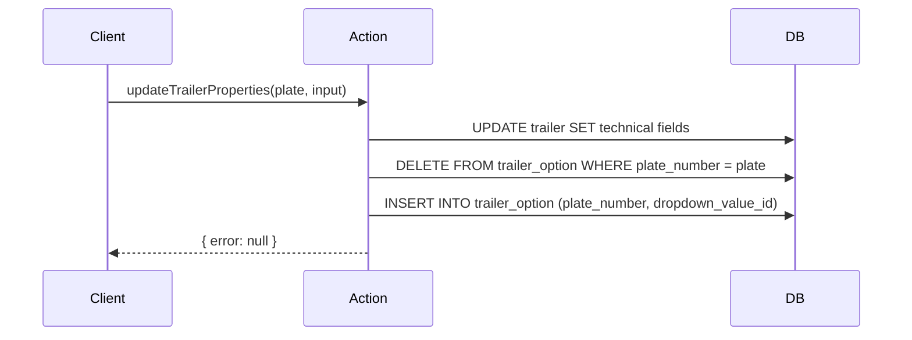

## Overview

The trailer server actions in `lib/actions/trailers.ts` handle all create, read, and update operations for the trailer (fleet) entity. Trailers are identified by their `plate_number` primary key rather than a numeric ID.

## Input types

### CreateTrailerInput

```typescript
interface CreateTrailerInput {
  plate_number: string;       // Primary key, must be unique
  trailer_ref: string;        // Internal reference, must be unique
  nickname?: string;
  chassis_number: string;
  date_first_registration: string;
  construction_year: number;
  initial_customer?: string;
  brand?: string;
  trailer_number?: string;
  status_id: number;          // FK to dropdown_value
  company_id: number;         // FK to company
  location_id: number;        // FK to dropdown_value
  remarks?: string;
}
```

### UpdateTrailerInput

```typescript
interface UpdateTrailerInput {
  trailer_ref?: string;
  nickname?: string;
  chassis_number?: string;
  date_first_registration?: string;
  construction_year?: number;
  initial_customer?: string;
  brand?: string;
  trailer_number?: string;
  status_id?: number;
  company_id?: number;
  location_id?: number;
  remarks?: string;
}
```

### UpdateTrailerPropertiesInput

```typescript
interface UpdateTrailerPropertiesInput {
  trailer_type_id: number;
  volume: number;
  sheet_type_id: number;
  model_id: number;
  door_type_id: number;
  chassis_material_id?: number | null;
  rim_material_id?: number | null;
  empty_weight_kg?: number | null;
  max_weight_kg?: number | null;
  option_ids: number[];       // Junction table entries
}
```

## Functions

### getTrailer

Fetches a single trailer by its plate number.

| Property | Value |
|----------|-------|
| Signature | `getTrailer(plateNumber: string)` |
| Auth | None (public read) |
| Returns | `{ data: Record<string, any> \| null; error: string \| null }` |
| Revalidates | No |

### createTrailer

Creates a new trailer record with uniqueness checks for plate number and trailer reference. Automatically assigns default technical properties (trailer type, sheet type, model, door type) from the first active dropdown values.

| Property | Value |
|----------|-------|
| Signature | `createTrailer(input: CreateTrailerInput)` |
| Auth | `requireAuth()` |
| Returns | `{ data: { plate_number: string } \| null; error: string \| null }` |
| Revalidates | `/fleet` layout |

**Validation rules:**
- `plate_number`, `trailer_ref`, `chassis_number`, `date_first_registration`, `construction_year`, `status_id`, `company_id`, `location_id` are all required
- `plate_number` must be unique (returns `DUPLICATE_PLATE`)
- `trailer_ref` must be unique (returns `DUPLICATE_REF`)

### updateTrailer

Updates general trailer information. Only fields present in the input are updated.

| Property | Value |
|----------|-------|
| Signature | `updateTrailer(plateNumber: string, input: UpdateTrailerInput)` |
| Auth | `requireAuth()` |
| Returns | `{ error: string \| null }` |
| Revalidates | `/fleet` layout |

**Validation rules:**
- If `trailer_ref` is being changed, checks uniqueness against other trailers (returns `DUPLICATE_REF`)

### getTrailerProperties

Fetches technical properties for a trailer, including the junction table entries for options.

| Property | Value |
|----------|-------|
| Signature | `getTrailerProperties(plateNumber: string)` |
| Auth | None (public read) |
| Returns | Technical properties object with `option_ids` array |
| Revalidates | No |

### updateTrailerProperties

Updates technical properties and syncs the `trailer_option` junction table using a delete-and-reinsert strategy.

| Property | Value |
|----------|-------|
| Signature | `updateTrailerProperties(plateNumber: string, input: UpdateTrailerPropertiesInput)` |
| Auth | `requireAuth()` |
| Returns | `{ error: string \| null }` |
| Revalidates | `/fleet` layout |

**Validation rules:**
- `trailer_type_id`, `volume`, `sheet_type_id`, `model_id`, `door_type_id` are all required

**Junction table sync:**


