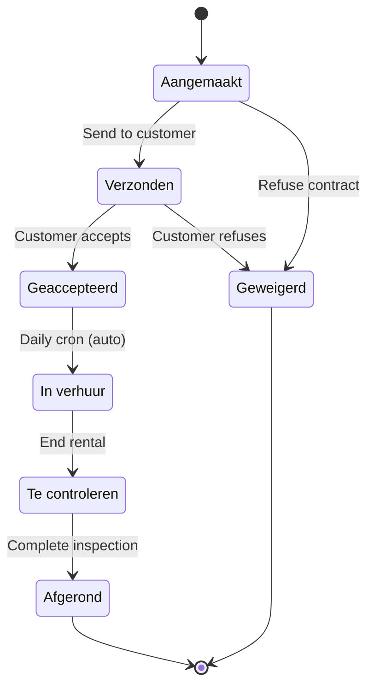

## Overview

The contract lifecycle in ARMS has seven states with both manual and automatic transitions. The key distinction is that **Geaccepteerd to In verhuur** is an automatic-only transition driven by a daily cron job -- it cannot be triggered manually from the UI.

## State diagram



## Status definitions

| Status | English | Description |
|--------|---------|-------------|
| Aangemaakt | Created | Initial draft state for a new contract |
| Verzonden | Sent | Contract sent to customer for review |
| Geaccepteerd | Accepted | Customer accepted; awaiting rental start date |
| In verhuur | In Rental | Active rental period; trailer is with the customer |
| Te controleren | To Check | Trailer returned; pending inspection |
| Afgerond | Completed | Rental completed and finalized |
| Geweigerd | Refused | Contract was refused by either party |

## Transition rules

| From | To | Type | Trigger |
|------|----|------|---------|
| Aangemaakt | Verzonden | Manual | User sends the contract |
| Aangemaakt | Geweigerd | Manual | User refuses the contract |
| Verzonden | Geaccepteerd | Manual | Customer accepts |
| Verzonden | Geweigerd | Manual | Customer refuses |
| Geaccepteerd | In verhuur | **Automatic only** | Daily cron when `effective_start_date <= today` |
| In verhuur | Te controleren | Manual | User ends the rental period |
| Te controleren | Afgerond | Manual | User completes the inspection |

<Callout kind="alert">
  The transition from **Geaccepteerd** to **In verhuur** is automatic only. It runs via a daily cron job (pg_cron or Edge Function) at 01:00 UTC. You cannot trigger this transition from the UI. See [Auto-transitions](/technical/business-logic/auto-transitions) for details.
</Callout>

## Confirmation dialogs

Certain transitions require an explicit confirmation dialog before proceeding:

| Target status | Reason |
|---------------|--------|
| Geweigerd | Irreversible -- the contract cannot be reactivated |
| Afgerond | Triggers automatic side effects (deposit credit note generation) |

## TypeScript type definition

```typescript contract-status-transitions.ts
export type ContractStatusKey =
  | "Aangemaakt"
  | "Verzonden"
  | "Geaccepteerd"
  | "In verhuur"
  | "Te controleren"
  | "Afgerond"
  | "Geweigerd";
```

## API reference

### getAllowedContractTransitions

Returns **manual-only** transitions available from the current status. Used by the UI to display action buttons.

```typescript
import { getAllowedContractTransitions } from "@/lib/contract-status-transitions";

getAllowedContractTransitions("Aangemaakt");
// Returns: ["Verzonden", "Geweigerd"]

getAllowedContractTransitions("Geaccepteerd");
// Returns: [] -- no manual transitions available

getAllowedContractTransitions("In verhuur");
// Returns: ["Te controleren"]
```

<Callout kind="tip">
  The empty array for **Geaccepteerd** is intentional. The only valid transition (to **In verhuur**) happens automatically via the cron job, so the UI shows no action buttons.
</Callout>

### isContractTransitionAllowed

Validates whether a transition is valid, including automatic transitions. Used by server actions and the cron job.

```typescript
import { isContractTransitionAllowed } from "@/lib/contract-status-transitions";

// Manual transition
isContractTransitionAllowed("Aangemaakt", "Verzonden");     // true

// Automatic transition -- valid for server-side validation
isContractTransitionAllowed("Geaccepteerd", "In verhuur");  // true

// Invalid transition
isContractTransitionAllowed("Afgerond", "Aangemaakt");      // false
```

### requiresContractConfirmation

Checks whether a target status should trigger a confirmation dialog in the UI.

```typescript
import { requiresContractConfirmation } from "@/lib/contract-status-transitions";

requiresContractConfirmation("Geweigerd"); // true
requiresContractConfirmation("Afgerond");  // true
requiresContractConfirmation("Verzonden"); // false
```

## Side effects by transition

| Transition | Side effect |
|------------|-------------|
| Geaccepteerd to In verhuur | Creates advance invoice + deposit invoice automatically |
| Te controleren to Afgerond | Generates deposit credit note automatically |

For full details on these side effects, see [Auto-transitions](/technical/business-logic/auto-transitions).

## Related pages

- [Offer status machine](/technical/state-machines/offer-status) -- the preceding lifecycle stage
- [Auto-transitions](/technical/business-logic/auto-transitions) -- cron job and side effect details
- [Invoice calculations](/technical/business-logic/invoice-calculations) -- billing logic for active contracts
