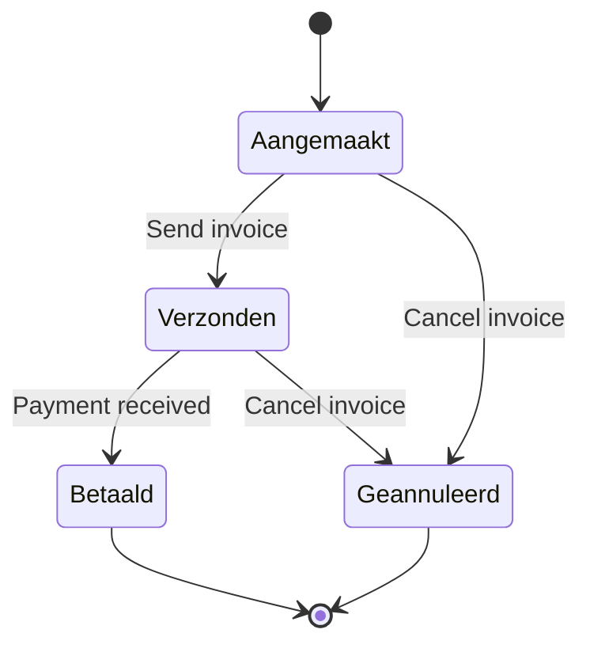

## Overview

Invoices in ARMS follow a four-state lifecycle. All transitions are manual, triggered by user actions or integrations (such as payment confirmation from Exact Online).

## State diagram



## Status definitions

| Status | English | Description |
|--------|---------|-------------|
| Aangemaakt | Created | Invoice generated, not yet sent to the customer |
| Verzonden | Sent | Invoice sent to the customer; awaiting payment |
| Betaald | Paid | Payment received and confirmed |
| Geannuleerd | Cancelled | Invoice cancelled; no payment expected |

## Transition rules

| From | To | Trigger |
|------|----|---------|
| Aangemaakt | Verzonden | User sends the invoice (or exports to Exact Online) |
| Aangemaakt | Geannuleerd | User cancels before sending |
| Verzonden | Betaald | Payment confirmed |
| Verzonden | Geannuleerd | User cancels after sending |

> [!info]
> **Betaald** and **Geannuleerd** are terminal states. Once an invoice reaches either status, no further transitions are possible.


## TypeScript type definition

```typescript invoice-status-transitions.ts
export type InvoiceStatusKey =
  | "Aangemaakt"
  | "Verzonden"
  | "Betaald"
  | "Geannuleerd";
```

## API reference

### getAllowedInvoiceTransitions

Returns the list of statuses an invoice can transition to from its current status.

```typescript
import { getAllowedInvoiceTransitions } from "@/lib/invoice-status-transitions";

getAllowedInvoiceTransitions("Aangemaakt");
// Returns: ["Verzonden", "Geannuleerd"]

getAllowedInvoiceTransitions("Verzonden");
// Returns: ["Betaald", "Geannuleerd"]

getAllowedInvoiceTransitions("Betaald");
// Returns: []
```

### isInvoiceTransitionAllowed

Validates whether a specific transition is permitted.

```typescript
import { isInvoiceTransitionAllowed } from "@/lib/invoice-status-transitions";

isInvoiceTransitionAllowed("Aangemaakt", "Verzonden");     // true
isInvoiceTransitionAllowed("Verzonden", "Betaald");        // true
isInvoiceTransitionAllowed("Betaald", "Aangemaakt");       // false
isInvoiceTransitionAllowed("Geannuleerd", "Verzonden");    // false
```

## Invoice types

ARMS supports several invoice types, each following the same status machine:

| Type key | Dutch | French | Description |
|----------|-------|--------|-------------|
| `rental` | Huur | Location | Recurring rental invoices |
| `advance` | Voorschot | Avance | Advance payment invoices |
| `deposit` | Waarborg | Garantie | Deposit invoices |
| `credit_note` | Creditnota | Note de credit | Credit notes (e.g., deposit refund) |
| `damage` | Schade | Dommage | Damage invoices |

## Related pages

- [[technical/state-machines/contract-status|Contract status machine]] -- contracts that generate invoices
- [[technical/business-logic/invoice-calculations|Invoice calculations]] -- how invoice amounts are calculated
- [[technical/business-logic/auto-transitions|Auto-transitions]] -- automatic invoice generation on contract status changes
