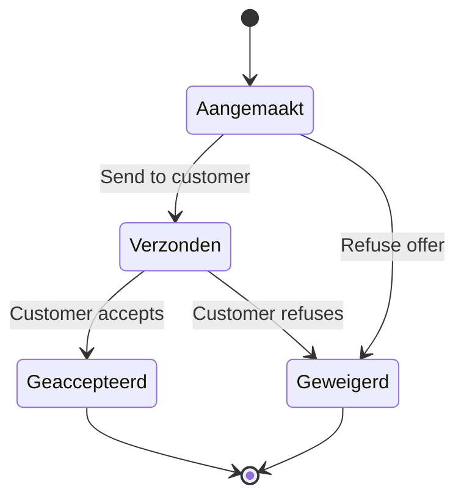

## Overview

Every offer in ARMS follows a four-state lifecycle. Status transitions are enforced both in the UI and on the server using the `offer-status-transitions.ts` module. All status keys use the Dutch `value_nl` strings stored in the `dropdown_value` table.

## State diagram



## Status definitions

| Status | English | Description |
|--------|---------|-------------|
| Aangemaakt | Created | Initial state when a new offer is drafted |
| Verzonden | Sent | Offer has been sent to the customer |
| Geaccepteerd | Accepted | Customer accepted the offer; a contract can be created |
| Geweigerd | Refused | Offer was refused by either party |

## Transition rules

| From | To | Trigger | Type |
|------|----|---------|------|
| Aangemaakt | Verzonden | User sends the offer | Manual |
| Aangemaakt | Geweigerd | User refuses the offer | Manual |
| Verzonden | Geaccepteerd | Customer accepts | Manual |
| Verzonden | Geweigerd | Customer refuses | Manual |

> [!info]
> **Geaccepteerd** and **Geweigerd** are terminal states. Once an offer reaches either status, no further transitions are possible.


## TypeScript type definition

The status keys are defined as a union type for compile-time safety:

```typescript offer-status-transitions.ts
export type OfferStatusKey =
  | "Aangemaakt"
  | "Verzonden"
  | "Geaccepteerd"
  | "Geweigerd";
```

## API reference

### getAllowedOfferTransitions

Returns the list of statuses an offer can transition to from its current status. Used by the UI to render available action buttons.

```typescript
import { getAllowedOfferTransitions } from "@/lib/offer-status-transitions";

// When offer is in "Aangemaakt" status
const allowed = getAllowedOfferTransitions("Aangemaakt");
// Returns: ["Verzonden", "Geweigerd"]

// When offer is in a terminal state
const terminal = getAllowedOfferTransitions("Geaccepteerd");
// Returns: []
```

### isOfferTransitionAllowed

Validates whether a specific transition is permitted. Used by server actions before executing a status change.

```typescript
import { isOfferTransitionAllowed } from "@/lib/offer-status-transitions";

isOfferTransitionAllowed("Aangemaakt", "Verzonden");    // true
isOfferTransitionAllowed("Aangemaakt", "Geaccepteerd"); // false
isOfferTransitionAllowed("Geweigerd", "Aangemaakt");    // false
```

### getOfferStatusKey

Validates and casts a raw string to the `OfferStatusKey` type. Returns `null` for unrecognized values.

```typescript
import { getOfferStatusKey } from "@/lib/offer-status-transitions";

getOfferStatusKey("Verzonden");  // "Verzonden"
getOfferStatusKey("Invalid");    // null
```

## Contract prefill on acceptance

When an offer reaches the **Geaccepteerd** status, a contract can be created from it. The `buildContractPrefill` function maps offer fields to contract defaults. All prefilled fields remain editable before saving the contract.

Prefilled fields include: company, customer, contact, language, pricing (unit price, discount, insurance, VAT), desired trailer specifications, and estimated rental dates.

## Related pages

- [[technical/state-machines/contract-status|Contract status machine]] -- the next lifecycle stage after offer acceptance
- [[technical/state-machines/invoice-status|Invoice status machine]] -- invoice lifecycle for billing
