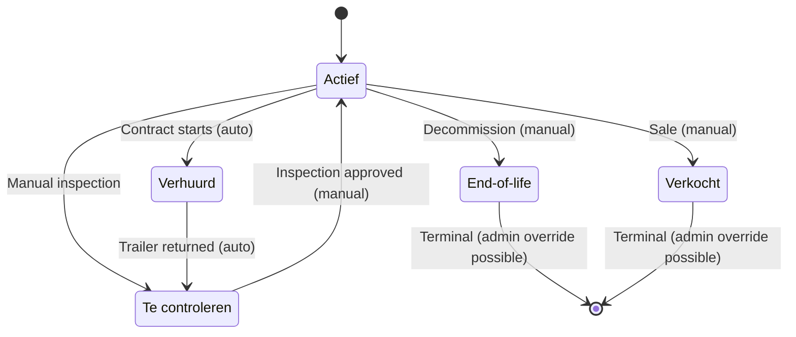

## Overview

Trailers in ARMS have five statuses with a mix of manual and automatic transitions. Two statuses (**End-of-life** and **Verkocht**) are irreversible for regular users -- only administrators can reverse them.

## State diagram



## Status definitions

| Status | English | Description |
|--------|---------|-------------|
| Actief | Active | Trailer is available for rental |
| Verhuurd | Rented | Trailer is currently assigned to an active contract |
| Te controleren | To Check | Trailer returned from rental; pending inspection |
| End-of-life | End of Life | Trailer decommissioned; no longer available |
| Verkocht | Sold | Trailer has been sold; removed from fleet |

## Transition rules

| From | To | Type | Validation |
|------|----|------|------------|
| Actief | Verhuurd | Automatic | System sets this via contract status change |
| Actief | Te controleren | Manual | User initiates inspection |
| Actief | End-of-life | Manual | Confirmation dialog required |
| Actief | Verkocht | Manual | Confirmation dialog required |
| Verhuurd | Te controleren | Automatic | Triggered on trailer return |
| Te controleren | Actief | Manual | After inspection approval |
| End-of-life | Any | **Admin only** | Requires admin role to reverse |
| Verkocht | Any | **Admin only** | Requires admin role to reverse |

> [!danger]
> Transitions to **End-of-life** and **Verkocht** are irreversible for regular users. Only users with the **admin** role can reverse these statuses. A confirmation dialog is always shown before entering these states.


## Role-based access

The transition logic checks the user's role before allowing status changes:

```typescript status-transitions.ts
export function getAllowedTransitions(
  currentStatusNl: string,
  isAdmin: boolean,
): TrailerStatusKey[] {
  const key = getStatusKey(currentStatusNl);
  if (!key) return [];

  // Admin can transition away from terminal states
  if (ADMIN_ONLY_SOURCES.includes(key) && isAdmin) {
    return (
      ["Actief", "Verhuurd", "Te controleren", "End-of-life", "Verkocht"]
    ).filter((s) => s !== key);
  }

  return ALLOWED_TRANSITIONS[key];
}
```

| User role | Can enter End-of-life / Verkocht | Can leave End-of-life / Verkocht |
|-----------|----------------------------------|----------------------------------|
| Regular user | Yes (with confirmation) | No |
| Admin | Yes (with confirmation) | Yes (to any other status) |

## TypeScript type definition

```typescript status-transitions.ts
export type TrailerStatusKey =
  | "Actief"
  | "Verhuurd"
  | "Te controleren"
  | "End-of-life"
  | "Verkocht";
```

## API reference

### getAllowedTransitions

Returns available transitions based on current status and user role.

```typescript
import { getAllowedTransitions } from "@/lib/status-transitions";

// Regular user with active trailer
getAllowedTransitions("Actief", false);
// Returns: ["Verhuurd", "Te controleren", "End-of-life", "Verkocht"]

// Regular user with sold trailer
getAllowedTransitions("Verkocht", false);
// Returns: []

// Admin with sold trailer
getAllowedTransitions("Verkocht", true);
// Returns: ["Actief", "Verhuurd", "Te controleren", "End-of-life"]
```

### isTransitionAllowed

Validates a specific transition considering the user's role.

```typescript
import { isTransitionAllowed } from "@/lib/status-transitions";

isTransitionAllowed("Actief", "End-of-life", false);  // true
isTransitionAllowed("Verkocht", "Actief", false);      // false
isTransitionAllowed("Verkocht", "Actief", true);       // true (admin)
```

### requiresConfirmation

Checks whether a transition target requires a confirmation dialog.

```typescript
import { requiresConfirmation } from "@/lib/status-transitions";

requiresConfirmation("End-of-life"); // true
requiresConfirmation("Verkocht");    // true
requiresConfirmation("Actief");      // false
```

## Server action

The `changeTrailerStatus` server action in `lib/actions/trailer-status.ts` performs the full validation flow:

1. Authenticate the user
2. Fetch the user's role from `user_profile`
3. Load the trailer's current status via the `dropdown_value` join
4. Load the target status `value_nl`
5. Call `isTransitionAllowed` with the role context
6. Update the trailer record
7. Revalidate the fleet page cache

## Related pages

- [[technical/state-machines/contract-status|Contract status machine]] -- contract lifecycle that drives automatic trailer status changes
- [[technical/business-logic/auto-transitions|Auto-transitions]] -- automatic transition details
