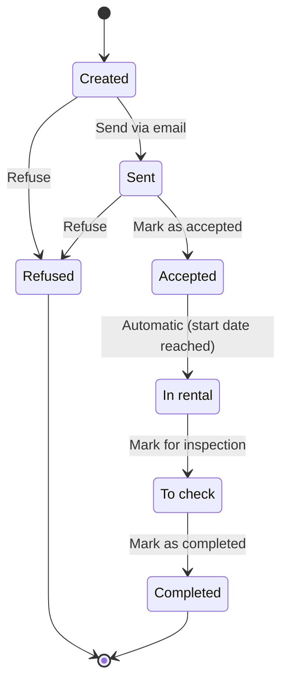

Every contract in ARMS follows a defined lifecycle with seven possible statuses. Some transitions are manual (triggered by you), while others happen automatically based on business rules.

## Status flow diagram

## Status transitions

| From | To | Trigger | Automatic? | Side effects |
|------|-----|---------|------------|--------------|
| Created | Sent | You confirm the email send | Manual | Contract is emailed to the customer |
| Created | Refused | You refuse the contract | Manual | Terminal state |
| Sent | Accepted | You mark the contract as accepted | Manual | -- |
| Sent | Refused | You refuse the contract | Manual | Terminal state |
| Accepted | In rental | Contract start date is today or earlier | **Automatic** | Advance invoice and deposit invoice are created |
| In rental | To check | You mark the contract after trailer return | Manual | -- |
| To check | Completed | You mark the contract as completed after inspection | Manual | Deposit credit note is created automatically |

## Automatic transitions

### Accepted to In rental

ARMS runs a daily check for contracts in "Accepted" status where the effective start date is today or in the past. When this condition is met, the contract automatically transitions to "In rental".

> [!info]
> The effective start date is the **real start date** if set, otherwise the **estimated start date**. Make sure to keep your estimated dates accurate if the real pickup date is not yet known.

**Side effects when entering "In rental":**
- An **advance invoice** is automatically created for the calculated advance amount
- A **deposit invoice** is automatically created for the deposit amount
- Both invoices appear in the [[user-guide/invoicing/overview|invoice overview]] with status "Created"

See [[user-guide/contracts/deposits-advances|Deposits and advances]] for how these amounts are calculated.

### To check to Completed

When you mark a contract as "Completed" after inspection, the system automatically creates a **credit note** for the full deposit amount. This credit note is ready for export to Exact Online.

## Manual transitions

### Sending a contract

When you send a contract via email, the status changes from "Created" to "Sent". See [[user-guide/contracts/sending-outlook|Sending via Outlook]] for the detailed process.

### Accepting or refusing

After sending, you manually update the status based on the customer's response:
- **Accept**: moves to "Accepted", where the contract waits for the rental period to begin
- **Refuse**: moves to "Refused", which is a terminal state. The contract cannot be reactivated.

> [!warning]
> Refusing a contract is permanent. If a customer later changes their mind, you need to create a new contract.

### Marking for inspection

When the customer returns the trailer, you manually transition the contract from "In rental" to "To check". This signals that the trailer needs a physical inspection.

> [!tip]
> After marking a contract as "To check", complete the [[user-guide/contracts/damage-control|damage control]] checklist before marking the contract as completed.

### Completing a contract

After the inspection is done and any damage is resolved, you manually mark the contract as "Completed". This triggers the automatic deposit credit note creation.

## Attention indicators

| Indicator | Condition | Appears on |
|-----------|-----------|------------|
| Yellow row | Contract in "Sent" status for more than 7 days | Contract list |
| Yellow background | Trailer not inspected or damage found | Contract list and planning timeline |

These visual indicators help you identify contracts that need follow-up. See [[user-guide/contracts/damage-control|Damage control]] for resolving yellow-highlighted contracts.

## Related pages

- **[[user-guide/contracts/damage-control|Damage control]]** — Handle post-return inspection and damage tracking.

  - **[[user-guide/contracts/deposits-advances|Deposits and advances]]** — Understand the automatic invoice creation when a contract enters "In rental".
