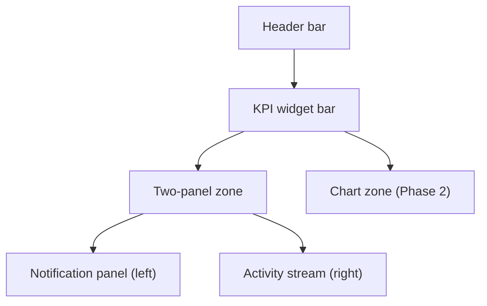

The dashboard is your start screen after logging in to ARMS. It provides a consolidated operational overview of rental activities, outstanding actions, and critical alerts -- all in a single view.

## Dashboard layout

The dashboard is divided into four main zones, each serving a specific purpose.

| Zone | Location | Purpose |
|------|----------|---------|
| **Header bar** | Top of screen | Logo, main navigation, user profile, and language switch |
| **KPI widget bar** | Below header | 5-6 clickable counter widgets showing key metrics |
| **Notification panel** | Left panel | Priority-sorted list of action items requiring attention |
| **Activity stream** | Right panel | Last 20 modified or created records across the system |
| **Chart zone** | Bottom (Phase 2) | Occupancy rates and revenue comparison charts |

## Header bar

The header bar is visible on every page in ARMS and contains:

- **Logo** -- Click to return to the dashboard from any page.
- **Navigation menu** -- Access all modules: Fleet, Customers, Offers, Contracts, Invoicing, Planning, and Administration.
- **User profile** -- View your account details, role, and sign-out option.
- **Language switch** -- Toggle between Dutch (NL) and French (FR). The interface updates immediately.

## KPI widget bar

The KPI bar displays 5-6 widgets in a single row. Each widget shows a **counter** (number) and a **label** describing what it counts.

Every widget is clickable. When you click a widget, ARMS navigates you to the relevant list view with the appropriate filter already applied.

> [!tip]
> Use the KPI widgets as shortcuts to quickly access filtered views of your most important data. For example, click "Active contracts" to jump directly to the contracts list filtered to show only contracts currently in rental.

For detailed information about each KPI widget, see [[user-guide/dashboard/kpis|KPI widgets]].

## Notification panel

The left panel displays a sorted list of action items that require your attention. Notifications are color-coded by priority level:

| Priority | Color | Meaning |
|----------|-------|---------|
| Critical | Red | Immediate action required (e.g., expired inspection) |
| Attention | Orange | Important items needing follow-up |
| Warning | Yellow | Items to monitor (e.g., unresponsive contracts) |
| Info | Blue | Low-priority informational items |

Notifications are generated in real time from your data. They cannot be dismissed manually -- they disappear automatically when the underlying issue is resolved.

For detailed information about each notification type, see [[user-guide/dashboard/notifications|Notifications]].

## Activity stream

The right panel shows the last 20 records that were modified or created across contracts, offers, and trailers. Each entry displays:

- Entity icon (contract, offer, or trailer)
- Name or identifier
- Action performed (created, updated, etc.)
- User who performed the action
- Relative timestamp (e.g., "2 hours ago")

Click any entry to navigate directly to its detail screen.

For detailed information, see [[user-guide/dashboard/activity-stream|Activity stream]].

## Chart zone (Phase 2)

> [!info]
> The chart zone is planned for Phase 2 and is not yet available. When released, it will display occupancy rates per trailer type and monthly revenue comparisons.

## Role-based access

All user roles have access to the dashboard. The Read-only role can view all dashboard data but cannot perform any actions.

| Role | Dashboard access |
|------|-----------------|
| Admin | Full access |
| Commercial | Full access |
| Accounting | Full access |
| Fleet manager | Full access |
| Read-only | View only |

## Related pages

- **[[user-guide/dashboard/kpis|KPI widgets]]** — Understand what each KPI widget measures and where it navigates on click.

  - **[[user-guide/dashboard/notifications|Notifications]]** — Learn about notification types, priority levels, and how to resolve them.

  - **[[user-guide/dashboard/activity-stream|Activity stream]]** — Track recent changes and creations across your rental operations.

  - **[[user-guide/administration/parameters|Parameters]]** — Configure thresholds that control dashboard notifications and KPI calculations.
