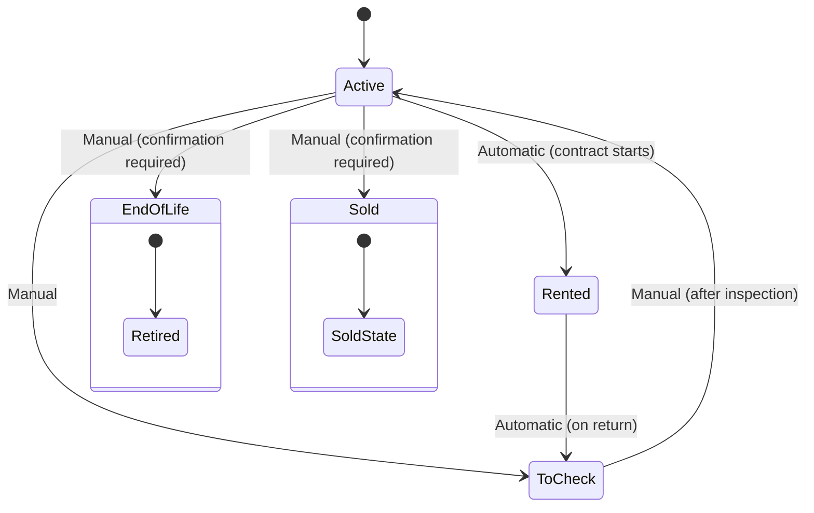

Each trailer in ARMS has a status that reflects its current operational state. Status transitions follow specific rules to maintain data integrity and ensure accurate fleet tracking.

## Status overview

| Status | Color | Description |
|--------|-------|-------------|
| **Active** | Green | Trailer is available for rental |
| **Rented** | Blue | Trailer is under an active rental contract |
| **To check** | Yellow | Trailer needs inspection (typically after return) |
| **End-of-life** | Dark gray | Trailer is permanently retired |
| **Sold** | Gray | Trailer has been sold |

## Status transition diagram

## Transition rules

| From | To | How | Details |
|------|----|-----|---------|
| Active | Rented | Automatic | The system sets this automatically when a rental contract becomes active |
| Active | To check | Manual | You trigger this when a trailer needs inspection outside of the normal return flow |
| Active | End-of-life | Manual | Requires a confirmation prompt. This indicates the trailer is permanently retired |
| Active | Sold | Manual | Requires a confirmation prompt. This indicates the trailer has been sold |
| Rented | To check | Automatic | The system sets this automatically when a trailer is returned from a rental |
| To check | Active | Manual | You set this after the post-return inspection is completed and approved |
| End-of-life | Any | Not allowed | This status is irreversible. Only an Admin can override this in exceptional cases |
| Sold | Any | Not allowed | This status is irreversible. Only an Admin can override this in exceptional cases |

## Changing a trailer's status

<Steps>
  <Step title="Open the status dialog" icon="arrow-right-left" titleType="p">
    On the [trailer detail screen](/user-guide/fleet/trailer-details), click the **Change status** button in the header card.
  </Step>

  <Step title="Select the new status" icon="check-circle" titleType="p">
    Choose the target status from the available options. Only valid transitions appear based on the current status.
  </Step>

  <Step title="Confirm if required" icon="alert-triangle" titleType="p">
    For transitions to **End-of-life** or **Sold**, a confirmation dialog appears. Read the warning carefully and confirm to proceed.
  </Step>
</Steps>

<Callout kind="danger">
  Transitioning a trailer to **End-of-life** or **Sold** is irreversible under normal operations. Only users with the Admin role can reverse these statuses in exceptional circumstances. Make sure this is the intended action before confirming.
</Callout>

<Callout kind="info">
  You do not need to manually set a trailer to "Rented" or back to "To check" after return. These transitions happen automatically through the contract lifecycle.
</Callout>

## Related pages

<Columns cols="2">
  <Card title="Fleet overview" href="/user-guide/fleet/overview" icon="list" horizontal="false">
    See status badges across your entire fleet.
  </Card>

  <Card title="Trailer details" href="/user-guide/fleet/trailer-details" icon="file-text" horizontal="false">
    Access the status change button from the detail screen.
  </Card>
</Columns>
