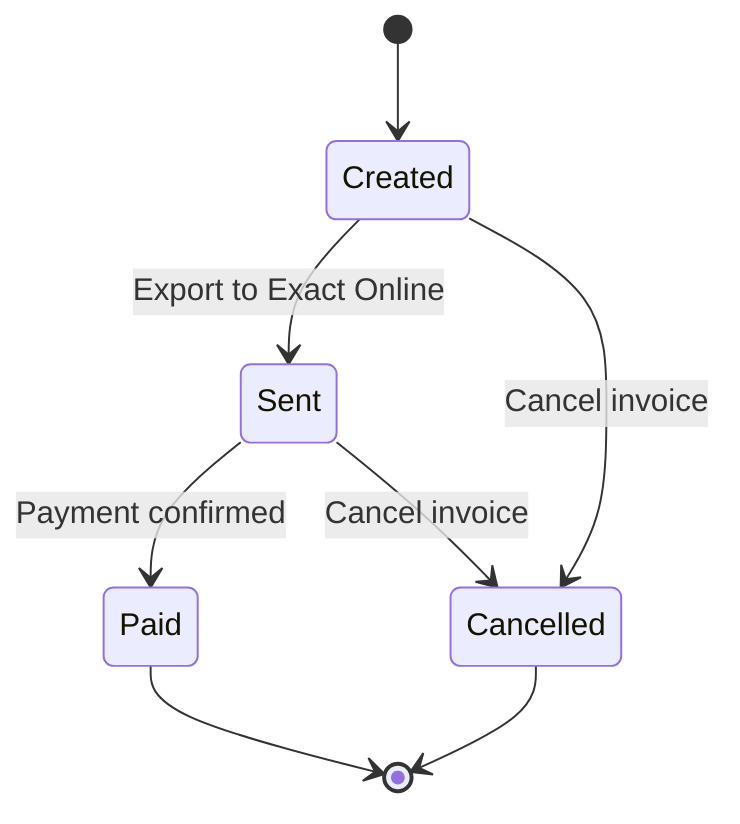

The invoicing module in ARMS handles the full invoice lifecycle: from generating proposals based on contract data to managing effective invoices and exporting them to Exact Online.

> [!warning]
> Only users with the **Admin** or **Accounting** role can create and manage invoices. Commercial users can view invoice overviews but cannot create or modify them.

## Screen layout

The invoicing screen is divided into two main sections:

| Section | Purpose |
|---------|---------|
| **Invoice proposals** | Generate billing overviews based on contracts and select which items to invoice |
| **Effective invoices** | View and manage all created invoices, credit notes, and their statuses |

You switch between these sections using the tabs at the top of the invoicing screen.

## Invoice types

ARMS supports four invoice types:

| Type | Description | Created by |
|------|-------------|------------|
| **Standard invoice** | Regular rental invoice generated from proposals | User (from proposals or manually) |
| **Advance invoice** | Prepayment invoice created when a contract enters "In rental" | Automatic |
| **Deposit invoice** | Security deposit invoice created when a contract enters "In rental" | Automatic |
| **Credit note** | Refund document created when a contract is completed (deposit return) | Automatic |

See [[user-guide/contracts/deposits-advances|Deposits and advances]] for details on when advance and deposit invoices are created automatically.

## Invoice status flow

| Status | Description |
|--------|-------------|
| **Created** | Invoice has been generated but not yet exported |
| **Sent** | Invoice has been exported to Exact Online |
| **Paid** | Payment has been confirmed (status returned from Exact Online) |
| **Cancelled** | Invoice has been cancelled and is no longer active |

## Typical invoicing workflow

### Step 1: Generate invoice proposals

On the **Invoice proposals** tab, select the unit type, date range, and company. Click **Generate overview** to see which contracts are ready for invoicing.

    See [[user-guide/invoicing/proposals|Invoice proposals]] for detailed instructions.

### Step 2: Review the proposals

Review the calculated amounts, check for any warnings (partially invoiced, missing data), and select the contracts you want to invoice.

### Step 3: Create invoices

Click **Generate invoice(s)** to create the effective invoices from the selected proposals. The invoices appear on the **Effective invoices** tab.

### Step 4: Export to Exact Online

On the effective invoices tab, export the new invoices to Exact Online for payment processing.

    See [[user-guide/invoicing/exact-online-export|Exact Online export]] for the export process.

## Related pages

- **[[user-guide/invoicing/proposals|Invoice proposals]]** — Generate and review billing proposals for your contracts.

  - **[[user-guide/invoicing/managing-invoices|Managing invoices]]** — View, manage, and track your effective invoices.

  - **[[user-guide/invoicing/exact-online-export|Exact Online export]]** — Export invoices to Exact Online for payment processing.
