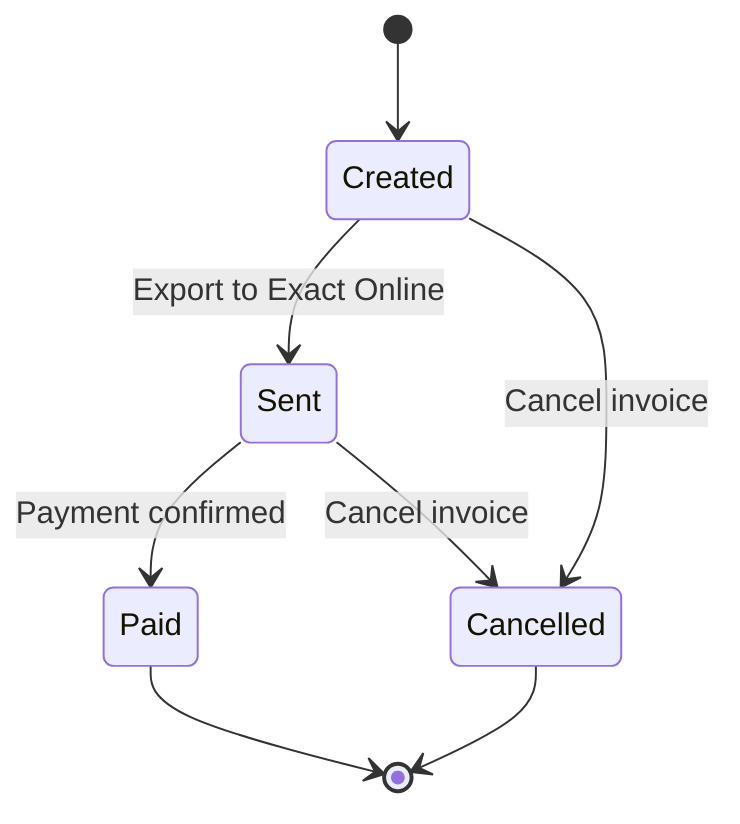

The invoicing module in ARMS handles the full invoice lifecycle: from generating proposals based on contract data to managing effective invoices and exporting them to Exact Online.

<Callout kind="alert">
  Only users with the **Admin** or **Accounting** role can create and manage invoices. Commercial users can view invoice overviews but cannot create or modify them.
</Callout>

## Screen layout

The invoicing screen is divided into two main sections:

| Section | Purpose |
|---------|---------|
| **Invoice proposals** | Generate billing overviews based on contracts and select which items to invoice |
| **Effective invoices** | View and manage all created invoices, credit notes, and their statuses |

You switch between these sections using the tabs at the top of the invoicing screen.

## Invoice types

ARMS supports four invoice types:

| Type | Description | Created by |
|------|-------------|------------|
| **Standard invoice** | Regular rental invoice generated from proposals | User (from proposals or manually) |
| **Advance invoice** | Prepayment invoice created when a contract enters "In rental" | Automatic |
| **Deposit invoice** | Security deposit invoice created when a contract enters "In rental" | Automatic |
| **Credit note** | Refund document created when a contract is completed (deposit return) | Automatic |
| **Damage invoice** | Invoice for damage costs assessed during or after the rental period | User (from damage control) |

See [Deposits and advances](/user-guide/contracts/deposits-advances) for details on when advance and deposit invoices are created automatically.

## Invoice status flow

| Status | Description |
|--------|-------------|
| **Created** | Invoice has been generated but not yet exported |
| **Sent** | Invoice has been exported to Exact Online |
| **Paid** | Payment has been confirmed (status returned from Exact Online) |
| **Cancelled** | Invoice has been cancelled and is no longer active |

## Typical invoicing workflow

<Steps>
  <Step title="Generate invoice proposals" icon="clipboard-list" titleType="p">
    On the **Invoice proposals** tab, select the unit type, date range, and company. Click **Generate overview** to see which contracts are ready for invoicing.

    See [Invoice proposals](/user-guide/invoicing/proposals) for detailed instructions.
  </Step>

  <Step title="Review the proposals" icon="eye" titleType="p">
    Review the calculated amounts, check for any warnings (partially invoiced, missing data), and select the contracts you want to invoice.
  </Step>

  <Step title="Create invoices" icon="file-text" titleType="p">
    Click **Generate invoice(s)** to create the effective invoices from the selected proposals. The invoices appear on the **Effective invoices** tab.
  </Step>

  <Step title="Export to Exact Online" icon="upload" titleType="p">
    On the effective invoices tab, export the new invoices to Exact Online for payment processing.

    See [Exact Online export](/user-guide/invoicing/exact-online-export) for the export process.
  </Step>
</Steps>

## Related pages

<Columns cols="3">
  <Card title="Invoice proposals" href="/user-guide/invoicing/proposals" icon="clipboard-list" horizontal="false">
    Generate and review billing proposals for your contracts.
  </Card>

  <Card title="Managing invoices" href="/user-guide/invoicing/managing-invoices" icon="settings" horizontal="false">
    View, manage, and track your effective invoices.
  </Card>

  <Card title="Exact Online export" href="/user-guide/invoicing/exact-online-export" icon="upload" horizontal="false">
    Export invoices to Exact Online for payment processing.
  </Card>
</Columns>
