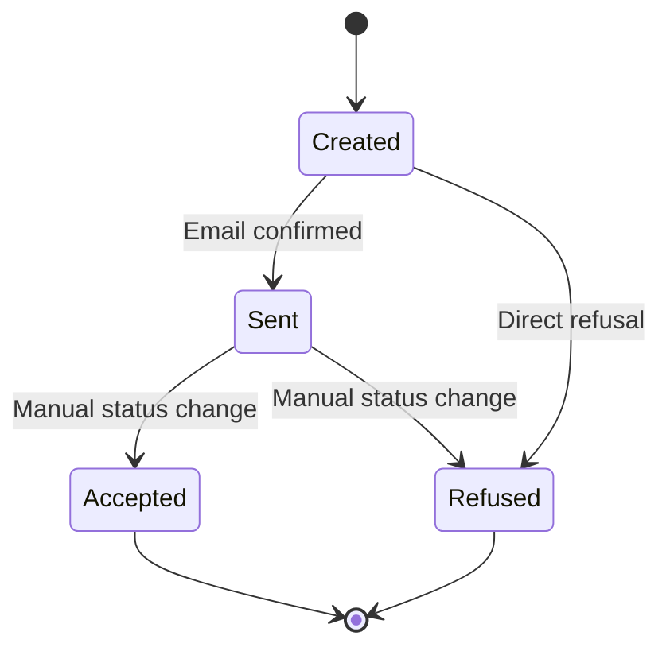

Every offer in ARMS follows a defined lifecycle with four statuses. Understanding this flow helps you track where each offer stands and what actions are available at each stage.

## Status flow diagram

## Status descriptions

| Status | Color | Description |
|--------|-------|-------------|
| **Created** | Gray | The offer has been drafted and saved. It has not yet been sent to the customer. |
| **Sent** | Blue | The offer has been emailed to the customer via Outlook. |
| **Accepted** | Green | The customer has agreed to the offer terms. |
| **Refused** | Red | The customer has declined the offer. |

## Status transitions

| From | To | How it happens |
|------|----|----------------|
| Created | Sent | You [[user-guide/offers/sending-outlook|send the offer via Outlook]] and confirm that the email was sent |
| Created | Refused | You manually change the status to Refused (for offers not sent to the customer) |
| Sent | Accepted | You manually change the status to Accepted after the customer confirms |
| Sent | Refused | You manually change the status to Refused after the customer declines |

> [!info]
> All status transitions are manual. ARMS does not automatically detect customer responses. Update the status when you receive confirmation from the customer.

## Terminal states

**Accepted** and **Refused** are terminal states. Once an offer reaches either status, it cannot transition further.

- **Accepted**: The offer can be [[user-guide/offers/converting-to-contract|converted to a contract]] using the "Create contract" button
- **Refused**: The offer is closed. You can create a new offer for the same customer if needed.

## Due date behavior

Each offer has a due date that indicates when the offer expires. The due date behaves as follows:

- Default value: today's date plus a configurable offset (set in [[user-guide/administration/parameters|Parameters]])
- When the due date passes and the offer status is **Created** or **Sent**, the due date is highlighted in **yellow** in the offer list
- The yellow highlight does not appear for offers with status Accepted or Refused, since those are already resolved

> [!tip]
> Regularly check the [[user-guide/offers/overview|Offers overview]] and filter for "Sent" status to identify offers with expired due dates that need follow-up.

## Related pages

- **[[user-guide/offers/sending-outlook|Sending via Outlook]]** — Send an offer to trigger the Created to Sent transition.

  - **[[user-guide/offers/converting-to-contract|Converting to contract]]** — Turn an accepted offer into a rental contract.
