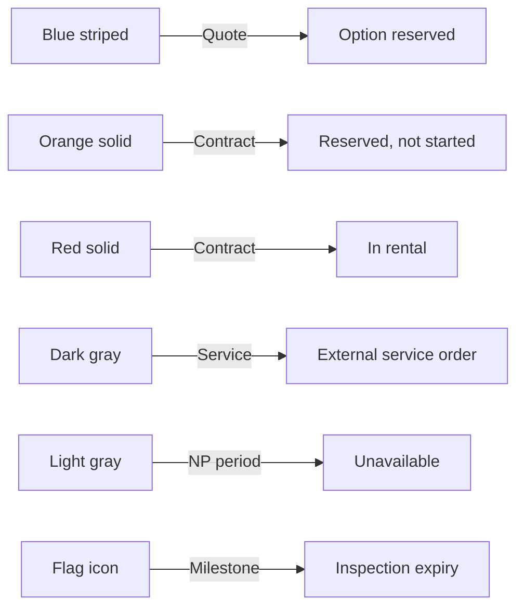

The planning timeline uses colors, patterns, and highlights to communicate different types of events and their statuses at a glance. This guide explains how to read every visual element on the timeline.

## Event bar colors

Each bar on the timeline represents a specific type of event. The color tells you what kind of event it is.

| Color | Pattern | Event type | Meaning |
|-------|---------|------------|---------|
| Blue | Striped | Quote (option) | A sent quote has reserved this trailer for the displayed period |
| Orange | Solid | Contract - Reserved | A contract exists but the rental has not started yet |
| Red | Solid | Contract - In rental | The trailer is actively rented under this contract |
| Dark gray | Solid | Service order | A service order from an external system is linked to this trailer |
| Light gray | Solid | Non-productive period | The trailer is unavailable due to maintenance, damage, or other reasons |

## Milestone markers

In addition to bars, the timeline shows milestone markers:

| Marker | Meaning |
|--------|---------|
| Flag icon | The expiry date of the trailer's active technical inspection |

<Callout kind="tip">
  Use inspection flags to quickly spot trailers whose inspections are expiring during a planned rental period. This helps you schedule inspections proactively.
</Callout>

## Background highlights

The background color of a trailer row provides additional context:

| Background | Meaning | Action needed |
|------------|---------|---------------|
| **Yellow** | Trailer needs attention | A contract is in "To check" status (post-return inspection pending) or damage was found on a recent return |
| **Normal** (white/default) | No attention needed | Inspection is completed or repair order is closed |

<Callout kind="alert">
  A yellow background means the trailer requires your review. Check whether a post-return inspection has been completed or whether a damage report needs follow-up.
</Callout>

## Hovering over events

Hover your cursor over any event bar to see a tooltip with summary information, including the event type, reference number, and date range. This gives you quick context without clicking.

## Clicking on events

Click any event bar to open a detail popup showing:

- **Event type and reference** (e.g., "Contract CT-2026-047")
- **Customer name** (for contracts and quotes)
- **Trailer** reference
- **Period** start and end dates
- **Status** of the event

From the popup, you can:

- Click **Show more** to navigate to the full detail screen for that event
- Click **Close** or click outside the popup to dismiss it

## Reading availability

To assess trailer availability for a specific period:

<Steps>
  <Step title="Set the date range" icon="calendar" titleType="p">
    Adjust the period filter to cover the dates you are interested in.
  </Step>

  <Step title="Apply property filters" icon="filter" titleType="p">
    Filter by trailer type, volume, sheet type, or other critical properties to show only relevant trailers.
  </Step>

  <Step title="Look for gaps" icon="eye" titleType="p">
    Available trailers show empty (uncolored) space during the target period. Any bar in the period means the trailer is partially or fully unavailable.
  </Step>

  <Step title="Check for yellow backgrounds" icon="alert-triangle" titleType="p">
    Trailers with a yellow background need attention before they can be considered available, even if their timeline shows a gap.
  </Step>
</Steps>

## Quick reference diagram

## Related pages

<Columns cols="2">
  <Card title="Planning overview" href="/user-guide/planning/overview" icon="gantt-chart" horizontal="false">
    Full guide to the planning screen layout and filters.
  </Card>

  <Card title="Fleet overview" href="/user-guide/fleet/overview" icon="list" horizontal="false">
    Check trailer statuses in the fleet list view.
  </Card>
</Columns>
